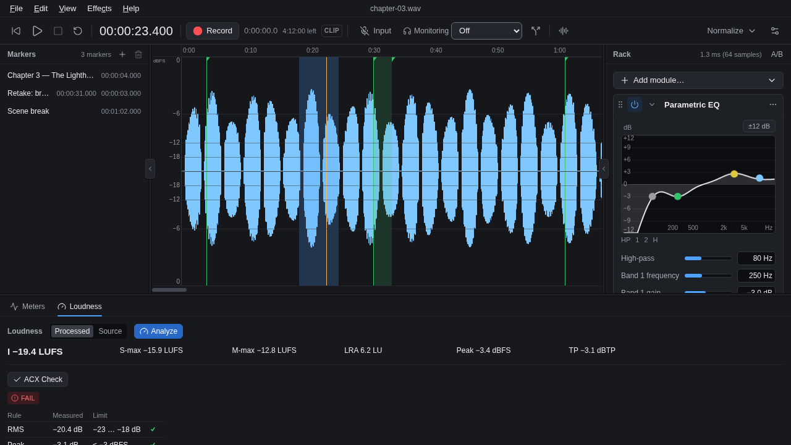
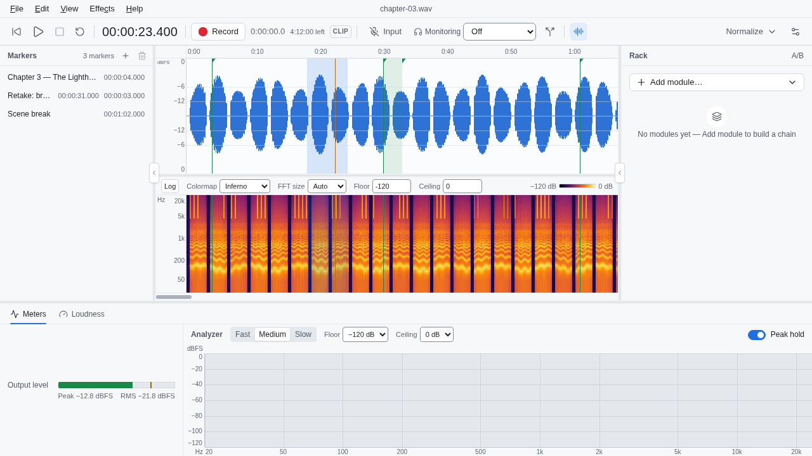
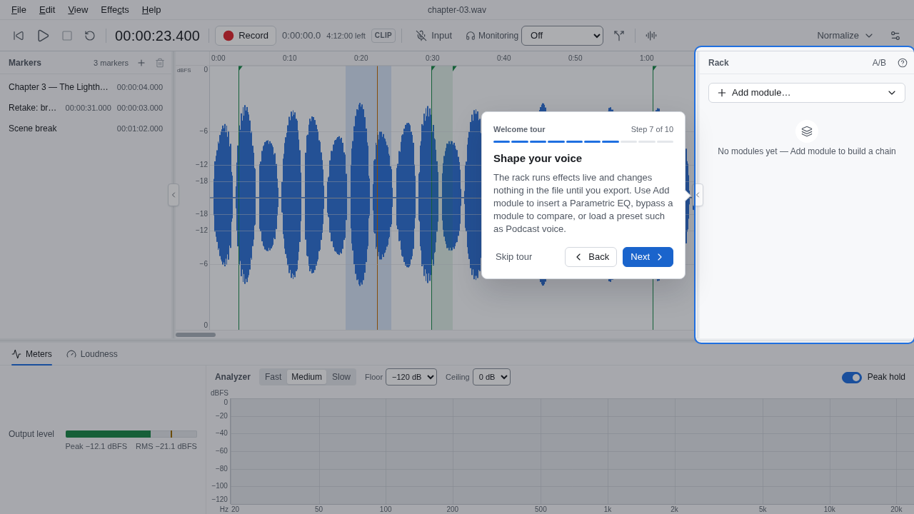
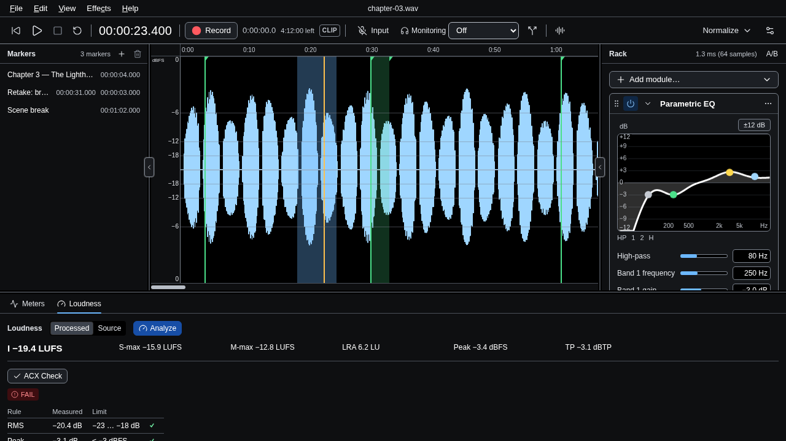

# PowerVoice

**A focused desktop editor for voice-over.** Record your voice, clean it up, make it sound good,
hit the loudness target, and export. Built for narrators, podcasters and audiobook producers who
want the essentials of Adobe Audition's Waveform Editor without a full multitrack DAW.



> **Status: early preview (v0.1.0).** PowerVoice is developed and tested on **Linux**. Windows and
> macOS builds compile from source but haven't been verified yet. Expect rough edges, and please
> report what you find.

## What it does

PowerVoice edits **one mono voice recording at a time**, and does that one job well:

1. **Record.** Pick your microphone and output, set levels, and record. Re-record a mistake with
   **punch-in** (pre-roll and post-roll included). A latency calibration keeps punches sample-accurate.
2. **See and edit.** A fast **waveform** and a **spectral view** (spectrogram) with zoom to
   selection, vertical zoom, markers, a loop, and time shown as timecode, samples or seconds.
   Selections can snap to zero crossings so edits never click. Cut, copy, paste, delete and
   silence. Undo everything.
3. **Clean and shape.** A **non-destructive effects rack** you hear live while you work:
   - **Noise gate** and **noise reduction** (capture a noise print from room tone, then reduce it)
   - **Parametric EQ** with a live response curve
   - **Dynamics** in the style of Audition (auto-gate, compressor, expander, limiter)
   - **True-peak limiter** and **Gain**
   - Presets, A/B comparison, and **Bake Rack** to render the chain into the audio (one undo step)
4. **Hit the target.** One-click **Normalize** favourites (−1, −0.1, −3 dB peak, or a LUFS target),
   a full **loudness analysis** (integrated / short-term / momentary LUFS, loudness range, true
   peak), and an **ACX check** for audiobook submissions.
5. **Export.** WAV (16/24/32-bit float), FLAC, and MP3 (via your system's LAME library).



### Also inside

- **Third-party plugins.** CLAP, VST3, LV2 and JSFX effects run in their own **sandbox process**,
  so a crashing plugin can't take your session down. A Plugin Manager handles install, uninstall,
  rescans, blocklisting and custom folders. LV2 and JSFX are Linux/macOS only, and LV2 needs the
  system `lilv` library.
- **Your own modules** can ship as standard CLAP plugins in a validated `.voxmod` package.
- **Safe by design.** Your original recording is never overwritten while you work. Autosave and
  crash recovery bring back unsaved sessions.
- **Themes.** Dark, Light, High Contrast, or follow your system.
- **Guided tours.** A welcome tour and short per-panel tours teach the app in minutes.
- **Audition-compatible shortcuts** (Help → Keyboard Shortcuts).

<p>
  
  
</p>

## Download

Pre-built Linux packages are on the [**Releases** page](https://github.com/engLucasCorreia/powervoice/releases):

- **AppImage:** download, make it executable, run. No installation needed.
  ```sh
  chmod +x PowerVoice_*_amd64.AppImage
  ./PowerVoice_*_amd64.AppImage
  ```
- **.deb** (Debian, Ubuntu and derivatives):
  ```sh
  sudo apt install ./PowerVoice_*_amd64.deb
  ```

Optional extras, installed automatically by `apt` as recommendations:
- `libmp3lame0` for **MP3 export**;
- `liblilv-0-0` for **LV2 plugins**.

On Arch: `sudo pacman -S lame lilv`. Everything else works without them.

**Windows and macOS:** no installers yet. You can [build from source](docs/building.md).

## Build from source

You need Rust (stable), Node.js 20+, [`just`](https://github.com/casey/just), and on Linux the
WebKitGTK, GTK3 and ALSA development packages (see [docs/building.md](docs/building.md)).

```sh
git clone https://github.com/engLucasCorreia/powervoice.git
cd powervoice
npm ci --prefix ui
just dev      # run in development mode
just check    # the full test suite (Rust + UI)
just build    # release build + Linux bundles (AppImage, .deb)
```

## How it's built

- **Core:** Rust. A real-time audio engine (the audio thread never allocates or locks), DSP
  modules, a chunked document store with undo history, and a plugin host that runs every
  third-party plugin in a separate process connected through shared memory.
- **Interface:** [Tauri 2](https://v2.tauri.app/) with a Svelte 5 / TypeScript UI. It uses WebGL
  for the waveform, spectrogram and analyzer, and types generated from the Rust side.

**Where to read more** — start at the [documentation hub](docs/README.md):
- [`docs/user-guide.md`](docs/user-guide.md): how to use the app.
- [`docs/shortcuts.md`](docs/shortcuts.md): every keyboard shortcut.
- [`docs/architecture/overview.md`](docs/architecture/overview.md): how PowerVoice is built, with diagrams.
- [`docs/contributing.md`](docs/contributing.md): dev setup, tests, and how to add things.
- [`docs/glossary.md`](docs/glossary.md): every term, in plain language first.
- [`docs/adr/`](docs/adr/): the architecture decisions.
- [`specs/`](specs/): the behaviour specifications.
- [`docs/performance.md`](docs/performance.md): measured performance, when available.

The project is developed spec-first: specs and ADRs define behaviour, and work is tracked as
tickets in [`tickets/`](tickets/). Every change passes `just check`, which runs formatting,
lints, ~1,800 UI tests and the full Rust suite.

## License

PowerVoice is dual-licensed under [MIT](LICENSE-MIT) or [Apache-2.0](LICENSE-APACHE), at your
option. Third-party components are listed in [`THIRD_PARTY_NOTICES`](THIRD_PARTY_NOTICES) (also in
the app under Help → About); the linking policy is in
[`docs/adr/ADR-007-licensing.md`](docs/adr/ADR-007-licensing.md).

PowerVoice is an independent project and isn't affiliated with Adobe. "Adobe Audition" is a
trademark of Adobe Inc., mentioned only to describe the kind of tool this is. VST is a trademark
of Steinberg Media Technologies GmbH.
