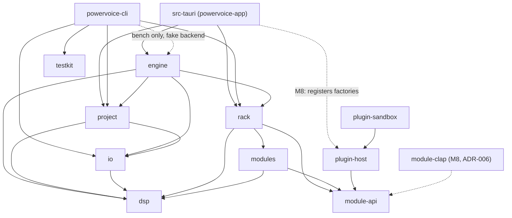
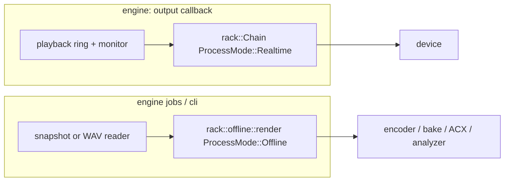

# ADR-001 — Architecture overview & crate graph
- Status: accepted (owner, M0 checkpoint 2026-09-12)
- Date: 2026-09-12
- Deciders: owner, orchestrator

## Context
PowerVoice is a Tauri 2 desktop editor for one mono file at a time, with a non-destructive effects rack
applied identically to playback, monitoring and export (PROMPT §2). All audio, DSP, file I/O and
document state are in Rust; the Svelte 5 UI only renders and sends intents. Every rack slot is a
Module API processor, so the rack must be "plugin-shaped" from day one even though external plugins
arrive in M8, out-of-process (§3.7). §4 fixes the crate names. Windows/macOS must compile and use
platform-neutral code paths even though only Linux is tested.

We need dependency rules that (a) keep the real-time and DSP code testable without devices, a
WebView or disk, (b) give the rack exactly **one code path** for real-time and offline use, and
(c) keep licensing-sensitive or crash-prone code (LGPL LAME, the ysfx JIT) at known edges.

## Decision

### 1. Processes
- **App process**: Tauri core (Rust) + system WebView (WebKitGTK / WebView2 / WKWebView). The engine,
  document and jobs all run in the Rust core. See ADR-002 for threads and ADR-003 for IPC.
- **`plugin-sandbox` processes** (M8): host external plugins behind shared memory (ADR-008).
- **`powervoice-cli`**: a separate binary with no Tauri. It never opens audio devices except through
  the engine's fake backend for `bench`.

### 2. Crate graph
An arrow `A --> B` means "A depends on B" (normal dependencies only; dev-dependencies on `testkit`
are omitted for readability).

### 3. Allowed directions (enforced rules)
1. The graph is acyclic and layered. A crate may depend only on crates the diagram shows it depending on.
   Adding an edge requires amending this ADR.
2. **Leaves with no internal dependencies:** `module-api`, `dsp`, `testkit`.
   - `dsp` does not depend on `module-api`. The ticket's chain `module-api ← dsp ← modules` is read
     as layering, not as a `dsp → module-api` edge. Pure DSP stays reusable by `io`, `project` and
     `engine`.
   - `testkit` implements its measurements (peak, RMS, LUFS, TP) independently of `dsp`, or wraps
     `ebur128`, so that tests never grade production code with itself.
3. **External crates are confined to one crate each:**
   - `cpal`: only `engine`, behind a default feature `backend-cpal`, so `cli` and tests build
     without system audio libraries.
   - `tauri` and `ts-rs`: only `src-tauri` (ADR-003).
   - `memmap2`: only `project` (ADR-004).
   - codec crates (`hound`, `symphonia`, `flacenc`) and `libloading` for the runtime-loaded LAME library (ADR-007): only `io`. **Exception:** `testkit` may use `hound` (plain f32/PCM WAV I/O for fixtures and `analyze`) so the measuring stick stays independent of production `io` code (amended after T-006 review).
   - `rubato` and `realfft`: only `dsp`. `io` and `engine` resample through `dsp::resample`.
4. **Forbidden edges:**
   - `rack` never depends on `engine`, `project`, `io` or `cpal`.
   - `project` never depends on `rack` or `engine`.
   - No library depends on `src-tauri` or `cli`.
5. **Plugins:**
   - `plugin-host` depends only on `module-api` (plus its format SDKs). Nothing in the core depends
     on `plugin-host`.
   - The composition roots (`src-tauri`, `cli`) register its proxy-module factories into the rack
     registry at startup.
   - Adapter code that links `ysfx` (Apache-2.0 library with an EEL2 JIT, so it can crash) is feature-gated so only `plugin-sandbox` enables it (ADR-007).
   - `module-clap` (M8, ADR-006) depends only on `module-api` plus `clack-*`. CLAP-packaged modules
     built with it are separate cdylibs and never part of the app's own dependency graph.
6. `testkit` is a dev-dependency of the library crates and a normal dependency of `cli` only.
7. `src-tauri` is thin. It holds:
   - command, event and channel handlers;
   - domain→DTO mapping and bindings generation (ADR-003);
   - window setup;
   - settings-file plumbing.

   It contains no business logic.

### 4. Where things live

| Concern | Crate |
|---|---|
| Module contract: descriptor, parameter schema, events, state, extensions (ADR-005) | `module-api` |
| Filters, envelopes, smoothers, STFT, loudness/true-peak math, min/max peak reduction, TPDF dither, resampler wrappers (`rubato`), FTZ/DAZ guard | `dsp` |
| Gain, gate, NR, EQ, dynamics, TP limiter | `modules` |
| Chain, module registry, host bypass/crossfade, parameter routing, latency compensation, offline render (pre-roll, latency trim, tail) | `rack` |
| WAV r/w (+ cue/adtl), FLAC, MP3 (LAME), symphonia import, downmix, sample-format conversion | `io` |
| Session store (chunks, per-chunk peaks, journal), snapshots/piece table, markers, edit ops (incl. normalize gain computation), undo/redo, clipboard, take writer, open/save, sidecar, crash recovery & GC (ADR-004) | `project` |
| Backend trait (cpal + fake), device polling, audio callbacks, control thread, transport, reader/prefetch, capture writer, monitoring, worker pool, spectrogram tile service, **jobs**: export, bake, ACX check, processed-output analysis (ADR-002) | `engine` |
| Tauri commands/events/channels, DTOs + generated TS types, clock sync, settings file | `src-tauri` |
| `gen`, `render --rack`, `analyze`, `bench` | `cli` |

Jobs that combine a snapshot, the rack and an encoder (export, bake, ACX) are orchestrated in
`engine`, because `engine` is the only library allowed to see `project`, `rack` and `io` together.
Bake does not make `project` depend on `rack`. `engine` renders the samples, then calls a generic
`project` edit op, "replace range with rendered stream".

### 5. One rack code path

- The rack state (`RackModel`: slots, module id@version, parameter values, state blobs) is plain
  data owned by the engine's control thread and serialized in the sidecar.
- Live and offline chains are both *instantiated* from a `RackModel` through the same registry.
  Offline jobs build their own instances and never share the live chain, so export can run while
  playback continues.
- Both paths set FTZ/DAZ through the same `dsp` guard.
- Acceptance test for T-103/T-105: the same input and static parameters, run through
  (a) the fake backend with randomized callback sizes and (b) offline render, differ by at most
  1e-6 absolute (≈ −120 dBFS).

### 6. Composition roots
- **`src-tauri`**
  - Builds the `engine::Engine` with the session root (`<app_local_data_dir>/sessions`, ADR-004), a
    registry containing `modules`' built-ins (plus M8 plugin factories) and settings.
  - Implements the engine's UI sink trait by forwarding to Tauri events and channels (ADR-003).
- **`cli`**: builds offline pipelines from `io` + `rack` (+ `project` when it needs a session) with
  a temporary session directory.

## Consequences
**Positive**
- `dsp`, `modules` and `rack` are testable with plain `cargo test`: no devices, WebView or disk.
- One rack implementation serves playback, monitoring, export, bake, ACX and the CLI, so the CLI's
  numbers are the app's numbers.
- Licensing-sensitive code sits at known edges: LAME in `io`, ysfx in `plugin-sandbox`.
- `just check-cross` can check every crate except `src-tauri` for Windows.

**Negative**
- `engine` is the largest crate. It is both the real-time host and the job orchestrator.
- `src-tauri` must map domain types to DTOs, which is boilerplate (ADR-003).

**Follow-ups**
- T-001 creates the crate skeletons with exactly these edges.
- Proposed for T-001/T-004: a `just deps-check` step that runs `cargo tree -e normal -p <crate>`
  and fails on a forbidden edge from rule 4.

## Alternatives considered
- **`dsp` depending on `module-api`** (literal reading of the ticket's chain): rejected. Nothing in
  pure DSP needs the module contract. The edge would force `io`/`project` to pull in `module-api`
  and blur the "pure DSP" rule.
- **A separate `session`/`core` crate between `engine` and `src-tauri`**: rejected for v1. It has no
  second consumer, since the CLI does not need live sessions. Revisit if `engine` grows unwieldy.
- **`project → rack` (bake as a document op)**: rejected. It couples the document model to effect
  hosting. The "replace range with stream" op keeps `project` generic.
- **Rack inside `engine`**: rejected by D-004. Export/bake/CLI would drag in cpal and threads.
- **Types/DTOs in domain crates behind a `ts` feature**: rejected in ADR-003. It spreads
  `ts-rs`/serde concerns into real-time crates.

## Open questions
- None for the owner.
- Internal: whether the `deps-check` recipe is worth adding in T-001, or whether review alone
  enforces rule 4.
