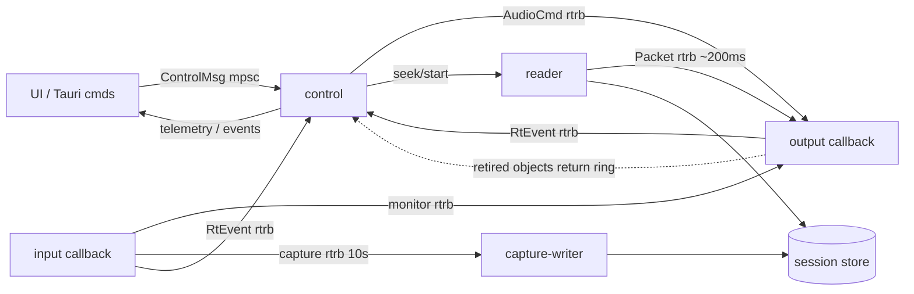

# ADR-002 — Threading & real-time rules
- Status: proposed
- Date: 2026-09-12
- Deciders: owner, orchestrator

## Context
The cpal 0.18 facts we have to design around (MEMORY gotchas):
- Input and output are separate streams, possibly on separate clocks.
- There is no per-channel input selection and no hot-plug notification.
- Callbacks run on host-owned threads.
- Timestamps (`StreamInstant`) are per-stream. Arithmetic across streams is not meaningful.
  `OutputStreamTimestamp { callback, playback }`, `InputStreamTimestamp { callback, capture }`
  (https://docs.rs/cpal/latest/cpal/struct.StreamInstant.html,
  https://docs.rs/cpal/latest/cpal/struct.OutputStreamTimestamp.html).

Performance targets (§4): playback start < 50 ms; full rack < 20 % of a core; NR latency ≤ 50 ms.

The document lives in a memory-mapped chunk store (ADR-004). Page faults must never happen on an
audio thread.

## Decision

### 1. Threads

| Thread | Owner | Blocks/allocates? | Responsibilities |
|---|---|---|---|
| Tauri main (UI) | Tauri | yes | Event loop, WebView. Commands are `async` and forward to the engine handle; no work > ~1 ms on this thread. |
| **control** | `engine` | yes (non-RT) | Only consumer of the `ControlMsg` inbox (std `mpsc`, many producers). **Only producer** of every queue into the audio threads. Owns the transport state machine, device config, the `RackModel` mirror and the playback snapshot. Journal appends (ADR-004). 16 ms tick (see below). |
| device-poll | `engine` | yes | Enumerates hosts/devices every ~1 s, posts diffs to control. Separate thread because ALSA enumeration can block for hundreds of ms. |
| cpal **output** callback | host (RT) | **never** | Transport clock, drains commands, pulls playback + monitor, runs the rack, writes device buffer, meters. |
| cpal **input** callback | host (RT) | **never** | Deinterleaves the selected channel; pushes to capture ring + monitor ring; input meter. |
| **reader/prefetch** | `engine` | may block on I/O; no per-block allocation | Holds the playback `Arc<DocSnapshot>`, reads chunks (mmap), resamples doc→device rate, keeps ~200 ms in the playback ring. |
| **capture-writer** | `engine` | yes | Drains the capture ring into the crash-safe take WAV + chunk store (ADR-004); live recording peaks. |
| workers | `engine` (`rayon` pool, N = clamp(cores − 2, 1, 8)) | yes | Peaks, spectrogram tiles, analysis, import/save/export/bake jobs. Cancellation via generation tokens. |

Control tick (16 ms):
- drain the RT event rings;
- aggregate telemetry into 30 Hz frames (ADR-003);
- drain the return ring: call `deactivate()` on retired chains/instances and drop them (ADR-005);
- check stream error flags.

The engine API (`EngineHandle: Clone + Send + Sync`) is synchronous. `src-tauri` calls it from async
commands through `tauri::async_runtime::spawn_blocking` when a reply can take > 1 ms.

The input stream is opened **on demand**: when input is armed (record panel/meter visible),
monitoring ≠ off, or recording. This avoids a permanent mic-in-use indicator. The output stream runs
**continuously** while an output device is configured, emitting silence when idle, so Play never
pays device start-up latency.

### 2. Real-time contract (all RT callbacks and `process()`)
- **Forbidden:** allocation, deallocation, locks, I/O, logging, syscalls, panics on valid input,
  unbounded loops.
- **Timing:** `std::time::Instant::now()` is the one permitted time read, once per callback.
  It is a vDSO/QPC/`mach_absolute_time` userspace read, used for clock mapping and load
  measurement.
- **Queues:** every RT boundary is an `rtrb` SPSC ring allocated when the stream is built. Each ring
  has exactly one producer thread and one consumer thread. Capacities:

  | Ring | Capacity |
  |---|---|
  | Commands | 1024 |
  | RT events | 1024 per stream |
  | Monitor | 8192 frames |
  | Capture | 10 s |
  | Playback | 64 packets |
  | Return (audio → control) | 64 |

  - A full ring never blocks the RT side. Events are dropped and counted in an atomic.
  - Capture overflow marks the take damaged (ADR-004).
- **Heap objects** handed to the audio thread (chains, module instances) are never dropped there.
  - When replaced, they are pushed onto the **return ring** to the control thread. The control thread
    calls `deactivate()` and drops them, or reuses them (ADR-005).
  - Flow control: the control thread keeps at most 32 swaps in flight, so a push can never fail. If
    one ever did, the audio thread would keep the object in a pending slot and retry on the next
    callback.
  - `assert_no_alloc` also traps deallocation, so an accidental drop on the audio thread fails tests.
- **The audio thread never holds an `Arc<DocSnapshot>`**; only the reader does. Old snapshots are
  therefore always dropped off the audio thread.
- **FTZ/DAZ:** `dsp::fp::DenormalGuard` (MXCSR FTZ|DAZ on x86_64, FPCR.FZ on aarch64, inline asm
  with `// SAFETY:`) at the top of every callback and every offline render. DSP must still be
  denormal-safe.
- **Allocation checks:** debug/test builds wrap callback bodies in `assert_no_alloc`, which catches
  allocations and frees. The fake backend drives the *real* callback code under it with synthetic
  timestamps and random buffer sizes.
- **Block size:** the output callback splits device buffers into sub-blocks of at most
  `MAX_BLOCK = 1024` frames, the realtime `max_block` passed to `activate` (ADR-005). Offline render
  uses 4096.

### 3. UI → audio: commands and parameter events
- Tauri commands reach the audio thread through the control thread: `ControlMsg` → control →
  `AudioCmd` over `rtrb`.
- `AudioCmd` is `Copy`, or carries boxed objects that leave the audio thread only through the return
  ring:
  - Transport and loop: `Play{epoch}`, `Stop`, `Seek{epoch}`, `SetLoop`.
  - Monitoring: `SetMonitor{off|dry|rack}`.
  - Rack: `SwapChain(Box<Chain>)`, `Param{slot, id, value}`, `SetBypass{slot|all}`.
- The output callback drains at most 256 commands per callback.
- **Parameter events:**
  - `Param` commands become entries in per-slot, preallocated event lists (capacity 512) that carry
    **sample offsets**, handed to `process()` for each sub-block.
  - Live UI changes land at offset 0 of the next sub-block. Offline jobs use real offsets.
  - When a list is full, the remaining events carry over to offset 0 of the next block (ADR-005).
  - **Smoothing is owned by the module** (ADR-005).
- **Rack edits** (insert/remove/reorder, `latency_changed`, sample-rate change):
  - The control thread builds and activates the new chain off-thread, where allocation is allowed,
    then sends `SwapChain`.
  - The audio thread swaps at a block boundary, applying the host crossfade (ADR-005).
  - The old chain goes back to the control thread through the return ring, where it is deactivated
    and dropped (ADR-005).
  - The control-side `RackModel` mirror is authoritative for rack state. The audio thread only owns
    the instances.

### 4. Output callback (per callback of *n* frames)
1. Enter the FTZ/DAZ guard; record `t_now`.
2. Drain commands.
3. For each sub-block of up to 1024 frames:
   1. `play` = packets from the playback ring (current epoch only), or zeros.
   2. `mon` = monitor ring through the drift servo (§6).
   3. `rack_in = play + (mon if monitor = rack)`.
   4. `out = rack(rack_in) + (mon if monitor = dry)`.
4. Write the device buffer: sample-format conversion, mono duplicated to all channels.
5. Push `RtEvent::Block { heard_pos, heard_time_ns, frames, peak, sum_sq, flags }`.

The rack has one input stream. During punch-in the playback and monitor signals are summed. Whether
the old material stays audible inside the punch range is a T-304 spec decision; if it must be muted,
the reader does it, by emitting silence packets.

### 5. Playback path: reader, packets, epochs, sample rates
- **Ring element.** The playback ring carries fixed packets:
  `Packet { epoch: u32, flags: u16 (DISCONTINUITY), len: u16, doc_pos: u64, samples: [f32; 256] }`.
  Tagging makes seek, loop wrap and playhead mapping exact without a second queue.
- **Reader loop.**
  - Blocks on its control channel with `recv_timeout(5 ms)`. The control thread is non-RT, so it
    may wake the reader immediately.
  - Tops the ring up to ~200 ms.
  - On loop wrap it emits a short packet up to the loop end, then a `DISCONTINUITY` packet at the
    loop start. The audio thread then calls `reset()` on the rack at that sample, as ADR-005
    requires on seek/loop wrap.
- **Start and seek.**
  - Control bumps the epoch, sends `Start{epoch, pos}` to the reader and `Play{epoch}` to the audio
    thread.
  - The audio thread discards stale-epoch packets.
  - It starts, with a ~5 ms fade-in, once ≥ 20 ms of the current epoch is buffered.
  - Seek while playing: fade-out, discard, reset rack, fade-in. Stop: ~5 ms fade-out.
  - Budget: wake (< 1 ms) + 20 ms read from page cache + one device period + output latency. This
    stays under 50 ms.
- **Sample rates.**
  - Engine rate = output device rate.
  - The control thread opens devices **at the document rate whenever the device supports it**, and
    reopens on document-rate change when not recording. PipeWire/JACK/CoreAudio normally accept it,
    so the common case needs no resampling.
  - Otherwise the **reader resamples doc → device rate** with `rubato::Fft`: synchronous,
    fixed-ratio, allocation-free `process_into_buffer`
    (https://docs.rs/rubato/latest/rubato/). It primes the resampler and discards `output_delay()`
    frames, so packet `doc_pos` stays exact.
  - In that fallback the rack runs at device rate. Modules are rate-agnostic by contract, so preview
    may differ from export only within spec tolerances.
  - If the input device cannot run at the document rate, the capture-writer resamples the take the
    same way.

### 6. Monitoring drift correction — **fill-level servo with fractional resampling**
- **Resampler.** The output callback pulls the monitor ring through `rubato::Async` with septic
  polynomial interpolation (`FixedAsync::Output`, fixed 64-frame chunks plus a carry buffer).
  - Base ratio = out_rate / in_rate.
  - Adjusted with `set_resample_ratio_relative(r, ramp = true)`
    (https://docs.rs/rubato/latest/rubato/struct.Async.html).
- **Controller.** A PI controller on the ring fill level:
  - Target fill F\* = max observed input period + max output period + 1 ms.
  - Input: low-passed fill error (τ ≈ 0.5 s).
  - Output: relative ratio clamped to ±1000 ppm (≤ 1.7 cents). Typical corrections are < 100 ppm,
    which is inaudible.
- **Faults.**
  - Underrun: fade out, reset the integrator, re-prefill to F\*, fade in.
  - Overrun (fill > 4·F\*): drop to F\* with a 64-sample crossfade.
  - Both are counted as `RtEvent`s.
- **Added latency** ≈ F\* + a few samples. "Through rack" adds the rack latency on top, and the UI
  shows the total (monitoring spec).

Rationale: one mechanism covers both **clock drift** between separate devices and **nominal rate
mismatch** (e.g. a 48 kHz mic into a 44.1 kHz output), with no periodic splice artifacts. Cost is
negligible for one mono channel. Monitoring is never recorded, so polynomial interpolation quality
is sufficient.

### 7. RT → control reporting
- Each stream has its own `RtEvent` ring.
- cpal **error callbacks**, which may run on any thread, only set bits in an `AtomicU32`
  (`DEVICE_LOST`, `BACKEND_ERROR`) and bump counters.
- **Xruns** are inferred in the callback: a gap between consecutive `callback` instants
  > 1.5 × the expected period, plus ring under/overflow counters.
- The control thread turns these into log entries (`tracing`) and UI notices.
- On device loss it stops the transport, finalizes a running take (ADR-004) and resumes polling for
  the device.

### 8. Transport time & latency
- **The output callback is the transport clock.**
- **Clock mapping.** Each stream maps its own `StreamInstant`s to one app clock (ns since a
  process-wide `APP_EPOCH: Instant`):
  `app_ns(x) = app_ns(t_now) + (x − ts.callback)`.
- **Per output callback:**
  - `p_in` = doc position of the first frame entering the rack (from its packet).
  - `L_rack` = chain latency in device samples.
  - `heard_pos = p_in − round(L_rack · r_doc / r_dev)`, clamped to at least the play start.
  - `heard_time_ns = app_ns(ts.playback)`.

  This is exactly *displayed playhead = rendered position − rack latency − output latency*, with the
  output latency taken from cpal (`playback − callback`).
- **Recording alignment.** The capture time of an input block is `app_ns(ts.capture)`. A sample
  captured at time T aligns with the document position heard at T, minus a user calibration offset
  (T-304).
- **Document time.** Selection, markers and edits are always in document time (`u64` doc samples).
  A marker added during playback lands at the heard position, extrapolated to the key-press time
  by the UI (ADR-003).

## Consequences
**Positive**
- The RT threads touch only rings, atomics, the rack and preallocated buffers, so there are no page
  faults and no snapshot drops in callbacks.
- Playback start stays under 50 ms because the output stream is already running and the reader is
  woken directly.
- The playhead and recording alignment rest on cpal's own timestamps, not on guessed buffer
  latency.

**Negative**
- Every message has one extra hop through the control thread.
- There are two resampler configurations: the reader's `Fft` and the monitor's `Async`.
- In the rare device-rate fallback, the rack runs at device rate.

**Follow-ups**
- T-105: backend trait, fake backend, rings, reader, `DenormalGuard`.
- T-107: servo, with a simulated ±200 ppm drift test: fill converges within 10 s and there are no
  underruns.
- T-110: a callback-time histogram using the permitted `Instant` read.

## Alternatives considered
- **Sample drop/insert with crossfade** (`rubato::Slip`, which slips a frame with a crossfade and
  corrects up to ~0.8 %,
  https://docs.rs/rubato/latest/rubato/struct.Slip.html): rejected. It cannot handle nominal rate
  mismatch, and it produces periodic splices whose rate scales with drift (100 ppm → ~5 per second
  at 48 kHz). Its advantage, bit-transparency at zero drift, does not matter for monitoring.
- **Rack at document rate with resampling after the rack in the callback**: rejected. The ticket
  places resampling in the reader. It would also put a high-quality sinc resampler on the RT thread.
  The device-rate policy makes the fallback rare anyway.
- **Audio thread holds `Arc<DocSnapshot>` and swaps it live**: rejected. It would need deferred
  drops and mid-play position remapping. Stopping playback on destructive edits (ADR-004) removes
  the need.
- **Starting/stopping the output stream per Play**: rejected. It costs device start latency and
  breaks monitoring.
- **`basedrop` deferred drops instead of the return ring**
  (https://docs.rs/basedrop/latest/basedrop/): rejected. ADR-005 needs retired instances back on the
  control thread for `deactivate()` and possible reuse, which a collector's drop cannot do cleanly.
  The return ring plus `assert_no_alloc`, which traps frees, gives the same safety with one fewer
  dependency.

## Open questions
- None for the owner.
- For T-105: confirm that `pipewire`/`jack` hosts in cpal 0.18 report meaningful `playback`
  timestamps. If not, fall back to buffer-period estimates and flag it in MEMORY.
- For T-105: confirm that opening at the document rate works on PipeWire without an audible
  graph-rate change for other apps.
