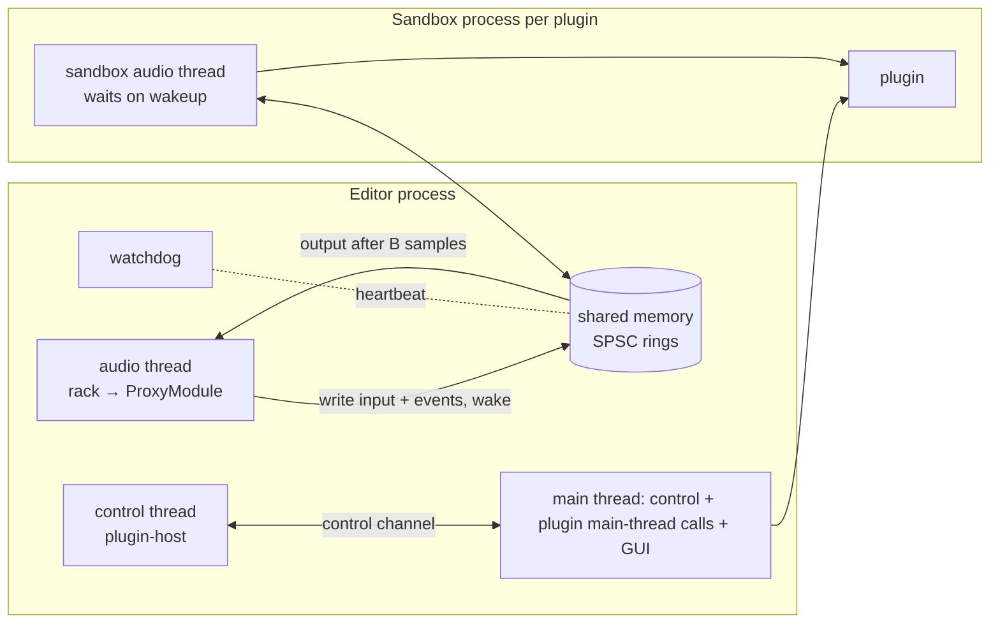

# ADR-008 — Plugin sandbox outline
- Status: accepted (owner, M0 checkpoint 2026-09-12)
- Date: 2026-09-12
- Deciders: owner, orchestrator

## Context
PROMPT §2 (LOCKED) requires external plugins to run **out of process**, with shared-memory audio, so
that "a crashing plugin never takes down the editor or a recording". The rest of the requirements
come from PROMPT §3.7:
- a separate `plugin-sandbox` process per plugin or per chain (this ADR decides);
- shared-memory rings plus a control channel;
- a watchdog, and silence/bypass on failure with a user notice and a flag;
- added latency reported through `latency_samples()`;
- scanning inside the sandbox;
- native editors in M9, using X11/XWayland on Linux.

This is the outline M8 builds on (T-801 ring/wakeup, T-802 process/watchdog/proxy, T-804 scanning,
T-901 editors). Real-time rules (CLAUDE.md, ADR-002) apply to the engine side. Installed PowerVoice
modules run here too (ADR-006).

## Decision

### 1. One sandbox process per plugin instance
Each external plugin instance in the rack gets its own `powervoice-plugin-sandbox` process. Reasons:
- **Exact blame:** a crash or hang identifies exactly one plugin, so flagging and blocklisting are
  precise.
- **Minimal blast radius:** other slots keep running.
- **Simple recovery:** respawn one process and reload one state.
- A voice-over rack is small (typically 0–3 external plugins), so the costs (about 10–30 MB per
  process, one wakeup per slot per block) are negligible.

yabridge, Bitwig and REAPER all offer per-plugin isolation, alongside grouped modes. Our wire protocol
addresses *instances inside* a process, so "sandbox groups" (one process per chain, or per vendor) can
be added later as a policy change if T-801 measurements show that per-slot wakeups cost too much.

### 2. Audio path: pipelined, never blocking the editor's audio thread
- On the engine side each sandboxed plugin is a **`ProxyModule`** (ADR-005 `Module`, in
  `plugin-host`).
- Per instance, one shared-memory segment holds:
  - an **input sample ring**, an **output sample ring** and a **parameter-event ring** (events stamped
    with absolute stream positions);
  - telemetry cells;
  - a header with the protocol version, sizes, sequence counters, heartbeat and a "currently in
    plugin call" marker.

  Everything is sized at `activate` for `max_block`.
- **Realtime mode:** each `process()` call:
  1. writes the block's input and events;
  2. issues one **non-blocking wake**;
  3. reads output delayed by exactly **B = max_block** samples.

  The sandbox always has at least one callback period to produce it. If the output isn't there yet,
  that is a **miss**: the proxy outputs its latency-matched dry signal for the block and counts it. The
  editor's audio thread never waits on another process, so a slow plugin causes a local glitch instead
  of an engine xrun.
- **Offline mode** (export, bake, ACX, CLI): same layout and same latency B, but the proxy **blocks**
  until the output is ready (with the hang timeout). No miss substitution, so renders are
  deterministic.
- **Choosing B.** ADR-002's realtime `MAX_BLOCK` = 1024 is only a ceiling; with it, B would add
  21 ms. The rack therefore activates each sandboxed slot with `max_block` = the current device
  period, rounded up to a power of two and at most 1024, and splits sub-blocks further for that slot
  only.
  - If the device period grows while active, callbacks exceed B and produce misses. The control
    thread sees the period change (RT event) and replaces the proxy with a new B (`Restart`).
- `latency_samples()` = **B + the plugin's own latency**. If the plugin's latency changes (CLAP
  `request_restart`, VST3 `kLatencyChanged`), the proxy raises `HostRequest::Restart` (ADR-005 §12).
  Example cost: B = 256 at 48 kHz adds 5.3 ms, which is compensated. It is noticeable only when
  monitoring through the rack.
- **RT-rule exception, to be recorded in ADR-002 and MEMORY:** the wake is a syscall
  (futex wake / `SetEvent` / `sem_post`). It is bounded and non-blocking, and it is the only syscall
  allowed on the audio thread, only inside `ProxyModule`.

### 3. Wakeup primitives (behind one `Wakeup` shim, T-801: `wake()` non-blocking, `wait(timeout)`)
- **Linux:** a futex on a 32-bit word in the shared segment (`FUTEX_WAKE`/`FUTEX_WAIT` *without*
  `FUTEX_PRIVATE_FLAG`, since it's cross-process). No fd passing is needed. eventfd is the fallback if
  futex turns out to be problematic.
- **Windows:** auto-reset event objects with random 128-bit names under `Local\`, passed on the command
  line. Hardening option: duplicate unnamed handles into the child (`DuplicateHandle`). The semantics
  are identical.
- **macOS:** POSIX named semaphores (`sem_open`, random names, `sem_unlink` right after both sides have
  opened them). Unnamed process-shared semaphores are unavailable, and private `__ulock` APIs are
  avoided.
- **Shared memory:**
  - Linux: `memfd_create` + seals, fd inherited by the child;
  - Windows: pagefile-backed `CreateFileMapping`;
  - macOS: `shm_open` + unlink after mapping.

  A thin hand-rolled OS layer (~300 lines) is preferred over a framework (see prior art).
- The sandbox's audio thread requests real-time priority itself: rtkit on Linux, MMCSS "Pro Audio" on
  Windows, time-constraint policy on macOS. In the editor, cpal owns the callback threads, so ADR-002
  has no such helper and T-802 implements one for the sandbox.

### 4. Control channel
- A local socket per instance: a Unix domain socket on Linux/macOS, a named pipe on Windows.
- Messages are length-prefixed `serde` messages, JSON in v1 because the traffic is low-rate; switch to a
  compact binary format only if profiling says so.
- Messages carry: handshake (protocol version), load/instantiate, activate/deactivate, param
  info/text (`ParamText`), state save/load (`LiveState` snapshots), extension calls (response curve),
  scan results, editor open/close (M9), log forwarding, shutdown.
- Every request has a timeout: 5 s for load/activate/state, 30 s for a scan.
- **Parent-death handling:** Linux `PR_SET_PDEATHSIG`; a Windows job object with `KILL_ON_JOB_CLOSE`;
  on macOS, EOF on the control socket or kqueue on the parent pid. The sandbox never outlives the
  editor.

### 5. Watchdog and failure policy
- The sandbox bumps a **heartbeat** counter every processed block and in its idle loop. A watchdog
  thread on the editor side (not the audio thread) checks it along with the miss counter.
- **Hang:** no progress for 250 ms while fed, or a control request timeout. The watchdog kills the
  process (`SIGKILL` / `TerminateProcess`). **Crash:** process exit or control-socket EOF.
- **On failure during playback or monitoring:**
  - the slot goes to host bypass (latency-matched dry, 15 ms crossfade, ADR-005 §9) and is marked
    *failed*;
  - the user gets a notice "‹Plugin› stopped responding and was bypassed" with **Restart plugin**
    (respawn + reload the last committed/`LiveState` state) and **Remove**;
  - the crash is counted and the plugin is **flagged** (warning badge) in the plugin manager.

  There is no automatic restart, because a deterministic crash would loop.
- **Recording is never affected:** the take is written from the dry input path, not through the rack
  (ADR-002). A plugin failure can only affect what is heard.
- **During an offline render:** failure **aborts the render with an error**. We never export a
  silently wrong file.
- **Blocklist policy:** plugins that crash or time out while *scanning* are auto-blocklisted
  (path + size + mtime + hash; they are cleared when the file changes or the user unblocks them).
  Runtime crashes only flag, and the user decides whether to blocklist.

### 6. Scanning happens in the sandbox
- `powervoice-plugin-sandbox --scan <file> --format <clap|vst3|lv2|jsfx>` loads **one plugin file per
  process**, enumerates its plugins (descriptor, audio ports, supported layouts, parameter count,
  PowerVoice `module-info` if present), prints JSON and exits.
- T-804 orchestrates scans: N parallel scans (N = cores/2), cached by (path, size, mtime).
- VST3 bundles with `moduleinfo.json` are indexed without loading code (T-806).
- A crashing scan can't kill the editor or the rest of the scan.

### 7. Editor windows (M9) are owned by the sandbox
- Plugin GUIs run on the sandbox's main thread as **floating top-level windows**.
- **Linux:** X11 windows, via XWayland under Wayland. Wayland has no cross-process embedding and the
  plugin GUI APIs (CLAP/VST3/LV2 on Linux) are X11-based, so the window is a normal floating window
  with a transient-for hint only where the editor window is also X11.
- **Windows:** a top-level HWND whose owner is the editor's main window. The handle is passed over the
  control channel; cross-process ownership is allowed.
- **macOS:** an NSWindow in the sandbox process, with no cross-process parenting.
- The editor never embeds foreign GUIs. Plugin-originated parameter changes come back as output events
  and update the host mirror.

### 8. What the sandbox links
The sandbox binary links the format hosts: CLAP (`clack-host`), VST3 (`vst3`), LV2 (`livi`), JSFX
(`ysfx`, **only here**; see ADR-007), and VST2 (T-811, gated; prefers a Carla bridge). The editor
binary links none of them. This keeps foreign code, crash risk and license-sensitive code in one
binary.

### 9. Security scope
The sandbox is a **crash-isolation boundary, not a security boundary**: plugins keep the user's
privileges. OS-level confinement (seccomp/Landlock, AppContainer, App Sandbox) is out of scope for v1.
32-bit Windows plugins are out of scope. Linux users can load Windows plugins through yabridge, which
exposes them as native VST3/CLAP.

## Consequences
**Positive**
- A crashing or hanging plugin can't take down the editor or a recording, and blame is exact.
- The audio thread never blocks on foreign code.
- Offline renders stay deterministic.
- Latency is constant and compensated through the normal Module API path.
- The same machinery serves scanning, installed modules and M9 editors.

**Negative**
- B samples of extra latency per sandboxed plugin (it only matters for monitoring through the rack).
- One process, and a little memory, per instance.
- Three OS-specific wakeup and shared-memory implementations, two of them untested on the owner's
  platform.
- A narrowly scoped exception to the "no syscalls" rule.

**Follow-ups**
- T-801: shim, rings, crash/hang/gain test plugins; measure wake round-trip cost and miss rate at
  B = 64/128/256.
- T-802: process lifecycle, watchdog, `ProxyModule`, failure UX.
- T-804: scan orchestration and blocklist.
- T-901: editors.
- ADR-002 and MEMORY: record the wake-syscall exception.

## Alternatives considered
- **One process per chain, or one process for all plugins:** fewer wakeups, but one crash silences
  every plugin in it and blame needs the in-call marker. Kept as a future grouping policy.
- **Synchronous round trip inside the callback (zero added latency; yabridge and Carla style):** the
  editor's audio thread would block on another process, so a slow plugin would xrun the whole engine.
  It could come later as a per-plugin "low-latency" option if monitoring latency becomes an issue.
- **`iceoryx2`** (MIT OR Apache-2.0, cross-platform zero-copy IPC): capable, but a large general-purpose
  pub/sub framework for what is two SPSC rings and a wake. Evaluate in T-801 as a benchmark reference.
- **`shmem-ipc`** (Apache-2.0/MIT): a clean memfd + eventfd SPSC design, but **Linux-only** (per its
  README). Used as a design reference.
- **Carla bridges (GPL-2.0-or-later) and yabridge (GPL-3.0):** proven designs (a shared-memory RT ring
  plus a non-RT channel, per-plugin processes with optional groups). Studied, **no code copied**
  (license). Bitwig and REAPER's per-plugin/grouped/dedicated modes are the UX reference.

## Open questions
1. Is B = one host block acceptable for "monitoring through rack" with external plugins, or does the
   owner want the synchronous low-latency option as well? Decide after the T-801 measurements.
2. Does the owner accept that sandboxing is crash isolation only, with no protection against
   malicious plugins?
