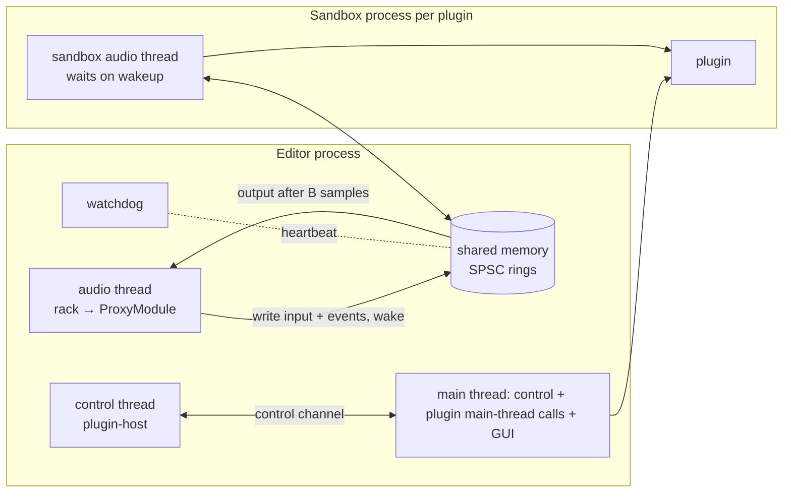

# ADR-008 — Plugin sandbox outline
- Status: accepted (owner, M0 checkpoint 2026-09-12)
- Date: 2026-09-12
- Deciders: owner, orchestrator

## Context
PROMPT §2 (LOCKED) requires external plugins to run **out of process**, with shared-memory audio, so
that "a crashing plugin never takes down the editor or a recording". The rest of the requirements
come from PROMPT §3.7:
- a separate `plugin-sandbox` process per plugin or per chain (this ADR decides);
- shared-memory rings plus a control channel;
- a watchdog, and silence/bypass on failure with a user notice and a flag;
- added latency reported through `latency_samples()`;
- scanning inside the sandbox;
- native editors in M9, using X11/XWayland on Linux.

This is the outline M8 builds on (T-801 ring/wakeup, T-802 process/watchdog/proxy, T-804 scanning,
T-901 editors). Real-time rules (CLAUDE.md, ADR-002) apply to the engine side. Installed PowerVoice
modules run here too (ADR-006).

## Decision

### 1. One sandbox process per plugin instance
Each external plugin instance in the rack gets its own `powervoice-plugin-sandbox` process. Reasons:
- **Exact blame:** a crash or hang identifies exactly one plugin, so flagging and blocklisting are
  precise.
- **Minimal blast radius:** other slots keep running.
- **Simple recovery:** respawn one process and reload one state.
- A voice-over rack is small (typically 0–3 external plugins), so the costs (about 10–30 MB per
  process, one wakeup per slot per block) are negligible.

yabridge, Bitwig and REAPER all offer per-plugin isolation, alongside grouped modes. Our wire protocol
addresses *instances inside* a process, so "sandbox groups" (one process per chain, or per vendor) can
be added later as a policy change if T-801 measurements show that per-slot wakeups cost too much.

### 2. Audio path: pipelined, never blocking the editor's audio thread
- On the engine side each sandboxed plugin is a **`ProxyModule`** (ADR-005 `Module`, in
  `plugin-host`).
- Per instance, one shared-memory segment holds:
  - an **input sample ring**, an **output sample ring** and a **parameter-event ring** (events stamped
    with absolute stream positions);
  - telemetry cells;
  - a header with the protocol version, sizes, sequence counters, heartbeat and a "currently in
    plugin call" marker.

  Everything is sized at `activate` for `max_block`.
- **Realtime mode:** each `process()` call:
  1. writes the block's input and events;
  2. issues one **non-blocking wake**;
  3. reads output delayed by exactly **B = max_block** samples.

  The sandbox always has at least one callback period to produce it. If the output isn't there yet,
  that is a **miss**: the proxy outputs its latency-matched dry signal for the block and counts it. The
  editor's audio thread never waits on another process, so a slow plugin causes a local glitch instead
  of an engine xrun.
- **Offline mode** (export, bake, ACX, CLI): same layout and same latency B, but the proxy **blocks**
  until the output is ready (with the hang timeout). No miss substitution, so renders are
  deterministic.
- **Choosing B.** ADR-002's realtime `MAX_BLOCK` = 1024 is only a ceiling; with it, B would add
  21 ms. The rack therefore activates each sandboxed slot with `max_block` = the current device
  period, rounded up to a power of two and at most 1024, and splits sub-blocks further for that slot
  only.
  - If the device period grows while active, callbacks exceed B and produce misses. The control
    thread sees the period change (RT event) and replaces the proxy with a new B (`Restart`).
- `latency_samples()` = **B + the plugin's own latency**. If the plugin's latency changes (CLAP
  `request_restart`, VST3 `kLatencyChanged`), the proxy raises `HostRequest::Restart` (ADR-005 §12).
  Example cost: B = 256 at 48 kHz adds 5.3 ms, which is compensated. It is noticeable only when
  monitoring through the rack.
- **RT-rule exception, to be recorded in ADR-002 and MEMORY:** the wake is a syscall
  (futex wake / `SetEvent` / `sem_post`). It is bounded and non-blocking, and it is the only syscall
  allowed on the audio thread, only inside `ProxyModule`.

### 3. Wakeup primitives (behind one `Wakeup` shim, T-801: `wake()` non-blocking, `wait(timeout)`)
- **Linux:** a futex on a 32-bit word in the shared segment (`FUTEX_WAKE`/`FUTEX_WAIT` *without*
  `FUTEX_PRIVATE_FLAG`, since it's cross-process). No fd passing is needed. eventfd is the fallback if
  futex turns out to be problematic.
- **Windows:** auto-reset event objects with random 128-bit names under `Local\`, passed on the command
  line. Hardening option: duplicate unnamed handles into the child (`DuplicateHandle`). The semantics
  are identical.
- **macOS:** POSIX named semaphores (`sem_open`, random names, `sem_unlink` right after both sides have
  opened them). Unnamed process-shared semaphores are unavailable, and private `__ulock` APIs are
  avoided.
- **Shared memory:**
  - Linux: `memfd_create` + seals, fd inherited by the child;
  - Windows: pagefile-backed `CreateFileMapping`;
  - macOS: `shm_open` + unlink after mapping.

  A thin hand-rolled OS layer (~300 lines) is preferred over a framework (see prior art).
- The sandbox's audio thread requests real-time priority itself: rtkit on Linux, MMCSS "Pro Audio" on
  Windows, time-constraint policy on macOS. In the editor, cpal owns the callback threads, so ADR-002
  has no such helper and T-802 implements one for the sandbox.

### 4. Control channel
- A local socket per instance: a Unix domain socket on Linux/macOS, a named pipe on Windows.
- Messages are length-prefixed `serde` messages, JSON in v1 because the traffic is low-rate; switch to a
  compact binary format only if profiling says so.
- Messages carry: handshake (protocol version), load/instantiate, activate/deactivate, param
  info/text (`ParamText`), state save/load (`LiveState` snapshots), extension calls (response curve),
  scan results, editor open/close (M9), log forwarding, shutdown.
- Every request has a timeout: 5 s for load/activate/state, 30 s for a scan.
- **Parent-death handling:** Linux `PR_SET_PDEATHSIG`; a Windows job object with `KILL_ON_JOB_CLOSE`;
  on macOS, EOF on the control socket or kqueue on the parent pid. The sandbox never outlives the
  editor.

### 5. Watchdog and failure policy
- The sandbox bumps a **heartbeat** counter every processed block and in its idle loop. A watchdog
  thread on the editor side (not the audio thread) checks it along with the miss counter.
- **Hang:** no progress for 250 ms while fed, or a control request timeout. The watchdog kills the
  process (`SIGKILL` / `TerminateProcess`). **Crash:** process exit or control-socket EOF.
- **On failure during playback or monitoring:**
  - the slot goes to host bypass (latency-matched dry, 15 ms crossfade, ADR-005 §9) and is marked
    *failed*;
  - the user gets a notice "‹Plugin› stopped responding and was bypassed" with **Restart plugin**
    (respawn + reload the last committed/`LiveState` state) and **Remove**;
  - the crash is counted and the plugin is **flagged** (warning badge) in the plugin manager.

  There is no automatic restart, because a deterministic crash would loop.
- **Recording is never affected:** the take is written from the dry input path, not through the rack
  (ADR-002). A plugin failure can only affect what is heard.
- **During an offline render:** failure **aborts the render with an error**. We never export a
  silently wrong file.
- **Blocklist policy:** plugins that crash or time out while *scanning* are auto-blocklisted
  (path + size + mtime + hash; they are cleared when the file changes or the user unblocks them).
  Runtime crashes only flag, and the user decides whether to blocklist.

### 6. Scanning happens in the sandbox
- `powervoice-plugin-sandbox --scan <file> --format <clap|vst3|lv2|jsfx>` loads **one plugin file per
  process**, enumerates its plugins (descriptor, audio ports, supported layouts, parameter count,
  PowerVoice `module-info` if present), prints JSON and exits.
- T-804 orchestrates scans: N parallel scans (N = cores/2), cached by (path, size, mtime).
- VST3 bundles with `moduleinfo.json` are indexed without loading code (T-806).
- A crashing scan can't kill the editor or the rest of the scan.

### 7. Editor windows (M9) are owned by the sandbox
- Plugin GUIs run on the sandbox's main thread as **floating top-level windows**.
- **Linux:** X11 windows, via XWayland under Wayland. Wayland has no cross-process embedding and the
  plugin GUI APIs (CLAP/VST3/LV2 on Linux) are X11-based, so the window is a normal floating window
  with a transient-for hint only where the editor window is also X11.
- **Windows:** a top-level HWND whose owner is the editor's main window. The handle is passed over the
  control channel; cross-process ownership is allowed.
- **macOS:** an NSWindow in the sandbox process, with no cross-process parenting.
- The editor never embeds foreign GUIs. Plugin-originated parameter changes come back as output events
  and update the host mirror.

### 8. What the sandbox links
The sandbox binary links the format hosts: CLAP (`clack-host`), VST3 (`vst3`), LV2 (`livi`), JSFX
(`ysfx`, **only here**; see ADR-007), and VST2 (T-811, gated; prefers a Carla bridge). The editor
binary links none of them. This keeps foreign code, crash risk and license-sensitive code in one
binary.

### 9. Security scope
The sandbox is a **crash-isolation boundary, not a security boundary**: plugins keep the user's
privileges. OS-level confinement (seccomp/Landlock, AppContainer, App Sandbox) is out of scope for v1.
32-bit Windows plugins are out of scope. Linux users can load Windows plugins through yabridge, which
exposes them as native VST3/CLAP.

## Consequences
**Positive**
- A crashing or hanging plugin can't take down the editor or a recording, and blame is exact.
- The audio thread never blocks on foreign code.
- Offline renders stay deterministic.
- Latency is constant and compensated through the normal Module API path.
- The same machinery serves scanning, installed modules and M9 editors.

**Negative**
- B samples of extra latency per sandboxed plugin (it only matters for monitoring through the rack).
- One process, and a little memory, per instance.
- Three OS-specific wakeup and shared-memory implementations, two of them untested on the owner's
  platform.
- A narrowly scoped exception to the "no syscalls" rule.

**Follow-ups**
- T-801: shim, rings, crash/hang/gain test plugins; measure wake round-trip cost and miss rate at
  B = 64/128/256.
- T-802: process lifecycle, watchdog, `ProxyModule`, failure UX.
- T-804: scan orchestration and blocklist.
- T-901: editors.
- ADR-002 and MEMORY: record the wake-syscall exception.

## Alternatives considered
- **One process per chain, or one process for all plugins:** fewer wakeups, but one crash silences
  every plugin in it and blame needs the in-call marker. Kept as a future grouping policy.
- **Synchronous round trip inside the callback (zero added latency; yabridge and Carla style):** the
  editor's audio thread would block on another process, so a slow plugin would xrun the whole engine.
  It could come later as a per-plugin "low-latency" option if monitoring latency becomes an issue.
- **`iceoryx2`** (MIT OR Apache-2.0, cross-platform zero-copy IPC): capable, but a large general-purpose
  pub/sub framework for what is two SPSC rings and a wake. Evaluate in T-801 as a benchmark reference.
- **`shmem-ipc`** (Apache-2.0/MIT): a clean memfd + eventfd SPSC design, but **Linux-only** (per its
  README). Used as a design reference.
- **Carla bridges (GPL-2.0-or-later) and yabridge (GPL-3.0):** proven designs (a shared-memory RT ring
  plus a non-RT channel, per-plugin processes with optional groups). Studied, **no code copied**
  (license). Bitwig and REAPER's per-plugin/grouped/dedicated modes are the UX reference.

## Open questions
1. Is B = one host block acceptable for "monitoring through rack" with external plugins, or does the
   owner want the synchronous low-latency option as well? Decide after the T-801 measurements.
2. Does the owner accept that sandboxing is crash isolation only, with no protection against
   malicious plugins?

## Amendment 1 — T-801 transport, as implemented (2026-09-14)
Crate `vox-sandbox-ipc` (std + libc; windows-sys on Windows; no new third-party crate).

### 1. Segment layout, version 1 (`layout.rs`, frozen by `tests/layout.rs`)
| Offset | Size | Content |
|---|---|---|
| 0 | 64 | header, host-written once: magic `PVSBXIPC`, version, sizes, sample rate, `max_block` B, ring capacity C, event capacity E, latency L, start position, host pid |
| 64 | 64 | host cursors: `in_write_pos`, event cursors, `host_command` (run/shutdown) |
| 128 | 64 | plugin cursors: `in_read_pos`, `out_write_pos`, `out_valid_from`, event cursors, overruns, chunks |
| 192, 256 | 64 + 64 | doorbells host → plugin and plugin → host (`seq`, `waiters`) |
| 320 | 64 | liveness, plugin-written: state (Created/Running/Stopped/Failed), plugin pid, heartbeat, in-call marker |
| 384 | 64 | 16 telemetry cells (`f32` bits) |
| 512 | 4C + 4C | input and output **sample rings** |
| 512 + 8C | 32E + 32E | event rings host → plugin and plugin → host (`pos`, `id`, `kind`, `value`) |

- The rings are **indexed by absolute stream position** (masked by C − 1), not by block, so the
  output delay is exactly L for any callback size ≤ B. C = next_pow2(8·B), at least 64. The
  total size is rounded up to 4 KiB.
- L = `latency_samples` ∈ [0, B]. The default L = B is §2's pipelined mode. L = 0 is the
  synchronous "low-latency" alternative, and uses the same code path.
- Every word is an atomic. The host never indexes with a plugin cursor unmasked, and it treats
  `out_write_pos` beyond its own published input as a miss. The dry signal comes from a host-local
  copy of the input.
- **Overrun:** the host never waits for ring space; it overwrites. The plugin re-checks
  `in_write_pos` after copying (a seqlock-style check). If it lags by more than C − B, it
  resynchronises to the present and publishes `out_valid_from`, and the host treats older output
  as a miss.
- **Event rings** are SPSC. When full, the event is dropped and counted. The plugin delivers the
  events with `pos` < chunk end; late events land at offset 0.

### 2. Wakeup and shared memory
- **Linux:** futex as decided in §3: `FUTEX_WAKE` only when the peer is parked (waiter count),
  `FUTEX_WAIT_BITSET` with an absolute deadline.
- **Shared memory, Linux:** memfd with shrink/grow/seal seals. The fd is inherited by exactly one
  child: `pre_exec` clears `FD_CLOEXEC` in that child only. The handle is `memfd:<fd>`.
- **Shared memory, macOS:** `shm_open` (also built and tested on Linux).
- **Shared memory, Windows:** `CreateFileMappingW`; only compile-checked (`just check-cross`).
- **macOS/Windows wakeup:** they use the portable `SpinYieldWakeup` for now: spin, then yield for up
  to 1 ms, then sleep in 100 µs steps, bounded by the deadline. The §3 primitives (named semaphores,
  named events) need per-doorbell OS handles passed next to the segment handle. They come with the
  process lifecycle (T-802) behind the same `Wakeup` trait.

### 3. Host wait and failure model
- **Wait budget:** `HostEnd::process` waits at most `WaitBudget::FractionOfBlock(0.25)` of the
  block period by default. `Fixed(hang_timeout)` is §2's offline mode (`HostOptions::offline`),
  where a miss means the render aborts. After 4 consecutive misses the host stops waiting until a
  block is on time. ADR-002 Amendment 2 records the syscall exception.
- **Miss:** the host outputs dry with a **splice crossfade** over 96 samples:
  `dry + δ·(1 − t)`, where δ = last output − dry at that position. The wet signal is unknown at a
  miss, so a true crossfade isn't possible. Recovery is a linear dry → wet crossfade over 96
  samples. Fully wet and fully dry blocks are bit-exact copies. This short glitch fade is
  separate from §5's 15 ms slot bypass, which T-802 applies on a fault.
- **Fault detection:** `Monitor::poll(PeerStatus)` runs on the control thread and never blocks.
  - `Crashed`: the process is gone (`Child::try_wait`; an unreaped crashed child is a zombie that
    `kill(pid, 0)` misses).
  - `Exited`: the plugin stopped cleanly without being asked to.
  - `Failed`: the plugin reported a fatal error.
  - `Hung { stale, in_call }`: the heartbeat has been stale for ≥ 250 ms. The clock starts at
    attach.
- **Effect of a fault:** the first fault sets the host's bypass flag. From then on the host
  outputs dry and makes no wake or wait. Misses are not faults; they reach the control thread as
  counters (`Health::new_misses`).
- **Heartbeat and shutdown:** the plugin bumps the heartbeat on every chunk and on every idle
  wake-up; the idle timeout must stay well below the hang timeout (the test plugins use 20 ms).
  Shutdown is `host_command` + a ring; the plugin then marks itself Stopped, which is not a fault.

### 4. Measurements (T-801 follow-up; this machine: 16 threads, Linux 7.2, release build)
Setup: the gain test plugin runs in a child process, paced at the real-time rate, 3 s per row,
with no RT priority on either side (`just bench`). Round trip = `HostEnd::process` duration.

| Block (period) | sync futex p50 / p99 / max µs | sync spin-yield p50 / p99 / max µs | pipelined futex (host cost) p50 / p99 / max µs | misses |
|---|---|---|---|---|
| 64 (1333 µs) | 113 / 211 / 365 | 70 / 200 / 268 | 7.8 / 21 / 95 | 0 |
| 128 (2667 µs) | 142 / 250 / 680 | 60 / 150 / 776 | 11 / 33 / 97 | 0 |
| 256 (5333 µs) | 115 / 226 / 526 | 66 / 144 / 605 | 17 / 26 / 70 | 0 |
| 512 (10667 µs) | 124 / 244 / 317 | 71 / 160 / 564 | 18 / 36 / 147 | 0 |

**Open question 1:** a synchronous (L = 0) round trip fits comfortably in the budget: its p99 is
16 % of a 64-frame period. That makes a per-plugin "low-latency" option viable later. Pipelined
L = B stays the default: it adds about 8–18 µs per callback and had no misses. Most of the
synchronous cost is waking the idle sandbox thread; RT priority (T-802) should shrink the tails.
iceoryx2 was not benchmarked, since that would add a dependency and the hand-rolled layer already
meets the budget.

## Amendment 2 — T-802 process, control channel, watchdog and proxy, as implemented (2026-09-14)
Crates: `vox-plugin-host` (editor side: `ProxyModule`, `SandboxFactory`, control client,
watchdog) and `powervoice-sandbox` (the process: backend seam, test backend, audio thread). The
editor links no plugin format code (§8). No new third-party crate.

### 1. Process
- **`powervoice-sandbox --shm <handle> --host-pid <pid>`**, one per plugin instance (§1). The
  binary is looked up next to the editor executable (`POWERVOICE_SANDBOX_BIN` overrides; `just dev`
  builds it; bundling it as a Tauri sidecar is a packaging follow-up).
- A **`PluginBackend`** (`load(plugin) → PluginInstance`) is the seam for T-803+ formats.
  `PluginInstance` is shared by the sandbox's main thread (control requests) and its audio
  thread (`process`), and synchronises internally, like a CLAP plugin.
- **Test backend** (`"test"`): `gain` hosts the built-in Gain module, so the proxy path can be
  compared bit for bit with the in-process module. `crash`, `hang` and `slow` add T-801's fault
  behaviours on top. Options go in the plugin reference, e.g. `crash?after=200`.
- **Sandbox audio thread:** it runs `PluginEnd::service` with a 20 ms idle timeout, and requests
  `SCHED_FIFO` at priority 60 (or the `RLIMIT_RTPRIO` ceiling) when allowed. rtkit, MMCSS and
  macOS are follow-ups.
- **Exit conditions:** the sandbox exits on `Shutdown`, on stdin EOF, when the host pid is gone,
  and, on Linux, on `PR_SET_PDEATHSIG`.

### 2. Control channel: pipes, not a socket
§4's local socket is replaced by the child's **stdin (host → sandbox)** and a **private duplicate
of its stdout** (sandbox → host). The sandbox points its own fd 1 at stderr, so a plugin that
prints can't corrupt the stream. Why pipes:
- they work the same on every OS through `std::process`, with no fd passing;
- EOF on stdin tells the sandbox the host is gone, on every platform.

**Frame:**
- a `u32` total length and a `u32` JSON length, both little-endian;
- the JSON message (`vox_sandbox_ipc::protocol`, `PROTOCOL_VERSION = 1`);
- a **binary payload** for plugin state, so state is never base64 inside JSON;
- at most 64 MiB.

**Requests and replies:**

| Request | Reply |
|---|---|
| `Hello {protocol}` | `Hello {protocol, pid}` |
| `Load {backend, plugin}` | `Loaded {name, vendor, version, params, groups, values}` (the module API's own serde types) |
| `Activate {sample_rate, max_block, mode}` | `Activated {latency_samples, tail_samples}` |
| `Deactivate` | `Ok` |
| `SetParams {values}` (inactive only) | `Ok` |
| `SaveState` | `State` + payload |
| `LoadState` + payload (inactive only) | `Params {values}` |
| `Shutdown` | `Ok` |

Failures answer `Error {message}`. The host side uses one writer thread and one reader thread per
sandbox, so a request never blocks the caller beyond its timeout.

**Timeouts:** 5 s for load, activate and state; 1 s for deactivate. A timeout counts as a hang
(the process is killed), and a closed channel as a crash.

### 3. Segment lifetime
- The host creates **one segment at spawn**, sized for the largest `B` (`MAX_TRANSPORT_BLOCK` =
  4096 = the offline block, about 300 KB). On Linux it is the memfd, inherited by this child only.
- Before every `Activate` the host re-initialises it (`Channel::create_in` on a duplicate
  mapping) for the actual `ChannelConfig::pipelined(rate, B)`, and the sandbox re-attaches.
- Named segments (macOS) are unlinked right after `Hello`, since both sides have them open by
  then. On Linux no named object ever exists.

### 4. Choosing `B`; latency
- **Offline:** `B` = the render block, with `HostOptions::offline(5 s)`.
- **Realtime:** `B` = next_pow2(max(largest callback seen by this factory's instances,
  `min_block` = 256)), capped by `max_block`.
- If a callback exceeds `B`, the proxy raises `HostRequest::Restart` once and records the size.
  The rack's normal replacement then activates a new instance with the larger `B`. This
  implements §2's "period change → Restart" without the engine telling plugins the device period.
- `latency_samples()` = `B` + the plugin's own latency.

### 5. Watchdog
**One `sandbox-watchdog` thread per editor process.** It spawns every sandbox, so
`PR_SET_PDEATHSIG`, which follows the *spawning thread*, is tied to a thread that lives as long
as the editor.

**Supervision**, every 10 ms, for each live sandbox: `Monitor::poll(PeerStatus::of_child)`.
- A hang (250 ms stale while fed) → SIGKILL.
- Every fault flips the channel to bypass. The `Monitor` now also **rings `to_host`** when it
  bypasses, and `HostEnd`'s bounded wait ends early on bypass, so an offline render aborts at once
  instead of after its 5 s timeout.

**Retiring**, when a proxy is dropped (the drop never blocks):
1. the channel is shut down (`host_command`) and `Shutdown` is sent;
2. stdin is closed;
3. the process gets 500 ms, then SIGKILL, and is **always reaped**.

The tests verify that removal, teardown, an editor `exit()` and an editor SIGKILL leave no
process, no fd and no `/dev/shm/pvs.*` object.

### 6. Failure policy (supersedes §5's "no automatic restart")
T-802 asks for "restart once with the last good state". A sandboxed slot whose proxy returns
`ProcessStatus::Error` gets this sequence:
1. The rack bypasses it with its 15 ms latency-matched crossfade (ADR-005 §9).
2. It marks the slot **Restarting** ("‹plugin› crashed / stopped responding and was bypassed";
   the reason comes from ADR-005 Amendment 3's `AdapterHealth`).
3. After 200 ms it replaces the instance with one built from the slot's committed state (a new
   process).
4. A second failure leaves the slot **Failed**, still bypassed, with a **Retry** action (= Restart).
   Retry resets the budget.

"Once" bounds the loop a deterministic crash would cause. Other rules:
- Invalid audio (non-finite output) and in-process modules never restart automatically.
- Offline, a failure (or a block that misses its deadline) aborts the render (`SlotFailed`).
- Recording is unaffected (the take is written from the dry input).

### 7. State
The proxy's `ModuleState`:
- `params` = the mirrored values (keyed by the plugin's parameter keys);
- `blob` = the plugin's state wrapped with its identity: magic `PVPLUGST`, wrapper version 1, a
  JSON header `{format, plugin, id, version}`, then the plugin bytes verbatim.

Loading applies the blob first, then the values (the values win: the rack's committed state
carries mirror values next to the blob captured at instantiation). A blob whose `id` or
`format` differs is refused. This state round-trips through the sidecar (`RackModel` JSON) and
module presets.

### 8. UI and developer flag
- `RackSlotDto.sandboxed` and `SlotStatusDto::Restarting` drive the slot badges: Running,
  Restarting…, Plugin failed, and Not installed for a missing module. The failure reason, and
  for a failed slot a **Retry** button, appear in the slot.
- `POWERVOICE_DEV_PLUGINS=1` registers `test:gain`, `test:crash` and `test:hang` (they fail after
  about 8 s) in every composition root. Without the flag, a sidecar's test slots load as "Not
  installed" placeholders (H-15) and are written back verbatim.

### 9. Known limits, for T-803+
- Instantiation (spawn, `Hello`, `Load`, `LoadState`, `Activate`) runs synchronously on the rack's
  control thread. That is a few ms with the test backend; real plugins need asynchronous
  instantiation.
- The rack's committed blob is captured at instantiation. Plugin state that isn't a parameter and
  changes later (GUIs, M9) needs a refresh from the live plugin at save time.
- `HostEnd`'s short miss substitute is delayed by `B`, not by `B` + the plugin's own latency. The
  rack's slot bypass is correctly latency-matched.
- Windows: no job object (`KILL_ON_JOB_CLOSE`) yet, no stdout redirect, and the wakeup is still
  spin-then-yield (Amendment 1 §2).

## Amendment 3 — T-803 CLAP backend, enumeration and asynchronous loading, as implemented (2026-09-14)
New crates: `vox-clap-abi` (bindings) and `vox-test-clap` (test plugin, never shipped). No new
third-party crate.

### 1. Bindings are hand-written, not clack (refines §8)
- **`vox-clap-abi`** transcribes the CLAP 1.2 subset we use as `#[repr(C)]` types:
  - the entry point and plugin factory, the plugin and host vtables;
  - `clap_process`, audio buffers, parameter and gesture events, in/out event lists, streams;
  - `params`, `state`, `latency`, `tail`, `audio-ports`, `log`, `thread-check`.
- It is layout-tested on 64-bit targets. The headers' MIT notice is in `LICENSE-CLAP` and in
  THIRD_PARTY_NOTICES (ADR-007 amendment).
- Why not `clack-host`: its API isn't frozen (ADR-007 pins exact versions), and the subset is
  about 600 lines. The plugins are loaded with `libloading`, already in the tree for LAME.
- Only `powervoice-sandbox` and the test plugin link the bindings; the editor links none.

### 2. The CLAP backend (`crates/sandbox/src/clap/`)
**Identity.** The plugin reference is `ClapPluginRef`, the JSON `{path, id}`. The module id is
`clap:<plugin id>`; the version comes from `Version::parse_lenient`.

**Load** (main thread): dlopen → `clap_entry.init(path)` → factory → `create_plugin` → `init`.
- The plugin needs `clap.audio-ports` with at least one input and one output: effects only.
  `note-ports` is ignored.
- A macOS bundle loads `X.clap/Contents/MacOS/X`.
- At exit, `destroy`, `deinit` and the unload all run on the main thread.

**Threads.**
- The control loop now reads frames on a reader thread. The main thread (the plugin's main
  thread) also ticks every 10 ms:
  - `request_callback` → `on_main_thread`;
  - `params.request_flush` while inactive → `params.flush`.
- `start_processing` runs on the audio thread before the first chunk; `stop_processing` runs
  there before the loop exits (`PluginInstance::audio_thread_stopping`).
- `thread-check` answers.
- The host log goes to the sandbox's stderr as `powervoice-sandbox: <plugin> [level] message`.

**Audio** (per activation, buffers for every port at `max_block`):
- **Mono shim, input:** every channel of the main input port gets the mono input (upmix).
  Other input ports (side chains) get silence.
- **Mono shim, output:** the mean of the main output port's channels (downmix). A mono port is
  copied as is; for a stereo-only plugin this is `(L + R) / 2`, exact when the channels match.
- `CLAP_PROCESS_ERROR` passes the chunk dry.
- The transport pointer is null (free running).

**Events** (per chunk):
- The ring's `PARAM_VALUE`s become `clap_event_param_value`s at their chunk offset, in order,
  with the cookie from `get_info` and −1 wildcards. This makes automation sample-accurate.
- `RESET` → `reset()`.
- Plugin output `PARAM_VALUE`s and gestures become wire events (mirror updates).

**Schema** (`params.rs`):

| CLAP | Module API |
|---|---|
| id | `key` = `p<clap id>`, `ParamId` = the CLAP id |
| min, max, default | plain values; linear taper, unit `None`, no smoothing |
| stepped | step 1 |
| stepped 0..1 | `BOOL` |
| enum 0..n, at most 64 values | enum labels from the plugin's `value_to_text` |
| automatable | `AUTOMATABLE` |
| read-only | `READ_ONLY` |
| hidden, or the plugin's own bypass | `HIDDEN` |
| first module-path segment | the parameter's group (groups start collapsed above 24 parameters) |

Degenerate ranges become hidden, read-only 0..1 parameters.

**Parameters and state.**
- A value set while inactive is a `params.flush` with one event.
- State goes through `clap.state` (`clap_ostream`/`clap_istream`). A plugin without it saves
  an empty blob; its parameters still restore through the mirror.

**Latency and tail.**
- Latency is `latency.get` after `activate`; tail is `tail.get` (≥ `i32::MAX` = infinite).
- A `request_restart` while active puts `EventKind::RESTART_REQUEST` (5, plugin → host) on the
  event ring. The proxy raises `HostRequest::Restart` once per instance.
- The rack then replaces the instance from its committed state (the mirror values win over
  the blob). §2's latency change is thus a compensated restart.
- A request made while the plugin is being activated is covered by that activation.

### 3. Protocol version 2; the plugin's own parameter text
- `ParamTexts {values}` → `Texts {texts}`, and `TextToParam {id, text}` → `Value {value}`.
- `PluginInfo.param_text` is new (`serde` default `false`).
- The proxy answers the host-internal `ParamText` extension (ADR-005 Amendment 4) when
  `param_text` is set. Its calls are best-effort: 500 ms, and a timeout is not a hang.
- The rack uses the plugin's text for `ParamChanged` text, for snapshots
  (`RackHost::param_texts`, one batched call → `RackSlot.texts` → `ParamValueDto.text`), and to
  parse typed text. The module API's text rules stay the fallback.

### 4. Enumeration (refines §6)
**Sandbox side.** `powervoice-sandbox --scan <file> --format clap`:
- prints a `ScanReply` on its protocol output: `{"ok": ScanReport}` with exit code 0, or
  `{"error": "…"}` with exit code 4 (fd 1 is pointed at stderr, as in control mode);
- reads descriptors only, without instantiating anything. T-804 may add ports and parameters.

**Editor side** (`vox_plugin_host::scan`):
- **Paths:** the standard ones, with `$CLAP_PATH` first:
  - Linux: `~/.clap`, `/usr/lib/clap`;
  - macOS: `~/Library/Audio/Plug-Ins/CLAP`, `/Library/Audio/Plug-Ins/CLAP`;
  - Windows: `%LOCALAPPDATA%\Programs\Common\CLAP`, `%COMMONPROGRAMFILES%\CLAP`.
- **Search:** recursive to depth 8, following symlinks; macOS bundles count as files.
- **Scans:** one process per file, cores/2 in parallel, killed after 30 s. A crash (signal),
  a timeout or an error becomes a `ScanFailure`, logged and never fatal.
- **Cache:** `<cache dir>/clap-scan.json` (Linux: `~/.cache/powervoice/`), written by
  write-then-rename. Entries are keyed by path + size + mtime. Failures aren't cached: they retry
  at the next start, and T-804's blocklist takes over.
- **Registry:** audio effects only (`audio-effect`, without `instrument` or `note-effect`); for a
  duplicate id the first file wins. The scan runs once per app start and every composition root
  shares it. Real plugins are **not** behind the developer flag. `POWERVOICE_NO_PLUGIN_SCAN=1`
  skips the scan.

### 5. Asynchronous instantiation (resolves Amendment 2 §9's first limit)
- `ModuleFactory::loads_async()` (ADR-005 Amendment 4) is `true` for `SandboxFactory`.
- The live rack creates **and activates** such instances on a `rack-loader` thread, for:
  - insert and `insert_module`;
  - document open (`RackHost::new`, `load_model`);
  - move and Retry;
  - the restart policy, `HostRequest::Restart`, and state or preset replacement.
- **First instance:** until it arrives, the slot is `SlotStatus::Loading`: a dry stand-in,
  latency 0, no schema, written back verbatim.
  - When it arrives, `RackNotice::SlotLoaded` (the engine re-sends the snapshot), and the
    instance replaces the stand-in through ADR-005 §12's crossfade. So at document open, the
    first latency + 15 ms of a plugin slot are dry.
  - A failed load leaves a failed slot ("Couldn't start ‹module›: ‹reason›") with a
    `SlotFailed` notice; Retry loads again.
- **Replacement:** the current instance keeps playing (or stays bypassed) until it arrives.
  - A failed slot shows `Loading` meanwhile.
  - A value edited during the load wins over the replacement's state.
- **Stale results** (the slot was removed, or a newer job exists) are deactivated and dropped on
  the control thread; after teardown, on the loader thread.
- `RackHost::is_loading()` reports loads in flight.
- Offline renders still create instances synchronously.

### 6. UI
- `SlotStatusDto::Loading` shows a "Loading…" badge, with no message and no body.
- Add Module lists `clap:*` modules under "Plugins (CLAP)", after the built-in categories.

### 7. Test plugin
`vox-test-clap` is a `cdylib` + `rlib` exporting `clap_entry`. It offers three plugins, all
running the built-in Gain, so tests are bit-exact with the in-process module:
- a mono gain with a latency of 64 samples;
- a **stereo-only** gain, for the mono shim;
- a gain with a `latency` parameter, which calls `request_restart` when it changes.

A copy whose file name contains `crash-on-scan` aborts in `init`; `hang-on-scan` never returns
from it. `powervoice-sandbox` dev-depends on the crate, so cargo builds the `.so` at
`target/<profile>/deps/`, where the tests find it.

### 8. Known limits (for T-804, T-806, T-901)
- The scan reads descriptors only.
- `params.rescan` changes are picked up at the next instantiation. State marked dirty by a
  plugin GUI isn't refreshed at save time (T-901).
- Not implemented: note ports, 64-bit audio, `audio-ports-config`, `configurable-audio-ports`,
  `render`, `voice-info`, the transport, GUIs.
- A plugin that requested a restart on every activation would restart about once per instance
  lifetime: there is no guard beyond one request per instance.
- Windows and macOS are only compile-checked.

## Amendment 4 — T-804 scanner orchestration, cache, blocklist, as implemented (2026-09-15)

New module `vox_plugin_host::catalog` (`PluginCatalog`), plus `blocklist` and `health`. No new
crate, no new third-party dependency (`crc32fast` was already a workspace dependency, used here
for the blocklist's content hash).

### 1. Richer scan data (refines Amendment 3 §4's "the scan reads descriptors only")
`ScannedPlugin` gained `param_count`, `main_input_channels`, `main_output_channels`. The sandbox
side (`crates/sandbox/src/clap/scan.rs`) still enumerates every plugin by descriptor alone, then
— only for one whose features look like an audio effect — instantiates it
(`ClapInstance::load`, main thread, never activated) to read its real ports and parameter count;
a plugin that fails to instantiate this way just keeps zeroed fields, it doesn't fail the scan.
This is still one disposable process per **file**, so a crash here is reported exactly like a
descriptor-time crash (§6).

**Cache schema bumped 1 → 2**: an old cache has none of the new fields, so it's discarded
wholesale (never silently trusted with zeroed ports).

### 2. Blocklist (`vox_plugin_host::blocklist`, refines §5)
Persisted as `<cache dir>/plugin-blocklist.json` (write-then-rename, same convention as the scan
cache), one entry per path: `{path, size, mtime_s, mtime_ns, hash: Option<u32>, reason, blocked_at_unix_ms}`.
`hash` is a CRC32 (`crc32fast`) over the file's bytes at block time. A file is still considered
blocked only while its **current** stat and content hash match the stored one — touching the
mtime *or* the bytes clears the entry automatically, the moment it's next checked (no separate
sweep). `reason` is `Crashed | TimedOut | Manual` (the last is `plugins_block`). Scanning
(`scan::scan_clap_files_with`) checks the blocklist before the cache lookup — a blocklisted file
is skipped before a sandbox would ever be spawned for it — and, on a failure, blocklists it only
for `Crashed`/`TimedOut` (never for "not a CLAP library" or "couldn't start the sandbox" —
`scan::FailureKind` carries the distinction from `scan_file`'s exit-status/timeout handling).

### 3. Runtime crash flag (`vox_plugin_host::health`, refines §5's "runtime crashes only flag")
`HealthStore` persists a `crash_count`/`last_unix_ms` per **module id** (`<cache
dir>/plugin-health.json`), independent of the blocklist. `SandboxOptions` gained `health:
Option<Arc<HealthStore>>`; `Sandbox::spawn` takes the module id and this handle, and
`Sandbox::record` (the single place any fault — crashed, hung, exited, failed — is first
recorded for a process) calls `HealthStore::record_crash` exactly once per sandbox's lifetime.
This never touches the blocklist and never runs on the audio thread (the fault is recorded from
the watchdog/control-thread call sites that already call `record`, same as before this ticket).

### 4. Registry hot-add (`vox_rack::Registry`, refines ADR-005 §2)
`Registry`'s storage became a `Mutex<BTreeMap<..>>` (was a plain `BTreeMap`, immutable after
`with_factories`): `register` still errors on a duplicate id (unchanged behavior), and a new
`upsert` inserts or replaces without erroring. `get`/`ids`/`descriptors` now return owned values
(a `Mutex` guard can't outlive the call) instead of borrows — the only two call sites
(`rack_registry`, one test) needed a one-line adjustment. Every `Registry` is still built once by
a composition root and shared as `Arc<Registry>`, same as before; the difference is that the
*same* `Arc` can now be mutated after RackHost/engine/export/etc. already hold it.

### 5. The catalog (`PluginCatalog`, item 1's orchestration)
Owns the current effect specs (`RwLock<Vec<SandboxSpec>>`), the sandbox options (with `health`
attached), the cache/blocklist paths, the custom folders (item 5), and a list of `Weak<Registry>`
observers.
- **`load_cached`**: `find_clap_files` (a directory walk — cheap) then a cache-only lookup
  (`scan::cached_effect_specs`, stat-matched, blocklist-filtered) — **no sandbox process is ever
  spawned**. `src-tauri`'s `lib.rs` calls this (via `plugins::configure`) before the engine
  starts, so start-up never blocks on a scan.
- **`rescan`**: the authoritative scan (`scan::scan_clap_files_with`, which now accepts a
  progress callback: `on_progress(done, total, path)`, called under an internal lock so calls
  from parallel scan workers are never interleaved — `done` is always strictly increasing, one
  call at a time, even though the underlying scans finish in parallel and in any order). New or
  changed effects hot-add into every still-live observer (`Registry::upsert`); a dead `Weak` is
  dropped, never upgraded.
- **`rescan_in_background`**: `rescan` on its own thread.
- Every composition root's `plugins::registry()` call registers its returned `Arc<Registry>` as
  an observer, so `audio::start`'s engine, and also `export`/`loudness`/`nr_capture`'s
  longer-lived registries, all pick up a plugin found by a later rescan — not just the one behind
  Add Module.

### 6. Settings and commands (items 5–6)
`Settings.plugins: PluginsSettingsDto { custom_folders, disabled }` (additive, version stays 1).
`disabled` only hides an id from `rack_list_modules`'s Add-module list
(`rack_commands::visible_modules`) — the module stays registered, so an existing document that
already uses it still loads it, and `plugins_list` still reports it (as `Disabled`, not absent).

Commands (`src-tauri/src/ipc/plugin_commands.rs`, thin): `plugins_list` (registered effects —
`Ok`/`Disabled`/`Flagged{crash_count}` — plus blocklisted files, `Blocklisted{reason}`),
`plugins_rescan(full)` (`full` sets `ScanOptions::force`, ignoring the cache; blocklisted files
are still skipped), `plugins_set_enabled`, `plugins_block`/`plugins_unblock`,
`plugins_add_folder`/`plugins_remove_folder` (the latter two call `plugins::configure` again and
`plugins_add_folder` also kicks a background rescan). New event `plugin_scan_progress`
(`{done, total, current_path}` while scanning, `{summary: Some(..)}` once, at the end).

### 7. Known limits (for T-806–T-809)
- Format-agnostic in spirit only: the sandbox already takes `--format` as a parameter (§6), but
  `PluginCatalog`/`scan.rs` are still CLAP-specific function names. T-806 (VST3) is expected to
  add parallel functions/paths rather than a generic-over-format abstraction that has no second
  implementation to validate against yet.
- A blocklisted file's `plugins_list` entry has no id/name/vendor (the scan crashed before it
  could report a descriptor) — it's identified by path and a file-stem-derived name only.
- No "missing" status: a plugin file deleted from disk simply drops out of the catalog's specs at
  the next scan; there's no persisted "this used to be here" marker for the plugin manager to
  show a distinct "missing" row until then. T-809 may want one.
- `plugins_add_folder`/`plugins_remove_folder` don't wait for the rescan they trigger; the UI
  should treat the folder list as applied immediately and the plugin list as catching up via
  `plugin_scan_progress`.
- The offline-render deadline-miss fault (`SandboxFault::OfflineDeadline`, set directly from the
  render thread without a lock, ADR-008 Amendment 2 §5) does not flag the health store — only
  faults that go through `Sandbox::record` do, to keep the audio/render path lock-free.

## Amendment 5 — H-29 duplicate-id policy, and "Uninstall…", as implemented (2026-09-15)

Amendment 4 §7 left two gaps for T-809's plugin manager: a duplicate id was resolved by whatever
order `find_clap_files`'s single alphabetical sort happened to produce (not a deliberate
priority), and there was no way to remove an installed plugin. H-29 closes both.

### 1. One duplicate-id policy, everywhere (refines §4/Amendment 3 §4, Amendment 4 §5)

**Policy:** a plugin id found in more than one file resolves to **the user's own install folder
first, then the other standard paths, then custom folders; a tie within one of those goes to
path order** (plain string comparison of the full path). This is deliberately simple — no
per-plugin override, no "prefer the newer version" — because it only has to be *predictable*:
whoever put a file in a higher-priority place wins, and the plugin manager always shows why
(§3).

**Where it's implemented, once:** `PluginCatalog::search_tiers` (private) now returns the three
priority groups as separate `Vec<PathBuf>`s — `[install_dir]`, `clap_search_paths()` (unchanged:
`$CLAP_PATH` first, then the OS's own per-user and system paths, still *one* tier, not split
further — Amendment 3 §4's reasoning for treating them as one list stands), `custom_folders` —
instead of one flattened, then globally-sorted, list. `scan::find_clap_files_ranked` finds every
tier's files (sorted by path within the tier, exactly as the old `find_clap_files` did for its
one flat list) and concatenates them tier by tier, deduplicating by canonical path across tiers
(a symlink or coincidental overlap keeps only its highest-priority position). `find_clap_files`
itself is unchanged — `find_clap_files_ranked` calls it once per tier — so every existing caller
(the sandbox integration tests, the T-804 custom-folder scan test) is unaffected.

`effect_specs`'s "first occurrence of an id wins" (unchanged code) then applies this order
directly. Both `PluginCatalog::load_cached` (start-up, cache-only) and `PluginCatalog::rescan`
(quick and full) call `find_clap_files_ranked(&self.search_tiers())`, so the instant start-up
list, a quick rescan and a full rescan can never disagree about which file wins a duplicate id.
`PluginCatalog::install`/`install_with` already made the just-installed file win immediately
(T-809, unchanged) by dropping any existing spec with the same id — consistent with the policy,
since the install folder is always the top tier.

### 2. The loser isn't just dropped — it's "Shadowed by …" (refines Amendment 4 §7's known limits)

`scan::effect_specs_with_shadows` is `effect_specs` plus a `Vec<ShadowedPlugin>` of every audio
effect that lost: its own file, its scanned descriptor (name/vendor/version — it did scan fine),
and the path of the file that won instead. `PluginCatalog` keeps the latest one (`shadowed()`),
refreshed by the same `load_cached`/`rescan` calls that refresh `specs()`. `plugins_list`
appends a row per shadowed plugin (`PluginStatusDto::Shadowed { by }`) after the registered and
blocklisted ones, with an empty `id` (like a blocklisted file with no descriptor) so it can never
collide, as a UI row key, with the winner's own row. The plugin manager shows it exactly like any
other status badge, with a "Shadowed by ‹file›" detail line.

Known limit: shadow information is only as fresh as the last `load_cached`/`rescan` — installing
a file that starts shadowing (or stops shadowing) some other file doesn't recompute `shadowed()`
until the next rescan, the same staleness Amendment 4 §7 already accepted for the scan snapshot
itself.

### 3. "Uninstall…" (T-809 known limit "no uninstall"; refines ADR-006 §7 step 6)

The plugin manager's row menu offers "Uninstall…" only for a file inside the per-user install
folder (`install::user_clap_dir()`) — the same folder ADR-006 Amendment 1 has "Install module…"
copy into. Anywhere else, the row offers "Block" instead, unchanged.

`install::uninstall_file(target, install_dir)` refuses anything whose canonicalized parent isn't
exactly the canonicalized `install_dir` (so a symlink can't be used to point "the installed file"
somewhere else, and a nested subfolder — nothing `install_file` ever creates — doesn't count
either), then removes the file (or, on macOS, the bundle directory). `PluginCatalog::uninstall`
wraps this under the same `scan_lock` as an install/rescan, then:
- drops every spec whose file is the removed path from the catalog's snapshot and its per-id
  detail cache;
- removes the same file's entry from the scan cache (`scan::cache_remove`), so a later scan never
  trusts a stale hit for a plugin that no longer exists;
- removes each of those ids from every observed live [`Registry`](../../crates/rack/src/registry.rs)
  (`Registry::remove`, new: the registry was append/replace-only before this — `register` errors
  on a duplicate, `upsert` never removes).

An open document that already uses the module keeps its slot: `Registry::resolve` already treats
a missing id as the "Missing module" placeholder (ADR-005's mechanism, unchanged), and neither
`uninstall_file` nor `PluginCatalog::uninstall` ever touches a document's own state — the slot's
stored `state` blob round-trips through the sidecar exactly as it did before the uninstall.
Uninstalling a file that was shadowing another one doesn't immediately promote the loser back
into `specs()`/the registry — like §2's known limit, that resolves at the next rescan, not
instantly.

### Consequences

**Positive:** the duplicate-id outcome no longer depends on filesystem enumeration order or a
flat alphabetical sort that happened to mix priority tiers together; it's now a policy anyone can
predict and the manager explains; "Install module…" finally has a way back.

**Negative:** shadow and uninstall state can each be one rescan stale, as noted above — accepted
for the same reason Amendment 4 accepted it for "missing" status: the alternative is a live
filesystem watch, which is out of scope here.

## Amendment 6 — T-806 VST3 backend, moduleinfo indexing, as implemented (2026-09-15)

New crate `vox-test-vst3` (test plugin, never shipped); new dependency `vst3` 0.3.0 (coupler-rs,
MIT OR Apache-2.0, as ADR-007 §6 names it). No other new crate.

### 1. Bindings: the `vst3` crate, SDK 3.8.0 (refines §8)
- `vst3` 0.3.0 ships pre-generated bindings (no build-time SDK) from the `pluginterfaces` of
  **VST SDK 3.8.0** (coupler-rs/vst3_pluginterfaces commit "VST SDK 3.8.0", 2025-10-20), which
  carry Steinberg's MIT license — so ADR-007 §6's "regenerate if they predate 3.8.0" doesn't
  apply. 3.8.1 changed nothing in the interfaces used here; move to it when the crate does.
- It has both halves we need: `ComPtr`/`ComRef` + generated `…Trait` impls to *call* plugin
  interfaces, and `Class` + `ComWrapper` to *implement* the host's (`IHostApplication`,
  `IComponentHandler`, `IMessage`, `IAttributeList`, `IBStream`, `IParameterChanges`,
  `IParamValueQueue`). No hand-written bindings were needed.
- Only `powervoice-sandbox` and the test plugin link it. The Steinberg MIT text is in
  `crates/sandbox/LICENSE-VST3-SDK` and THIRD_PARTY_NOTICES.
- The bundle layout and the sub-category vocabulary (`vox_sandbox_ipc::vst3`: `binary_path`,
  `moduleinfo_path`, `features`) are shared by the sandbox and the editor. They are plain facts
  about files, not plugin code.

### 2. The backend (`crates/sandbox/src/vst3/`)
**Identity.** The plugin reference is `Vst3PluginRef`, the JSON `{path, cid}`: the bundle and
the processor class id as 32 upper-case hex digits in FUID string order (`moduleinfo.json`'s
`CID`, the same on every OS; a Windows `TUID` is COM-ordered). The module id is `vst3:<cid>`.

**Load** (main thread = the plugin's UI thread):
1. The binary is `Contents/<arch>/<name>.so|.vst3`, or on macOS `Contents/MacOS/<name>`. The
   SDK loader's fallback applies: any binary in the architecture folder. A regular file is loaded
   as the binary itself (Windows' legacy layout; tests).
2. The entry runs: `ModuleEntry(dlopen handle)` / `bundleEntry(CFBundleRef)` / `InitDll`. Then
   `GetPluginFactory`, then `IPluginFactory2` classes when offered.
3. The `Audio Module Class` component is created and initialised with the host context.
4. It must be an `IAudioProcessor`.
5. The controller is **combined** (the component answers `IEditController`) or **separate**
   (`getControllerClassId` → create → initialise). A separate one is joined through
   `IConnectionPoint` both ways, synced with `setComponentState(component state)`, and given the
   `IComponentHandler`.
6. The plugin needs at least one audio input and one audio output bus: effects only.
7. Teardown order: deactivate, disconnect, terminate the controller, terminate the component,
   release the factory, run the module exit, unload.

**Host context.** `IHostApplication::createInstance` allocates the `IMessage`/`IAttributeList`
that SDK-based components and controllers send each other. Messages are delivered directly
between the two connection points, on the main thread.

**Buses and the mono shim.**
- Before each activation the host tries `setBusArrangements` with the main buses mono, then
  stereo, then whatever the plugin reports.
- Only the main audio buses are activated; aux inputs get silence and event buses are off.
- The shim itself is CLAP's (Amendment 3 §2): upmix to every main-input channel, and the mean of
  the main-output channels.

**Processing.**
- `setupProcessing` (`kRealtime`/`kOffline`, 32-bit, `max_block`, rate) runs, then
  `setActive(true)`; latency (`getLatencySamples`) and tail (`kInfiniteTail` → infinite) are read
  after it.
- `setProcessing(true)` runs on the audio thread before the first block, and `setProcessing(false)`
  when the audio thread stops (`audio_thread_stopping`). `RESET` = `setProcessing` off, then on.
- `ProcessData` carries a `ProcessContext` (free-running: 120 BPM, 4/4, the stream position).

**Parameter events.**
- The ring's `PARAM_VALUE`s become points of **preallocated** `IParameterChanges` queues at their
  chunk offsets: up to 64 parameters × 512 points per block in, 64 × 64 out, with no allocation.
  This is sample-accurate.
- Output parameter changes become wire events (mirror updates).

**Threads, and keeping the controller in sync.** Lock-free per-parameter slots (`host::Shared`)
cross between the threads:
- *audio → main:* every value the processor got or reported is replayed to the controller with
  `setParamNormalized` on the main thread's 10 ms idle tick, as DAWs do for automation. This is
  also how a controller learns about a latency-changing value.
- *main → audio:* `beginEdit` / `performEdit` / `endEdit` become `GESTURE_BEGIN` / processor input
  + `PARAM_VALUE` / `GESTURE_END`. `restartComponent(kParamValuesChanged)` re-reads every value
  into the mirror.
- `restartComponent` with `kLatencyChanged`, `kIoChanged` or `kReloadComponent` →
  `RESTART_REQUEST`, which the proxy turns into `HostRequest::Restart`, exactly as for CLAP. A
  request made during activation is covered by it.

**Values set while inactive** (VST3 has no inactive parameter call).
- `SetParams` updates the controller.
- If that differs from what the controller already reports, the value is queued. The next
  activation first flushes the queue: `setActive(true)` → `setProcessing(true)` → a **zero-sample
  `process`** carrying the queued changes → `setProcessing(false)` → `setActive(false)`. The real
  activation follows.
- So latency and state reflect them from the start. Without this, the rack's committed state
  (mirror values + the blob captured at instantiation, values win) would restart a
  latency-changing plugin forever.
- The extra activation only happens when a value really differs from the blob.

### 3. Parameters: normalized and step-index domains (refines ADR-005 §14)
ADR-005 §14 expected the adapter to convert with `normalizedParamToPlain`. That is a controller
(UI-thread) call, while host events reach the sandbox on its audio thread. The mirror therefore
uses domains the adapter converts exactly, on any thread, without the plugin:
- **Continuous** (`stepCount` 0): min 0, max 1, the value *is* the normalized value.
- **Discrete** (`stepCount` n): min 0, max n, step 1, the value is the step index, using the SDK's
  own conversions (`i / n` and `min(n, ⌊x·(n+1)⌋)`). n = 1 → `BOOL`; a list (`kIsList`, ≤ 64
  entries) gets its labels from the plugin.

What the user sees is the plugin's own text: `getParamStringByValue` plus the parameter's units
("-6.00 dB"). Typed text goes through `getParamValueByString`, retried without the units. The
sidecar stores normalized values for continuous VST3 parameters, the same convention DAWs use for
VST3 automation.
- `kCanAutomate` → `AUTOMATABLE`; `kIsReadOnly` → `READ_ONLY`; `kIsHidden`, `kIsBypass` and
  `kIsProgramChange` → `HIDDEN`.
- A non-root `IUnitInfo` unit becomes the group.

### 4. State
The plugin bytes are `PVV3`, `u32` version 1, then the component state (`IComponent::getState`)
and the controller state (`IEditController::getState`), each as a little-endian `u64` length plus
the bytes. The proxy wraps them with the identity, as for every format (Amendment 2 §7).

Loading:
1. `IComponent::setState`.
2. For a separate controller, `setComponentState` with the same bytes.
3. The controller's own state; a controller that refuses it keeps its defaults.

### 5. Enumeration (refines §6 and Amendment 4 §1)
**Paths.** `$VST3_PATH` first, then the SDK's standard folders:
- Linux: `~/.vst3`, `/usr/lib/vst3`, `/usr/local/lib/vst3`;
- macOS: `~/Library/Audio/Plug-Ins/VST3`, `/Library/…`;
- Windows: `%LOCALAPPDATA%\Programs\Common\VST3`, `%COMMONPROGRAMFILES%\VST3`.

Bundles are found like `.clap` files but never searched inside. Each format has its own H-29 tiers
(its per-user install folder, its standard folders, then the shared custom folders). Module ids
are format-prefixed, so the duplicate-id policy applies within a format.

**`moduleinfo.json` indexing, without loading code.**
- A bundle whose `Contents/Resources/moduleinfo.json` parses, and which has a binary for this
  platform, is indexed by the **editor** from that file; no sandbox is spawned.
- The SDK's `moduleinfotool` writes JSON5-style trailing commas, so a small relaxed-JSON pass
  drops comments and trailing commas first.
- Every `Audio Module Class` with a valid CID is listed, with features from its sub-categories:
  `Fx` → `audio-effect`, `Instrument` → `instrument`, `EQ` → `equalizer`, `Tools` → `utility`, …
  (`OnlyARA` classes are not effects).
- Parameter and port counts stay unknown (0).
- These count as `ScanOutcome::indexed` / `ScanSummary::indexed`, not `scanned`.

**Sandboxed scan.** Any other bundle goes to `powervoice-sandbox --scan <bundle> --format vst3`,
which lists the classes and instantiates each effect (never activated) for its parameter count and
main bus channels. Crash, timeout and error handling, and blocklisting, are Amendment 4's.

**Cache and blocklist.**
- The scan functions take files of either format (by extension); `scan_plugin_files(_with)` is the
  neutral name, and `scan_clap_files(_with)` remains.
- One cache file holds both formats. Entries carry `format` (entries without it are CLAP's), and a
  scan replaces only its own formats' entries.
- Blocklist entries record `format` too.
- A bundle's cache and blocklist key (stat, content hash) is its **binary**, else its
  `moduleinfo.json`: a directory's mtime doesn't change when the binary inside is rebuilt.
- Runtime crash flags are keyed by the format-prefixed module id.

**Install / Uninstall.**
- "Install module…" accepts a `.vst3` bundle, a directory on every OS (Windows also takes a legacy
  single file). It goes into the per-user VST3 folder (`install::user_vst3_dir`,
  `user_install_dir_for`) with the same staging, collision, scan-only-this-file, rollback and
  blocklist rules as a `.clap`.
- A file picked *inside* a bundle stands for the bundle (`install::plugin_root`). A Linux or
  Windows file dialog can't select a directory.
- "Uninstall…" removes the bundle directory.
- `PluginFoldersDto.install_folders` lists both per-user folders, for the manager's Uninstall rule
  and its install badge.

### 6. UI
- Add Module lists `vst3:*` modules under "Plugins (VST3)", after "Plugins (CLAP)".
- The install dialog's file filter takes `.clap` and `.vst3`.
- The manager's format badge already spelled VST3.

### 7. Test plugin
`vox-test-vst3` (`cdylib` + `rlib`, on the `vst3` crate's plugin side) offers three classes, all
running the built-in Gain (bit-exact) behind a delay line:
- a mono gain with a **separate** controller, connected through connection points;
- a **stereo-only** gain whose component is its **own** controller (the mono shim and a combined
  controller);
- a gain with a discrete `Latency` parameter in an "Advanced" unit. Its processor tells the
  controller its activation latency with an `IMessage` it allocates through the host. The
  controller calls `restartComponent(kLatencyChanged)` when a value differs from it.

Gain is continuous (−60 + 84·n dB, quantized to 0.001 dB so the tests' values round-trip exactly),
with units "dB". A binary whose file name contains `crash-on-scan` aborts in `ModuleEntry` (core
dumps off first); `hang-on-scan` never returns from it.

### 8. Known limits (for T-807, T-808, T-901)
- **Formats.** Effects only: no event buses or instruments, 32-bit audio only, no program lists or
  `IUnitInfo` programs.
- **Host interfaces not offered:** `IComponentHandler2`, `IPlugInterfaceSupport`, `IProgress`,
  `IStreamAttributes`.
- **The flush activation.** One extra `setActive` pair when a value set while inactive differs
  from the blob. A plugin that treats a zero-sample `process` as a no-op still gets the value at
  its first real block, but its latency is then only corrected by its own `restartComponent`.
- **Deferred to the next instantiation:** `kParamTitlesChanged` and parameter-list changes, as for
  CLAP.
- **GUIs (T-901).** `createView` isn't used. `performEdit` from a GUI already reaches the
  processor and the mirror, but the committed blob isn't refreshed at save time (Amendment 3 §8).
- **Moduleinfo accuracy.** A moduleinfo-indexed bundle whose `moduleinfo.json` doesn't match its
  binary is only found out at load (a failed slot); a full rescan doesn't re-read the binary.
- **Naming.** ~~The cache file keeps its T-803 name (`clap-scan.json`) although it now holds both
  formats.~~ Renamed to `plugin-scan.json`, H-34 (Amendment 7).
- **Platforms.** The macOS entry (`CFBundleCreate` + `bundleEntry`) isn't compiled in CI here.
  Windows is only compile-checked (`just check-cross`).
- **Real plugins.** No real VST3 plugin is installed on the development machine. The opt-in smoke
  test `POWERVOICE_TEST_REAL_VST3=<bundle or folder>` exists but hasn't run against one.

## Amendment 7 — H-34 plugin polish, as implemented (2026-09-15)

Three follow-ups after T-806, no new crates or dependencies.

1. **Teardown test flakiness.** `crates/sandbox/tests/teardown.rs::nothing_outlives_its_owner`
   could read "file descriptors leaked" on a loaded machine: its baseline was taken right after
   dropping the warm-up proxy, before the watchdog had actually finished closing that sandbox's
   pipes and reaping it. The baseline is now taken after a bounded poll confirms the warm-up
   sandbox's fd count has settled (unchanged for a short window), not a fixed sleep; the leak
   check itself is unchanged (still an exact `fd_count() == baseline`). Run 20× back to back,
   interleaved with the rest of the sandbox crate's tests under `cargo test`, all green.
2. **Install dialog wording on Linux.** The native file picker (`plugin:dialog|open`,
   `directory: false`) can't select a `.vst3` bundle directory; per §7, a file picked *inside* it
   already stands for the bundle. On Linux only (`ui/src/lib/ui/platform.ts::currentPlatform`),
   the picker's title and filter-name strings now say so directly, and the plugin manager shows a
   standing hint under the Install button explaining the same thing. No change to the filter's
   extensions (still `clap`, `vst3`) or to `plugin_root`'s resolution.
3. **Cache rename.** `clap-scan.json` → `plugin-scan.json` (`vox_plugin_host::scan::CACHE_FILE_NAME`).
   `vox_plugin_host::scan::migrate_cache_file_name` renames a leftover legacy file into the new
   path once, only when the new path doesn't exist yet (never overwrites real data); `src-tauri`'s
   `plugins::catalog()` calls it before constructing `CatalogPaths`, so an upgrade doesn't force a
   full rescan.

## Amendment 8 — T-807 LV2 backend, as implemented (2026-09-15)

New crates `vox-lv2-abi` (hand-written LV2 bindings) and `vox-test-lv2` (test plugin, never
shipped). No new third-party crate. lilv is loaded at run time (ADR-007 amendment).

### 1. Library: lilv through a runtime-loaded function table (refines §8)
The ticket's three candidates:
- **`livi`** (Rust host on the `lilv` crate): `lilv-sys` links `liblilv-0` at build time. Every
  build would need lilv's development files (the Windows cross-check included), and a machine
  without lilv couldn't even start `powervoice-sandbox` — the dynamic loader fails before
  `main`, taking CLAP and VST3 down with it. Rejected.
- **Hand-rolled Turtle and manifest parsing** with `dlopen` of `lv2_descriptor`: full Turtle plus
  LV2's data model (`rdfs:seeAlso`, plugin classes, scale points, port groups, default states)
  is a large surface, and real plugins' data exercises all of it. lilv is the reference
  implementation every LV2 host uses. Rejected.
- **Chosen: lilv through a hand-written function table** (`crates/sandbox/src/lv2/lilv.rs`,
  about 60 functions of the lilv 0.24+ C API), resolved with `libloading` from `liblilv-0.so.0`.
  - On macOS the table resolves `liblilv-0.0.dylib`, including the Homebrew paths.
  - `POWERVOICE_LILV=<path>` overrides the library's location.
  - Only the sandbox loads it, lazily, the first time an LV2 bundle is scanned or loaded. The
    editor never loads it.
  - When it's missing, every LV2 scan or load fails with "LV2 support needs the lilv library
    (liblilv-0), which isn't installed". Nothing else changes.
  - lilv's `lilv_instance_*` functions are `static inline`, so the backend calls the plugin's
    `LV2_Descriptor` directly through `LilvInstanceImpl`, the struct lilv documents for that.
  - Tested with lilv 0.28.0.

### 2. The backend (`crates/sandbox/src/lv2/`, unix only)
**Identity.** The plugin reference is `Lv2PluginRef`, the JSON `{path, uri}`: the bundle
directory and the plugin URI. The module id is `lv2:<uri>`; `ModuleRef` splits at the last `@`,
so a URI may contain one. The version is `lv2:minorVersion.microVersion`.

**Load** (main thread):
1. Each instance has its own lilv world, which loads **only its bundle**
   (`lilv_world_load_bundle`, never `load_all`).
2. `lilv_plugin_verify` checks the plugin's data.
3. The ports, classes, required features and required options are read (`describe`).
4. The plugin is refused when:
   - a port is not audio, control, CV or atom and isn't `lv2:connectionOptional` (optional ones
     are connected to null);
   - it requires a feature or an option PowerVoice doesn't provide;
   - it has no main audio input or output (effects only).

**Features given to `instantiate`:**
- `urid:map`/`unmap` and the deprecated `uri-map`;
- `options:options`: `bufsz:maxBlockLength`, `minBlockLength` = 1 (blocks are split at events),
  `nominalBlockLength`, `sequenceSize` and `param:sampleRate`;
- `bufsz:boundedBlockLength`, `worker:schedule` and `state:loadDefaultState` (the default state
  is applied through lilv when the plugin lists the feature).

Save and restore get `state:mapPath` (paths kept absolute) and `state:freePath`. `lv2:isLive`,
`lv2:inPlaceBroken` (buffers are never shared), `lv2:hardRTCapable` and `state:threadSafeRestore`
are honoured without data.

**Not provided:**
- `log:log`: its functions are C variadics, which stable Rust can't define;
- fixed, power-of-two or coarse block lengths;
- `state:makePath`;
- the UI-only features.

**One instance per rate.** An LV2 instance is bound to a sample rate. The first one is made at
load (48 kHz, 4096 frames), so the schema, state and text work before activation. An activation
at another rate, or with a bigger block, re-instantiates; the control values and the
`state:interface` properties carry over.

**Ports and the mono shim:**
- Every main audio input (not `lv2:isSideChain`) gets the mono input; the output is the mean of
  the main outputs. This is CLAP's shim (Amendment 3 §2).
- Side-chain and CV inputs get silence.
- Before every `run`, atom inputs hold an empty `atom:Sequence`, and atom outputs get an
  `atom:Chunk` of the buffer's capacity (8 KiB, or `rsz:minimumSize`).
- The control ports share one buffer, connected at instantiation. An atomic mirror lets the main
  thread read the values while the plugin runs.

**Sample-accurate control:**
- A chunk is `run` in segments split at its `PARAM_VALUE` offsets, because a control port has
  one value per `run`.
- Before each segment, the audio ports are re-connected at the segment's offset
  (`connect_port` is real-time safe).
- No allocation, no lock beyond the audio state's uncontended mutex (as in CLAP).

**Latency.**
- The `lv2:latency` output port (or `lv2:reportsLatency`) is only valid after a `run`.
  Activation therefore runs 256 silent frames, reads the port, then calls `deactivate` and
  `activate` again, so the stream starts fresh.
- A later change puts `RESTART_REQUEST` on the event ring once per activation, as for CLAP and
  VST3.
- LV2 has no tail report: the tail is 0.
- A `lv2:freeWheeling` port is hidden and set to 1 for offline activations.
- `RESET` events are ignored: LV2 has no equivalent.

**Worker.** Two preallocated byte rings (`rtrb`) carry framed requests and responses.
- *Realtime:* a worker thread calls `work`. The audio thread delivers the responses after
  `run`, then calls `end_run`.
- *Offline, and the latency probe:* the thread running the plugin services the requests itself,
  right after `run`. This is synchronous and deterministic.

**Threads.** Instantiation-class calls (instantiate, activate, deactivate, restore) happen on
the main thread. `run` and `connect_port` happen on the audio thread, `work` on the worker
thread. `save` may run while the plugin runs, which LV2 state allows.

### 3. Parameters (refines ADR-005 §14)
- **Which ports:** every control input is a parameter. Control outputs (meters) are read-only
  parameters, updated by output events; the latency port is excluded.
- **Identity:** `ParamId` = the port index. `key` = the port symbol lower-cased; a clash, or
  nothing usable, falls back to `p<index>`. Symbols are LV2's stable identifiers, so a sidecar
  keeps working across plugin versions that renumber ports.
- **Ranges:** plain `minimum`/`maximum`/`default`; `lv2:sampleRate` ports are scaled by the
  instantiation rate.
- **Discrete ports:**
  - `lv2:toggled` → `BOOL`;
  - `lv2:integer` → step 1;
  - `lv2:enumeration` whose scale points are exactly `0..n` → enum labels.
- **Tapers and units:**
  - `pprops:logarithmic` with `min > 0` → `Log`;
  - `units:db` → the `Db` unit and taper;
  - `hz`, `ms`, `s`, `pc`, `frame` → the module API's units; a few more become custom labels.
- **Flags:** `pprops:notAutomatic` → not automatable. `pprops:notOnGUI`, the plugin's own
  `lv2:enabled` (the rack has host bypass) and `lv2:freeWheeling` → `HIDDEN`.
- **Groups:** `pg:group` → a group named by its `lv2:name`/`rdfs:label`.
- **Degenerate ranges** → hidden read-only parameters, like CLAP's.
- **Text:** scale-point labels are the plugin's own text (the `ParamText` extension), and typed
  labels parse back. Other values use the module API's rules.

### 4. State
The plugin bytes are `PVL2`, `u32` version 1, then:
- the control input values **by port symbol**;
- the `state:interface` properties, each as its key URI, type URI, flags and bytes. URIs, not
  URIDs: URIDs only mean something inside one instance.

Non-POD properties are refused (`LV2_STATE_ERR_BAD_FLAGS`): they're meaningless in another
process. A plugin without `state:interface` saves its control values only. A restore that
returns an error is logged, not fatal. The proxy wraps the bytes with the identity (Amendment 2
§7).

### 5. Enumeration (refines §6 and Amendments 4–6)
**Paths.** `$LV2_PATH` first, then lilv's defaults:
- Linux: `~/.lv2`, `/usr/local/lib/lv2`, `/usr/lib/lv2`, and the `lib64` variants;
- macOS: `~/Library/Audio/Plug-Ins/LV2`, `~/.lv2`, `/usr/local/lib/lv2`,
  `/Library/Audio/Plug-Ins/LV2`;
- Windows: none. The sandbox hosts LV2 on unix only and answers "not supported on this
  platform".

LV2 has its own H-29 tiers; the per-user install folder is `~/.lv2`, or
`~/Library/Audio/Plug-Ins/LV2` on macOS.

**Bundles.**
- A bundle is a `.lv2` directory (never searched inside) whose `manifest.ttl` mentions `Plugin`.
  Every plugin is declared there with `a lv2:Plugin`, so specification and preset-only bundles
  never cost a sandbox. This machine's `/usr/lib/lv2` holds 25 specification bundles and no
  plugin.
- The cache stamp is the bundle's total file size and newest mtime (two levels deep), so a
  rebuilt binary or edited `.ttl` counts as a change. The blocklist's content hash is
  `manifest.ttl`'s.

**Sandboxed scan.** `powervoice-sandbox --scan <bundle> --format lv2` lists every plugin with
names, vendor, URL, features and port counts from its data:
- Features come from the plugin classes (`lv2:EQPlugin` → `equalizer`, `lv2:CompressorPlugin` →
  `compressor`, …) and the input count (`mono`/`stereo`). `lv2:InstrumentPlugin` (or a generator
  without audio input) → `instrument`.
- Each audio effect is also instantiated (never activated) with the real features, which loads
  its binary.
- One that can't be hosted is listed **without** `audio-effect`, with the reason on the
  sandbox's stderr, so it never reaches Add Module. Examples: a missing required feature, a
  binary that doesn't load.
- A crash or hang blocklists the bundle, as for the other formats.

**Install / Uninstall.** "Install module…" accepts an `.lv2` bundle directory on unix; picking
its `manifest.ttl` (or any file inside it) stands for the bundle, via `install::plugin_root`.
Staging, collisions, rollback, blocklisting and "Uninstall…" are the other formats'.
`PluginFoldersDto.install_folders` gains the LV2 folder.

### 6. UI
- Add Module lists `lv2:*` modules under "Plugins (LV2)", after "Plugins (VST3)".
- The install picker's filter takes `clap`, `vst3`, `lv2` and `ttl`. `ttl` lets the picker show
  an LV2 bundle's `manifest.ttl`.
- The Linux picker strings and the manager's Linux hint (Amendment 7 §2) now name `.lv2` folders
  too.

### 7. Test plugin
`vox-test-lv2` is a `cdylib` + `rlib`. `write_bundle` writes `manifest.ttl`, `plugins.ttl` and a
copy of the library into a temporary `.lv2` bundle, so tests go through real lilv discovery.
Three plugins, all running the built-in Gain (bit-exact) behind a 64-sample delay:
- **Mono gain.**
  - Requires `urid:map`, `options:options` (it refuses to instantiate without `maxBlockLength`
    and a matching `param:sampleRate`) and `bufsz:boundedBlockLength`.
  - Has atom ports (silence unless the host's input sequence is valid).
  - Has enumeration, toggled and logarithmic ports, and a `level` output.
  - Implements `state:interface`: a restore counter and a note.
- **Stereo-only gain.** No features and no state interface.
- **Latency gain.**
  - Requires `worker:schedule`.
  - A change of its `latency` port is only *reported* after a real worker round trip, so the
    host's restart comes from the worker path.
  - Its `latency` port is in an "Advanced" `pg:group`.

A bundle whose path contains `crash-on-scan` aborts in `instantiate` (core dumps off first);
`hang-on-scan` never returns from it.

### 8. Known limits (for T-808, T-901)
- **Formats.** Effects only: no MIDI or instruments. Atom outputs are ignored.
- **Parameters.** Parameters set through atom messages (`patch:writable`, e.g. a plugin's file
  paths) aren't exposed.
- **Not implemented:** LV2 presets (`pset:`), `log:log`, block-length constraints and
  `state:makePath`. Plugins requiring those are listed without `audio-effect`.
- **State paths** stay absolute: files a plugin references by path aren't copied into the
  project.
- **`lv2:sampleRate` ranges** are scaled at 48 kHz in the schema.
- **Old `ev:EventPort` ports** are hostable only when optional.
- **GUIs (T-901).** Not implemented.
- **Platforms.** No LV2 on Windows. macOS compiles but hasn't been run.
- **Runtime dependency.** lilv must be installed (see ADR-007's amendment for packaging).
- **Real plugins.** No real LV2 plugin is installed on the development machine: the opt-in smoke
  test `POWERVOICE_TEST_REAL_LV2=<bundle or folder>` exists but hasn't run against one.

## Amendment 9 — H-36 plugin → host events travel with their chunk (2026-09-15)

**Bug.** The sandbox's audio loop collected a chunk's plugin → host events (restart requests,
parameters the plugin changed itself) in a buffer and pushed them to the event ring only after
`PluginEnd::service` returned. `service` keeps processing while input keeps arriving, up to
`MAX_CHUNKS_PER_SERVICE` chunks (Amendment 1). In an offline render nothing paces the two
sides: the host publishes the next block as soon as it reads the previous one's output, so one
`service` call could cover the whole render. Every event raised during it then reached the host
after its last block, and events beyond the buffer's 512 per call were dropped. It affected
every format. The LV2 offline worker test (T-807) exposed it as an 8-in-10 failure.

**Fix** (`vox-sandbox-ipc`):
- `PluginEnd::service_with_events` gives each chunk a cleared event buffer.
- It queues that chunk's events on the ring **before** publishing the chunk's output, so the host
  sees a chunk's events no later than its audio, however many chunks one call processes.
- `service` remains, as a wrapper, for plugins without output events.
- `powervoice-sandbox`'s audio loop uses the new call, and the per-call buffer is now per chunk.

Covered by `sandbox-ipc/tests/transport.rs::output_events_travel_with_their_chunk` and by the
LV2 test, which now requires the request within three offline blocks.

## Amendment 10 — H-40 live recovery of Missing plugin slots, as implemented (2026-09-15)

T-810 found the gap: `Registry::resolve`'s "Missing module" placeholder (ADR-005's mechanism,
unchanged) keeps a slot's state and blob verbatim once its module id disappears from the
registry (H-29 uninstall) or was never there (opened a document that names a plugin that isn't
installed) — but nothing re-resolved it *live*. Installing the plugin, or rescanning and finding
it, already hot-adds the id into every registry a live rack shares (T-804 item 1's
`Registry::upsert`/`observe`); the rack just never looked again until the document was closed and
reopened.

### 1. A poll, not a push (`crates/rack`)

`Registry` gets a `generation: AtomicU64`, bumped by every `register`/`upsert`/`remove` that
actually changed the registered set. `RackHost::tick` (already the ADR-002 §1 control tick, ~16
ms) compares it against the generation it last saw and, only when it moved, walks the slots for a
`Kind::Placeholder { failed: false, .. }` (a Missing or too-new placeholder — never one that
already failed to *start*, §3 below) whose module id now resolves, and re-resolves each one
(`RackHost::recover_missing`/`begin_recovery`). This is deliberately not a callback or an
observer list of its own: `PluginCatalog`'s `Weak<Registry>` observers (T-804 item 1) already hot-
add into the registry from a scan/install thread with no knowledge of which racks exist or when
they tick; a cheap once-per-tick integer compare is simpler than teaching the registry to fan out
notifications to every rack that holds an `Arc` to it, and 16 ms is unnoticeable for something the
owner triggers by hand (Install Module…/rescan/unblock/re-enable).

### 2. The re-resolve is the existing machinery, not a new path

A recovered slot goes through exactly the paths every other slot resolution already uses:
- a module whose factory `loads_async` (T-803, every real out-of-process plugin) becomes
  `Kind::Loading` and a background job, same as an initial open or a `Restart`, so a live recovery
  never blocks the control thread;
- the instance is built from the slot's kept `state` (parameters and blob) exactly as
  `Registry::resolve` always reads it — nothing about "what state to load" is new;
- it's swapped onto the audio thread via the ordinary `LayoutEntry::replace` flow, the same T-103
  crossfade every restart/preset-load/replacement uses. `crates/rack/tests/live_recovery.rs`'s
  tests run entirely through `Driver`, whose harness already wraps every `LiveRack::process` call
  in `assert_no_alloc` (`crates/rack/tests/common/mod.rs`) — proving the swap itself doesn't
  allocate on the audio thread is therefore incidental to using the existing path, not something
  this amendment had to add separately.

A re-resolve that still can't produce a module — still not installed (another id's rescan bumped
the generation), still too new, or a genuine activate/create failure — leaves the placeholder (and
its blob) exactly as it was; an activate/create failure additionally becomes a "Couldn't start"
placeholder with the usual `RackNotice::SlotFailed`, indistinguishable from any other failed
start. The slot's own stored state is never at risk either way — `begin_recovery` only ever reads
it, the same guarantee `Registry::resolve`'s own tests already establish for uninstall/rescan.

### 3. `SlotRecovered`, not `SlotRestarted` — and why that decides the dirty/undo question

A successful live recovery reports a new `RackNotice::SlotRecovered { slot, index, name }`,
deliberately not `RackNotice::SlotRestarted` (which stays reserved for a manual
`RackHost::restart`, e.g. the "Restart" button on a slot that failed to *start*, §1's `failed:
true` case). Two things depend on being able to tell the two apart at the `src-tauri` layer:

- **Undo:** SPEC-004 OD-1 already decided rack edits are outside the document's undo history in
  v1 — a live recovery, manual or automatic, was never going to create an undo entry, because
  nothing in this codebase wires *any* rack change into `Session`'s history. There is nothing
  further to do here; this amendment just records that the question was asked and the existing
  architecture already answers it.
- **`sidecar_dirty`:** SPEC-018 §4.3's dirty flag is a *derived* comparison — the current
  persisted-content digest (save format + markers + the live rack, `RackModel` JSON) against a
  baseline recorded at open or the last successful save (`document.rs`'s `SidecarState`;
  `current_rack_value`/`sidecar_dirty_of`). A recovered slot's `RackModel` almost never
  byte-matches the placeholder's kept JSON verbatim (a committed blob a module's own `save_state`
  doesn't preserve is the common case — Gain's, used in the H-40 document-level test, is one
  example), so leaving the baseline alone would flip `sidecar_dirty` on every recovery even though
  the *saved file* is untouched: the rack only just caught up, live, to what the saved state
  already named. `DocumentService::mark_rack_recovered`/`sync_pending_rack_recovery` rebase the
  baseline to the rack's current digest the same way `open`/`save` already do ("whatever it
  resolved to just now is the unmodified baseline") — deliberately *not* by calling
  `EngineHandle` back from `audio::forward_rack_notice` itself, which runs on the engine's own
  event-sink call stack (MEMORY.md S1-01: doing that deadlocks against the control thread that is
  calling it); the notice only flips an `AtomicBool`, and the next `DocumentService::info()` call
  — a normal command context — does the actual (engine-calling) rebase.

  Known limit, accepted: rebasing the *whole* digest baseline on any `SlotRecovered` would also
  silently swallow a genuine, unrelated rack edit made in the same narrow window (there is no way
  to attribute a coarse single-hash digest to "just this slot"). SPEC-018 §4.3's digest is already
  this coarse — one hash over save format, markers and the whole rack together — so this is not a
  new class of imprecision, just the existing one extended to one more caller.

Covered by `crates/rack/tests/live_recovery.rs` (recovery to Active with the kept state, a
`SlotRecovered` notice, sync and `loads_async` factories; a failing re-resolve keeps the
placeholder and its blob; every test runs under `no_alloc`) and
`document::tests::a_live_plugin_recovery_does_not_mark_the_document_dirty`
(`src-tauri/src/document.rs`).

## Amendment 11 — T-808 JSFX backend, as implemented (2026-09-15)

New crate `vox-ysfx-sys`: the vendored ysfx library, built by `cc` and bound by hand. It is linked
into `powervoice-sandbox` only (ADR-007's T-808 amendment). JSFX are REAPER's text effects,
JIT-compiled by EEL2 to native code, so the sandbox is where they belong.

### 1. Library: ysfx compiled into the sandbox (refines §8)
- ysfx was chosen over loading a system ysfx at run time: none is packaged anywhere.
- It builds with `YSFX_NO_GFX` (no LICE/SWELL) and compiles scripts with `ysfx_compile_no_gfx`, so
  `@gfx` is never compiled or run. Script GUIs are T-901.
- **Unix only**, on x86-64 and aarch64. Elsewhere the backend answers `UNSUPPORTED`, and the
  editor neither looks for JSFX nor installs them (`scan::JSFX_SUPPORTED`).

### 2. The backend (`crates/sandbox/src/jsfx/`)
**Identity.**
- The plugin reference is `JsfxPluginRef`, the JSON `{path}` of the script.
- The **effects root** is the script's nearest ancestor folder named `Effects` (REAPER's layout,
  and PowerVoice's own JSFX folder), else the script's own folder (`vox_sandbox_ipc::jsfx`).
- The module id is `jsfx:<path relative to the effects root>`, `/`-separated (ADR-005 §2), e.g.
  `jsfx:utility/volume`.
- The version is a ReaPack-style `// @version` header comment, when there is one: JSFX has no
  version field.

**Load** (main thread):
1. Load the script with its imports. ysfx looks for an import in the importing file's folder
   first, then anywhere under the effects root, which is passed as the import root; `<root>/../Data`
   is the data root when it exists.
2. Compile it.
3. Run `@init` once at 48 kHz, as REAPER does, so values and `@serialize` state exist from the
   start.

Scripts without audio input or output pins aren't effects and are refused.

**Activation.**
1. Set the rate and the block size.
2. Run `@init`.
3. Run a zero-frame process, which executes `@slider` and a zero-length `@block`, as REAPER runs
   `@slider` after `@init`.
4. Read `pdc_delay` as the latency.

A new rate is just another `@init`: there is no per-rate instance, unlike LV2.

**Sample-accurate sliders.**
- A chunk is processed in segments split at its `PARAM_VALUE` offsets. The values are set with
  `ysfx_slider_set_value(…, notify)`, which is real-time safe, so `@slider` runs before the
  segment's first frame.
- `@block` therefore runs once per segment.
- After a chunk, sliders the script moved itself (in any section) are reported as parameter
  changes.

**Pins and the mono shim.**
- The mono input feeds the first two input pins, the main pair. JSFX convention makes the pins
  beyond it side-chain or aux inputs, so they get silence.
- The output is the mean of the first two output pins, as in CLAP's shim (Amendment 3 §2).
- A script with no pin lines but an `@sample` is stereo (ysfx's default).

**Latency and tail.**
- A later `pdc_delay` change puts `RESTART_REQUEST` on the event ring once per activation, as for
  CLAP, VST3 and LV2. It travels with its chunk (Amendment 9).
- There is no tail report, so the tail is 0.
- RESET events are ignored.

**Threads.**
- The ysfx effect sits behind one mutex. The audio thread holds it for a chunk; the main thread
  holds it while inactive.
- For a script **with `@serialize`**, the main thread also holds it while saving the state, and the
  audio thread waits meanwhile: ysfx can't run `@serialize` alongside `@sample`. Scripts without
  it are saved from an atomic mirror, with no lock.
- EEL2 allocates script memory on first touch on the sandbox's audio thread, as in REAPER. This is
  confined to the sandbox, like any plugin's own behaviour.
- **EEL2 flushes zeros and denormals when it stores a variable**, so a script writes `−0.0` as
  `+0.0`. This is the only way a faithful script differs from bit-exact output.

### 3. Parameters (refines ADR-005 §14)
- **Identity:** `ParamId` = the slider index (`slider1` → 0). `key` = `slider<N>`, JSFX's own
  numbering, which REAPER and its presets use.
- **Enums and file sliders:** enum labels; the values are indices.
- **Integer sliders** (an integral increment ≥ 1 and integral bounds): stepped. `<0,1,1>` becomes
  `BOOL`.
- **Other increments** only set the shown decimals. The slider stays continuous, as REAPER
  automates it.
- **`:log` sliders** with a positive minimum: the `Log` taper.
- **Hidden sliders** (`-` before the name): `HIDDEN`.
- **Ranges:** reversed ranges are put in order; degenerate ones become hidden read-only 0..1
  parameters, like CLAP's.
- **Units:** none. JSFX puts them in the name ("Gain (dB)").
- **Text:** the module API's rules; enum labels come from the schema.

### 4. State
The bytes are `PVJS`, `u32` version 1, then:
- every slider as a `u32` index and an `f64` value;
- the `u32`-length-prefixed `@serialize` bytes, as ysfx writes them (`file_var` → little-endian
  `f32`).

Loading uses `ysfx_load_state`: sliders missing from the state go back to their defaults, then
`@serialize` reads. The proxy wraps the bytes with the identity (Amendment 2 §7), and the mirrored
values win on load, as for every format.

### 5. Enumeration and install (refines §6 and Amendments 4–8)
**Which files are scripts** (`vox_sandbox_ipc::jsfx::is_script`):
- `.jsfx` files;
- extensionless files whose header — the text before the first `@section` — has a `desc:` line.
  REAPER's own effects have no extension.

`.jsfx-inc` imports, text and binary files are skipped. `PluginFormat::of_path` reads a file's
beginning only for extensionless files, and only a JSFX walk calls it: other formats walk by
extension (`of_extension`).

**H-29 tiers:**
1. PowerVoice's own JSFX folder (the install folder): `<data dir>/Effects`, i.e.
   `~/.local/share/powervoice/Effects` or `~/Library/Application Support/app.powervoice.powervoice/Effects`;
2. REAPER's effects folder when it exists: `$XDG_CONFIG_HOME/REAPER/Effects` (default
   `~/.config/REAPER/Effects`), or `~/Library/Application Support/REAPER/Effects` on macOS;
3. the custom folders.

**Sandboxed scan**, one script per `powervoice-sandbox --scan <script> --format jsfx` process:
- It reports the name, author, version, tag features, pins as channel counts and the parameter
  count.
- Features: `audio-effect` (pins both ways) or `instrument` (outputs only), then the tags (`eq`,
  `dynamics`, `delay`, `utility`, …), then `mono`/`stereo`.
- The script is also compiled and its `@init` run once. One that doesn't compile, or misses an
  import, is listed **without** `audio-effect`, with the reason on stderr.
- One whose `@init` hangs or crashes is caught here and blocklisted like any other plugin.

**Install and Uninstall.**
- "Install module…" takes a `.jsfx` file. The files it imports relatively — found under its own
  folder, recursively through the imports' own imports — are copied next to it, keeping their
  relative paths.
- A different import already installed is a collision unless replacing.
- A rolled-back install removes the copied imports and the folders they created.
- "Uninstall…" removes the script only: an import may be shared by other scripts.
- The picker's filter adds `jsfx`. Extensionless REAPER scripts are found by scanning their folder
  instead.

### 6. UI
Add Module lists `jsfx:*` modules under "Plugins (JSFX)", after "Plugins (LV2)". The install strings
name JSFX. `PluginFoldersDto.install_folders` gains the JSFX folder, and the standard folders gain
REAPER's.

### 7. Test scripts (`crates/sandbox/tests/jsfx/`)
The scripts share `lib/gain_core.jsfx-inc`, which reproduces the built-in Gain bit for bit: the
ramp, and each sample's gain rounded to `f32` in EEL2. EEL2's `^` is libm `pow`, as in Rust.
- `gain.jsfx` (with enum, log and hidden sliders);
- `stereo.jsfx` (stereo pins only);
- `latency.jsfx` (`pdc_delay` from a slider, and a matching delay line);
- `serialize.jsfx` (a marker and a restore counter);
- `hang.jsfx` (`@init` never returns) and `hang_processing.jsfx` (`@sample` stops after 0.2 s);
- `broken.jsfx` (doesn't compile).

### 8. Known limits (for T-901 and later)
- **No GUIs.** `@gfx` is T-901.
- **No MIDI:** scripts get no MIDI in, and their MIDI out is dropped.
- **No time info:** no tempo or transport (`ysfx_set_time_info` is unused).
- **Sliders:** the value strings of `slider_show`, and `sliderchange`-driven visibility, aren't
  followed.
- **Imports** resolved elsewhere under an effects root aren't copied by the install; they're
  expected to exist there.
- **No REAPER preset banks** (`.rpl`) in the UI.
- **Platforms:** Windows is unsupported. macOS compiles the same code but hasn't been run.
- **Real scripts:** REAPER isn't installed on the development machine. The opt-in smoke test
  `POWERVOICE_TEST_REAL_JSFX=<script or folder>` exists but hasn't run against REAPER's stock
  effects.
