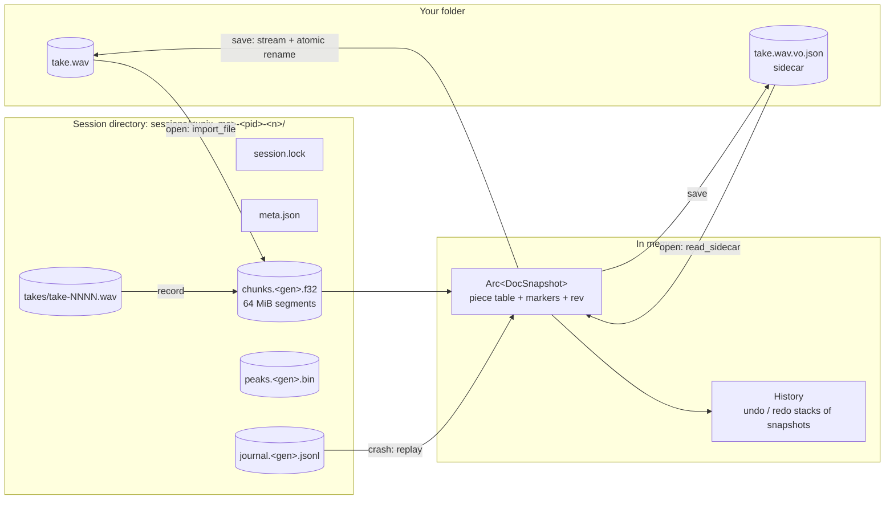
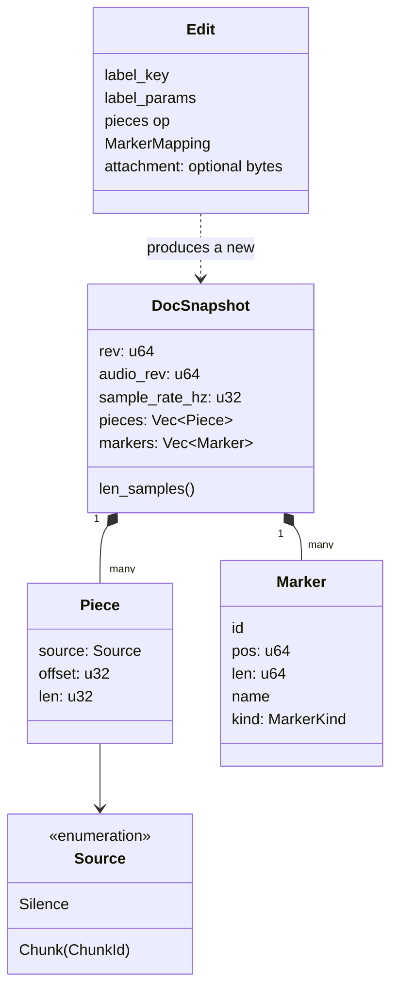
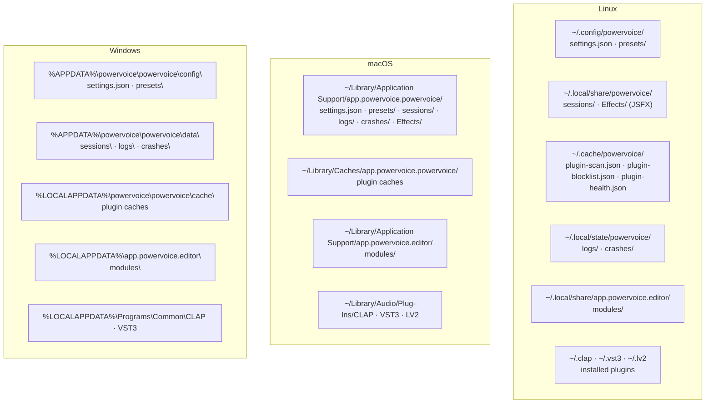

# Data: document storage, sidecar, settings and where files live

How PowerVoice keeps your work safe on disk. The design is
[ADR-004](../adr/ADR-004-document-storage.md) (with Amendments 1–7); behaviour is
[SPEC-004](../../specs/SPEC-004-document-undo.md) (document and undo) and
[SPEC-018](../../specs/SPEC-018-sessions-sidecar.md) (sidecar, save, recent files). The code is
`crates/project` (`vox-project`).

The one idea to remember: **your original file is never touched while you work.** Opening a file
imports it into a private *session*; every edit is written to that session's journal before the
command returns; *Save* writes a new file next to the original and swaps it in atomically.

## The session model

| Piece | What it is | Code |
|---|---|---|
| Session directory | One per open document, under the sessions root ([where files live](#where-files-live)). Name `<unix_ms>-<pid>-<n>` | `Session::create`, `session.rs::create_unique_dir` |
| `session.lock` | OS advisory lock held while the session is open; contents `pid`, `host`, `start_unix_ms` | `Session::init`, `gc::try_lock_session` |
| `meta.json` | Format version, generation, sample rate, source path, chunk and segment size; written atomically | `session.rs::Meta`, `fs_util::write_file_atomic` |
| Chunk store | `chunks.<gen>.f32` + `peaks.<gen>.bin` | [below](#the-chunk-store) |
| Journal | `journal.<gen>.jsonl` | [below](#the-journal) |
| Takes | `takes/take-NNNN.wav` (+ `-2`, `-3`… rollover parts at the 4 GiB RIFF limit) | `vox_project::take` |
| Snapshot | Immutable `DocSnapshot`: piece table, markers, `rev`, `audio_rev`, rate, length | `snapshot.rs` |
| History | Current snapshot + **unbounded** undo/redo stacks; only the disk budget limits depth | `history.rs` |

### The chunk store

`crates/project/src/store/` — an append-only store of immutable audio chunks.

- **Chunks:** `CHUNK_SAMPLES` = 65 536 mono f32 samples (256 KiB), aligned to 4096 bytes, each with
  a CRC-32 (`crc32fast`) checked on first read (`verify_chunk`). Chunk ids are `u32` and never
  reused.
- **Segments:** one file per *generation*, grown in preallocated 64 MiB segments
  (`posix_fallocate` on Linux, `F_PREALLOCATE` on macOS, `set_len` on Windows — a filesystem
  without real preallocation, like copy-on-write ones, gets a warning). Segments are mapped on
  demand with `memmap2`, and a memory budget (RAM/4 clamped to 512 MiB–4 GiB) evicts least
  recently used segments.
- **Peak pyramid:** for every chunk, min/max buckets at 64, 256, 1024, 4096, 16 384 and 65 536
  samples per bucket (1365 buckets per chunk) in `peaks.<gen>.bin`. The waveform's `peaks_get`
  and the accelerated peak scan for normalize read these instead of the audio. Peaks are
  recomputed if torn, so they are never fsynced.
- **Readers:** `SnapshotReader` copies `[pos, pos + n)` of a snapshot into a buffer — the playback
  reader thread and every job use one. The audio thread never reads the store.

### Snapshots and the piece table

A document is a list of pieces, each "play `len` samples of this chunk from `offset`" or
"`len` samples of silence":

- An edit builds a **new** snapshot by splicing pieces (`Edit`, `edit::cut/delete/...` in
  `crates/project/src/`) and appends new chunks only for new audio (recordings, normalize,
  bake). Undo is a pointer swap between snapshots.
- `rev` changes on every change, `audio_rev` only when audio changes (marker-only edits keep it).
  Undo/redo produce **fresh** values, so compare with `!=`, never `<`.
- Markers inside a replaced range clamp to the end of the new material; audio edits never delete
  markers (a region collapsing to zero becomes a point marker).

### The journal

`crates/project/src/journal.rs` — the crash-safety net.

- **Format:** one record per line, `<crc32 lowercase hex>\t<compact JSON>\n`. Parsing stops at
  the first torn or bad line.
- **Durability rule:** chunk bytes are synced (`ChunkStore::sync`) before any journal record
  references them, and every command that changes the document appends its records and
  `fdatasync`s before returning `Ok` (`Session::commit_internal` — the single place that
  enforces it).
- **Record types** (`enum Record`, tagged `type`): `open`, `chunks`, `edit`, `undo`, `redo`,
  `drop_undo`, `take_begin`, `take_discard`, `take_window`, `take_cancel`, `take_marker`,
  `state` (rack + view JSON, every 2 s when changed), `saved` (with the file's CRC, size and
  mtime), `checkpoint`, `close`.
- **Checkpoints** are written at session start, after an import sets the floor, and after
  compaction (a new generation). ADR-004's "every 256 records" is not implemented (Amendment 3);
  recovery of a 60-minute session with 1000 records measured 63.6 ms, so it isn't needed.

### Disk budget and compaction

`crates/project/src/budget.rs`, driven by the `housekeeping` thread (`src-tauri/src/housekeeping.rs`,
every 10 s and after edits, never while recording):

- Soft limit max(8 GiB, 8 × the document's size); keep at least 2 GiB free on the volume.
- If ≥ 25 % of the store is unreachable, **compact**: copy the live chunks into a new generation
  (`begin_compact` → `copy_chunks` without holding the document lock → `finish_compact`), write
  a fresh journal (`open` + last `saved` + last `state` + `checkpoint`), then delete the old
  generation.
- Otherwise **drop the oldest undo steps** (journaled `drop_undo`) with a notice, then compact.
- The in-app clipboard's pieces count as live.

## Recording into the session

A take is written twice while recording: to a crash-safe 32-bit float WAV under `takes/` (header
patched and `fdatasync`ed about once a second by `vox-take-sync`) and to the chunk store.
`TakeCapture::append` writes the WAV first. After a crash, the take's length comes from the WAV
file size, and recovery offers to apply, discard or open it as a new document.
See [runtime.md](runtime.md#record-and-punch-in).

## Recovery

`crates/project/src/{gc,recovery}.rs`:

1. At start-up `gc::collect_garbage` finishes interrupted deletions (`*.deleting`), skips sessions
   whose lock is held (another instance), deletes cleanly closed sessions and lists the rest as
   recoverable. Recoverable sessions are kept until you recover or discard them (D-015).
2. `Session::recover` takes the lock, reads the journal's valid prefix, replays from the last
   checkpoint, CRC-checks every chunk the result references, and if one is corrupt replays again
   up to the record before the one that introduced it. The journal is truncated after the kept
   record and other generations are removed.
3. An interrupted take stays open with its WAV length; an aligned record operation whose window
   never opened is cancelled.

Bounds: ≤ 250 ms of work lost on a process crash, about 1.5 s on power loss (ADR-004). The
sequence diagram is in [runtime.md](runtime.md#crash-recovery).

## The sidecar

`crates/project/src/sidecar.rs` — the file that makes the rack, markers and view travel with the
audio.

- **Name:** the full file name plus `.vo.json`: `take.wav` → `take.wav.vo.json`.
- **When:** written only on Save / Save As (autosave is the journal). A sidecar-only save (only
  rack/markers/view changed) skips re-rendering the audio.
- **Schema v1:** `format` = `org.powervoice.sidecar`, `version`, `compat_version`, `writer {app,
  app_version, written_at}`, `document {file_name, file_size_bytes, file_mtime, sample_rate_hz,
  len_samples, audio_crc32, fingerprint, save_format}`, `markers {items}`, `rack` (the
  `RackModel` slots with each module's state), `view` (waveform and spectral view state), plus
  unknown fields preserved in `extra`.
- **Identity:** sample rate + length + CRC-32 of the decoded samples (`crc32-ieee/f32le/v1`,
  built from per-chunk CRCs). A mismatch means the audio was changed by another program.
- **On open**, `read_sidecar` classifies it: none / valid / `Mismatch` / `Corrupt` / `TooNew` /
  `Unreadable` / valid with dropped items. An unusable or other-version sidecar is copied to
  `<sidecar>.bak` (one generation) before it is overwritten. With no sidecar, the current rack is
  kept (chapter workflow). If a WAV's `cue` markers differ from the sidecar's copy, the WAV wins
  with a notice.
- **Writes are atomic:** temp file `.<name>.powervoice-tmp-<pid>` → fsync → rename → directory
  fsync. Stale temp files from dead processes are swept before a save.

## Saving

`src-tauri/src/document.rs::save_to` decides between a full save and a sidecar-only save (full
when audio, markers, bit depth, container or dither changed, or the file is missing), streams
the snapshot through `vox_io::WavStreamWriter` (or buffers for FLAC, which is decoded and compared
before the rename), re-reads the written file for its CRC, writes the sidecar and journals
`saved`. Lossy sources (MP3, M4A, OGG) can only be saved as WAV or FLAC.

## Settings, presets and caches

| Data | File | Code |
|---|---|---|
| Settings | `settings.json` (versioned, `version` = 1, unknown fields preserved, atomic write). A corrupt file is copied to `settings.json.bak` and defaults are used, with a one-time notice | `src-tauri/src/settings.rs` |
| Recent files | inside `settings.json` (`recent_files`, max 10, de-duplicated by canonical path) | `settings.rs`, `ipc/recent_files_commands.rs` |
| Module presets | `presets/modules/<module id>/<name>.json` | `crates/presets/src/module_store.rs` |
| Rack presets | `presets/racks/<name>.json` (factory racks "Podcast voice", "Audiobook (ACX)", "Gentle cleanup" live in code) | `crates/presets/src/{rack_store,factory_rack}.rs` |
| Plugin scan cache | `plugin-scan.json` (per file: path, size, mtime → effects) | `crates/plugin-host/src/scan.rs` |
| Plugin blocklist | `plugin-blocklist.json` (path, size, mtime, CRC-32, reason) | `crates/plugin-host/src/blocklist.rs` |
| Plugin health | `plugin-health.json` (runtime crash counters per module id) | `crates/plugin-host/src/health.rs` |
| Installed modules | `modules/<id>/<version>/` (from `.voxmod` packages) | `crates/plugin-host/src/install.rs` |
| Logs | `logs/powervoice.log` (daily rolling; level from `POWERVOICE_LOG`, default `info`) | `src-tauri/src/logging.rs` |
| Crash reports | `crashes/crash-<unix_ms>-<pid>.log` (panic hook) | `src-tauri/src/logging.rs` |

Top-level `Settings` fields (`settings.rs`, all with defaults, exposed to the UI as the generated
`Settings` type): `device`, `default_format`, `monitor_mode`, `monitor_hint_shown`,
`telemetry_rate_hz`, `memory_budget_mib`, `normalize_dialog`, `recent_files`,
`spectral_defaults`, `analyzer_visible`, `analyzer_response`, `analyzer_peak_hold`,
`multichannel_policy`, `renderer_preference`, `record`, `record_offsets`, `save_dither`, `layout`,
`theme`, `playhead_follow`, `plugins`, `tours`, `snap_to_zero_crossing`, `analyzer_diagnostics`.
The UI gets defaults from `settings_defaults` rather than duplicating them.

Nothing prunes old logs or crash reports yet.

## Where files live

Paths come from `directories::ProjectDirs::from("app", "powervoice", "powervoice")`
(`settings.rs`, `document.rs`, `plugins.rs`, `logging.rs`), except installed modules, which use
Tauri's `app_local_data_dir()` for the identifier `app.powervoice.editor`, and the per-user plugin
folders, which follow each format's convention.

| Data | `ProjectDirs` method | Linux | macOS | Windows |
|---|---|---|---|---|
| Settings, presets | `config_dir` | `~/.config/powervoice` | `~/Library/Application Support/app.powervoice.powervoice` | `%APPDATA%\powervoice\powervoice\config` |
| Sessions, JSFX `Effects` | `data_dir` | `~/.local/share/powervoice` | same as config | `%APPDATA%\powervoice\powervoice\data` (roaming) |
| Plugin caches | `cache_dir` | `~/.cache/powervoice` | `~/Library/Caches/app.powervoice.powervoice` | `%LOCALAPPDATA%\powervoice\powervoice\cache` |
| Logs, crashes | `state_dir`, else `data_dir` | `~/.local/state/powervoice` | data dir | data dir |
| Installed modules | Tauri `app_local_data_dir()` | `~/.local/share/app.powervoice.editor/modules` | `~/Library/Application Support/app.powervoice.editor/modules` | `%LOCALAPPDATA%\app.powervoice.editor\modules` |
| Per-user plugin install folders | format convention (`install.rs`) | `~/.clap`, `~/.vst3`, `~/.lv2`, `…/powervoice/Effects` | `~/Library/Audio/Plug-Ins/{CLAP,VST3,LV2}` | `%LOCALAPPDATA%\Programs\Common\{CLAP,VST3}` |

`XDG_*` variables override the Linux locations. If `ProjectDirs` can't be resolved, each falls back
to `<temp>/powervoice/…`. Windows and macOS paths follow the `directories` crate's conventions and
are untested (the owner tests on Linux).

> **Differs from ADR-004 §1:** the ADR puts sessions under Tauri's `app_local_data_dir` (local,
> not roaming, on Windows). The code uses `ProjectDirs::data_dir()`, which is the roaming profile
> on Windows, and a different folder name (`powervoice` vs `app.powervoice.editor`) from the
> installed modules.
