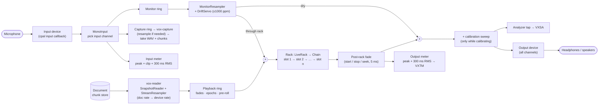
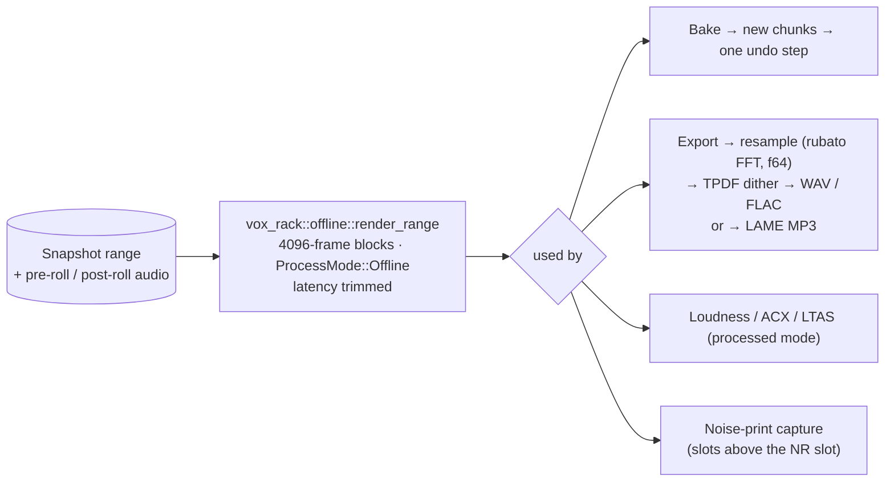
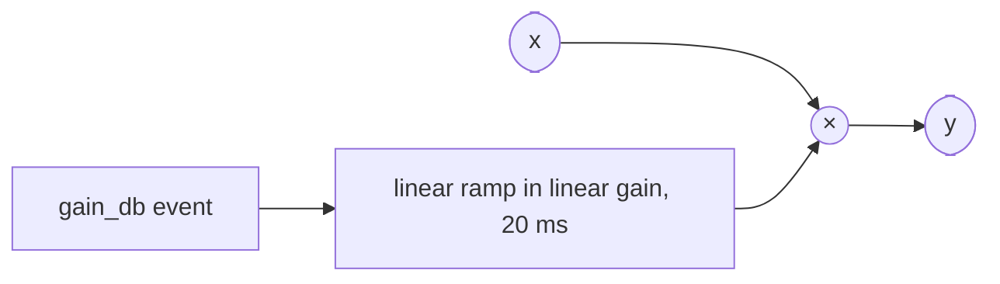
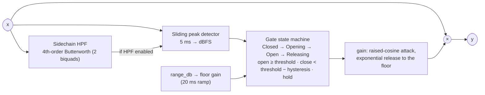
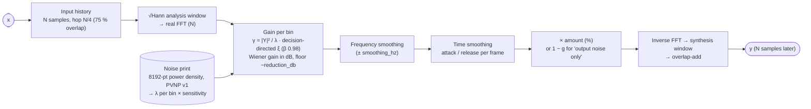
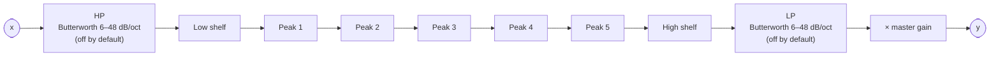
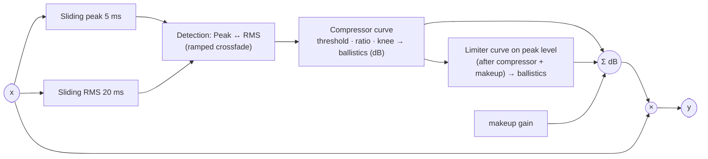
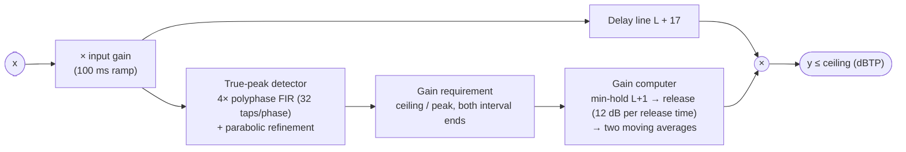

# DSP: the signal chain and the built-in modules

What happens to the sound between the microphone or file and the speakers or exported file, and
what every built-in effect does inside, with its parameters. Every module implements the
[Module API](plugins.md#the-module-api); the rack is [`crates/rack`](../../crates/rack/), the
modules are [`crates/modules`](../../crates/modules/) and the maths is
[`crates/dsp`](../../crates/dsp/). Parameter tables below are read from each module's schema
function; the spec named under each module is the behaviour contract.

Contents: [Live signal chain](#the-live-signal-chain) · [Offline chain](#the-offline-chain-export-bake-analysis) ·
[Latency](#latency) · [The rack](#the-rack) · Modules: [Gain](#gain) · [Noise Gate](#noise-gate) ·
[Noise Reduction](#noise-reduction) · [Parametric EQ](#parametric-eq) · [Dynamics](#dynamics) ·
[True-Peak Limiter](#true-peak-limiter) · [Loudness, ACX and normalize](#loudness-acx-and-normalize) ·
[Other DSP](#other-dsp-in-vox-dsp)

## The live signal chain

In the order the code runs it (`crates/engine/src/output.rs::OutputCb::process`, `input.rs`):

1. **Input callback:** the chosen channel of the input device is extracted (`MonoInput`), metered
   (peak, clip at full scale; the control thread keeps a 300 ms RMS window), pushed to the monitor
   ring when monitoring is on, and to the capture ring while recording. The input meter sees the
   raw signal, before any processing.
2. **Reader:** playback audio is read from the snapshot and resampled to the device rate on the
   `vox-reader` thread, never in the callback.
3. **Output callback, per sub-block (≤ 1024 frames):** playback samples (with the transport's
   fades) plus the *through-rack* monitor signal go into the rack; the rack runs; the post-rack
   fade applies; the **output meter** accumulates peak and Σx² of that signal; the *dry* monitor
   signal is added at unity gain after the rack (never metered, never recorded); the calibration
   sweep is added while calibrating; the result is written to every device channel and pushed to
   the **analyzer tap**.
4. **During rack pre-roll** (H-46) the rack is fed look-ahead samples and its output is discarded,
   so meters only ever see heard audio.

Monitoring modes (SPEC-002): **off** (default), **dry** (input straight to the output after the
rack) and **through rack** (input mixed into the rack input, sharing the playback rack). The
monitor path always resamples, so dry monitoring is not bit-exact.

> **Code note.** The output meter measures the rack output *without* the dry monitor signal, while
> the analyzer tap includes it; the comment next to the tap in `output.rs` says both see the same
> signal. They differ only while dry monitoring is on.

## The offline chain (export, bake, analysis)

- One chain implementation (`vox_rack::Chain`) serves playback and every offline render, so what
  you export is what you heard (ADR-001 §5). Offline chains are separate instances built from the
  same `RackModel`, so export can run during playback.
- A range render pre-rolls with the real audio before the range —
  `min(start, clamp(sum of active tails, 30 s, 60 s))` — and flushes the latency with the real
  audio after it; the result has exactly the range's length (SPEC-012 §2.8.1).
- Export order: rack → resample (only if the rate changes) → dither/quantize last → encode
  (SPEC-005 §2.12, `src-tauri/src/export.rs::run_pipeline`). WAV and FLAC exports are TPDF-dithered
  to 16/24-bit; 32-bit float is never dithered; MP3 gets the float samples directly.

## Latency

Each module reports `latency_samples()`; the chain's latency is the sum (bypassed slots count,
because their dry path is latency-matched). The engine compensates everywhere:

- **Playhead:** the heard position subtracts the rack latency, switching when a new instance is
  installed (SPEC-012 §2.5.1).
- **Playback start:** the rack pre-roll (H-46) warms up the chain by its latency, so Play starts at
  the play position without adding the latency to the start time.
- **Offline renders:** feed `L` extra samples and trim the first `L` outputs.
- **New or replaced instances** are held for their latency before a 15 ms crossfade, so their
  warm-up output is never heard.
- **Sandboxed plugins** add one transport block `B` (the pipelined round trip) to their own latency.

| Module | Latency at 48 kHz (defaults) | Tail |
|---|---|---|
| Gain | 0 | 0 |
| Noise Gate | 0 | 0 |
| Noise Reduction | N = FFT size, 2048 → 42.7 ms | 2N |
| Parametric EQ | 0 | up to ~35 s (narrow +24 dB peak at 20 Hz) |
| Dynamics | 0 | 0 |
| True-Peak Limiter | L + 17 = 257 samples (5 ms look-ahead) | 0 |

## The rack

`crates/rack`: up to 16 slots (`MAX_SLOTS`) in series, each a `Module`.

- **Parameter changes** travel as sample-accurate events through a lock-free ring and are smoothed
  by each module (typically 20 ms), so there is no zipper noise.
- **Edits** (insert, remove, reorder, replace) build a new chain off the audio thread; untouched
  instances are moved into it without restarting, changed slots crossfade over 15 ms.
- **Bypass** crossfades a slot to its latency-matched dry path; **whole-rack A/B** does the same
  for the rack. Both are listening-only: export always renders the rack.
- **Non-finite guard:** a slot that outputs NaN/Inf is bypassed and reported as failed.
- **Mono shim:** a stereo-only plugin is fed dual-mono and the left channel is kept
  (`DualMonoShim`).
- **Presets:** per-module and whole-rack, plus three factory racks ([data.md](data.md#settings-presets-and-caches)).

The rack UI (generic parameter controls, EQ graph, gain-reduction meters) is described in
[ui.md](ui.md#component-tree).

## Gain

`org.powervoice.gain@1.0.0` — [`crates/modules/src/gain.rs`](../../crates/modules/src/gain.rs) —
SPEC-012 §3.

| Parameter | Unit | Range | Default | Notes |
|---|---|---|---|---|
| `gain_db` | dB | −60 (= −∞) … +24 | 0 | dB taper, 20 ms smoothing |

## Noise Gate

`org.powervoice.noise-gate@1.0.0` —
[`crates/modules/src/noise_gate.rs`](../../crates/modules/src/noise_gate.rs),
[`crates/dsp/src/dynamics/`](../../crates/dsp/src/dynamics/) —
[SPEC-013](../../specs/SPEC-013-noise-gate.md).

The sidechain filter only shapes what the detector hears; the audio itself is never filtered.

| Parameter | Unit | Range | Default | Notes |
|---|---|---|---|---|
| `threshold_db` | dBFS | −80 … 0 | −40 | opens at or above |
| `hysteresis_db` | dB | 0 … 20 | 6 | closes below threshold − hysteresis |
| `attack_ms` | ms | 0.1 … 100 | 2 | raised-cosine opening of exactly this length |
| `hold_ms` | ms | 0.1 … 1000 | 50 | |
| `release_ms` | ms | 1 … 2000 | 100 | exponential time constant |
| `range_db` | dB | −100 (= −∞) … 0 | −30 | attenuation when closed |
| `sc_hpf_enabled` | on/off | | on | sidechain group |
| `sc_hpf_hz` | Hz | 20 … 2000 | 100 | 24 dB/oct |
| `lookahead_ms` | ms | 0 … 20 | 0 | **hidden, not implemented yet** |

Telemetry: `gate_open` (indicator), `gain_db` (gain reduction, shown in the slot header),
`sidechain_level_dbfs`.

## Noise Reduction

`org.powervoice.noise-reduction@1.0.0` —
[`crates/modules/src/noise_reduction.rs`](../../crates/modules/src/noise_reduction.rs),
[`crates/dsp/src/nr/`](../../crates/dsp/src/nr/) —
[SPEC-014](../../specs/SPEC-014-noise-reduction.md) (+ Amendment 1).

The noise print is captured from a selection (Effects → Capture Noise Print, Shift+P) through the
`NoiseProfile` extension ([runtime.md](runtime.md#noise-print-capture)). Without a print the module
is an exact N-sample delay. Parameters bind at frame boundaries.

| Parameter | Unit | Range | Default | Notes |
|---|---|---|---|---|
| `reduction_db` | dB | 0 … 40 | 12 | maximum attenuation |
| `amount_pct` | % | 0 … 100 | 100 | "reduce by" |
| `noise_only` | on/off | | off | audition the removed noise (export/bake ask for confirmation) |
| `fft_size` | choice | 1024 / 2048 / 4096 / 8192 | 2048 | Advanced; changing it restarts the module and changes latency |
| `sensitivity_db` | dB | −6 … +12 | +3 | Advanced; raises the noise estimate |
| `smoothing_hz` | Hz | 0 … 1000 | 100 | Advanced; spectral smoothing |
| `attack_ms` | ms | 1 … 200 | 5 | Advanced; spectral decay |
| `release_ms` | ms | 10 … 2000 | 100 | Advanced |

Latency N (42.7 ms at the default, inside PROMPT §4's 50 ms), tail 2N. No telemetry.

## Parametric EQ

`org.powervoice.parametric-eq@1.0.0` —
[`crates/modules/src/parametric_eq.rs`](../../crates/modules/src/parametric_eq.rs),
[`crates/dsp/src/eq/`](../../crates/dsp/src/eq/) —
[SPEC-015](../../specs/SPEC-015-parametric-eq.md).

RBJ-cookbook biquads with **f64 coefficients and state** (Direct Form I); frequencies clamp to
0.49 × sample rate; parameter changes ramp over 20 ms (log frequency, dB gain, log Q) with
per-sample coefficient updates; band on/off and slope changes crossfade over 20 ms; a disabled
band passes audio bit-exact. The `ResponseCurve` extension evaluates the same coefficients for
the EQ graph (`rack_response_curve`).

Parameter ids are `10 × (band + 1) + field` (band 0 = HP … 8 = LP; field on 0, freq 1, gain 2,
Q 3, slope 4):

| Band | Parameters | Defaults |
|---|---|---|
| Master | `master_gain_db` −24 … +24 dB | 0 |
| HP | `hp_on`, `hp_freq_hz` 20 Hz … 20 kHz, `hp_slope` 6 … 48 dB/oct | off, 80 Hz, 24 dB/oct |
| Low shelf | `ls_on`, `ls_freq_hz`, `ls_gain_db` ±24 dB, `ls_q` 0.3 … 2 | on, 100 Hz, 0 dB, 0.7071 |
| Peaks 1–5 | `bK_on`, `bK_freq_hz`, `bK_gain_db` ±24 dB, `bK_q` 0.1 … 30 | on, 200 / 500 / 1200 / 3000 / 6000 Hz, 0 dB, Q 1 |
| High shelf | `hs_on`, `hs_freq_hz`, `hs_gain_db`, `hs_q` | on, 10 kHz, 0 dB, 0.7071 |
| LP | `lp_on`, `lp_freq_hz`, `lp_slope` | off, 12 kHz, 24 dB/oct |

With the defaults the EQ is bit-exact (all gains 0, HP/LP off). Latency 0.

## Dynamics

`org.powervoice.dynamics@1.0.0` —
[`crates/modules/src/dynamics.rs`](../../crates/modules/src/dynamics.rs),
[`crates/dsp/src/dynamics/`](../../crates/dsp/src/dynamics/) —
[SPEC-016](../../specs/SPEC-016-dynamics.md).

| Parameter | Unit | Range | Default | Notes |
|---|---|---|---|---|
| `detection` | choice | Peak / RMS | RMS | |
| `knee_db` | dB | 0 … 20 | 6 | |
| `compressor_enabled` | on/off | | on | |
| `compressor_threshold_db` | dBFS | −60 … 0 | −20 | |
| `compressor_ratio` | ratio | 1 … 30 | 3 | |
| `compressor_attack_ms` / `_release_ms` | ms | 0.1 … 200 / 1 … 2000 | 10 / 100 | |
| `compressor_makeup_db` | dB | 0 … 30 | 0 | manual makeup |
| `limiter_enabled` | on/off | | off | |
| `limiter_threshold_db` | dBFS | −30 … 0 | −1 | |
| `limiter_attack_ms` / `_release_ms` | ms | 0.1 … 50 / 1 … 2000 | 1 / 100 | |
| `lookahead_ms`, `autogate_*` (5), `expander_*` (5) | | | | **hidden, not implemented yet** |

Telemetry: `gr_total_db` (shown in the slot header), per-section gain reduction, input level.
Latency 0.

> **Code vs SPEC-016.** The spec describes four sections (AutoGate → Expander → Compressor →
> Limiter) and look-ahead. The code implements the Compressor and Limiter; the AutoGate, Expander
> and look-ahead parameters exist with permanent ids but are hidden and inert
> (`Dynamics::NOT_YET_AVAILABLE`), and their telemetry channels are always 0. No `TransferCurve`
> extension exists yet.

## True-Peak Limiter

`org.powervoice.true-peak-limiter@1.0.0` —
[`crates/modules/src/true_peak_limiter.rs`](../../crates/modules/src/true_peak_limiter.rs),
[`crates/dsp/src/true_peak/`](../../crates/dsp/src/true_peak/) —
[SPEC-017](../../specs/SPEC-017-true-peak-limiter.md) (+ Amendments 1–2).

Staying under the ceiling is guaranteed by construction (each sample's gain covers both adjacent
inter-sample intervals); below the ceiling the output is bit-identical to the delayed input. The
acceptance tests measure against an independent 16× true-peak reference in `vox-testkit`.

| Parameter | Unit | Range | Default | Notes |
|---|---|---|---|---|
| `input_gain_db` | dB | −12 … +24 | 0 | applies at k + latency |
| `ceiling_dbtp` | dBTP | −12 … 0 | −1.0 | 20 ms ramp |
| `release_ms` | ms | 10 … 1000 | 100 | |
| `lookahead_ms` | ms | 1 … 10 (0.5 steps) | 5 | changing it restarts the module |

Latency L + 17 samples (L = look-ahead rounded up to even): 257 at 48 kHz. Telemetry:
`gain_reduction_db`.

## Loudness, ACX and normalize

| What | Code | Rules |
|---|---|---|
| Loudness analysis | `vox_dsp::loudness::LoudnessMeter` (`ebur128`, feature `precision-true-peak`) | Integrated LUFS, max momentary (≥ 400 ms), max short-term (≥ 3 s), LRA, sample peak, true peak. Mono, channel weight 1.0 (a −20 dBFS 1 kHz sine reads −23.0 LUFS). Processed (through the rack) or source |
| ACX check | `vox_dsp::acx::evaluate` | RMS −23 … −18 dB, sample peak ≤ −3 dBFS, noise floor (quietest 500 ms) ≤ −60 dB, inclusive |
| Peak normalize | `vox_project::normalize::plan_normalize_peak` | Target −60 … 0 dBFS or %; favorites −1, −0.1, −3 dB; no-op below −120 dBFS or when \|gain\| < 0.001 dB; scans the chunk peak pyramid instead of the audio |
| LUFS normalize | `vox_project::normalize::plan_normalize_lufs` | Target −60 … 0 LUFS (favorites −16, −19, −23); measures the **source**, gain = target − integrated; no-op at ≤ −70 LUFS; warns if the result's true peak exceeds −1 dBTP (no limiting) |

Normalize and bake are destructive and undoable; the rack stays non-destructive.
[SPEC-010](../../specs/SPEC-010-normalize.md) specifies peak normalize; LUFS normalize came from
ticket S4-01 (its spec, SPEC-011, was never written).

## Other DSP in `vox-dsp`

| Module | Purpose | Used by |
|---|---|---|
| `resample` | `StreamResampler` (rubato FFT, f32, playback) and `resample_offline` (f64, export) | reader, export |
| `capture_resample` | Push-based resampler, device rate → document rate | capture writer |
| `async_resample` | `MonitorResampler` (rubato async, septic polynomial, ±1000 ppm) | monitoring |
| `dither` | TPDF dither, seeded PCG32, 4096-sample exact-block skip | save, export |
| `spectro` | STFT frames (Hann), u8 quantization −150 … +6 dB, zoom → hop | spectrogram tiles |
| `analyzer` | BH4 FFT 4096–32 768, 1/24-octave bands from 20 Hz, Fast/Medium/Slow 50/150/500 ms | live analyzer |
| `diagnostics` | Power spectra, LTAS, YIN pitch, tone balance, sibilance, hum, rumble, noise floor, SNR | Voice diagnostics, Spectrum Inspector |
| `calibration` | Loopback sweep (5 × 1 s, 100 Hz–12 kHz) and GCC-PHAT latency analysis | record-offset calibration |
| `fp` | `DenormalGuard` (FTZ/DAZ) | callbacks, workers, offline renders |
