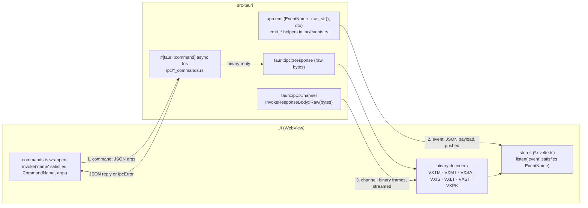
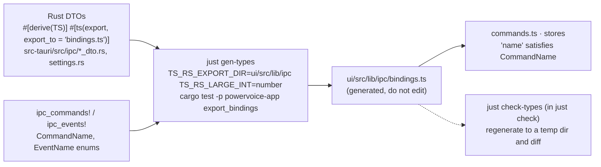

# IPC: commands, events, channels and shared types

How the Svelte UI and the Rust core talk. Decision: [ADR-003](../adr/ADR-003-ipc-data-paths.md)
(+ Amendments 1–5). Rust side: [`src-tauri/src/ipc/`](../../src-tauri/src/ipc/); UI side:
[`ui/src/lib/ipc/`](../../ui/src/lib/ipc/).

## Three paths

1. **Commands** (request → reply). Every handler is an `async fn` so it runs off the main thread;
   blocking work goes through `tauri::async_runtime::spawn_blocking` (or
   `document_commands::run_blocking`). Errors are an `IpcError { code, key, params }` whose `key`
   is an i18n key — the backend never sends display text.
2. **Events** (push). One registered list (`ipc_events!` in `events.rs`); payloads are DTOs. Used
   for state changes (`document_changed`, `transport_state`, `rack_changed` ...), job progress
   and notices.
3. **Binary channels and responses** for bulk and high-rate data: telemetry at 60 Hz, analyzer
   frames, spectrogram tiles, waveform peaks. Never JSON float arrays (CLAUDE.md, ADR-003).

`IpcErrorCode` (`src-tauri/src/ipc/error.rs`): `internal`, `invalid_argument`, `not_found`,
`not_while_recording`, `device_not_found`, `device_lost`, `io`, `cancelled`, `busy`,
`needs_confirmation` (the UI then shows a confirm dialog and repeats the call with a flag, e.g.
opening a file another instance has open, or choosing channels).

## Shared types (ts-rs)

- DTOs live only in `src-tauri` (`tauri` and `ts-rs` never enter the domain crates, ADR-001 rule 3);
  `src-tauri` maps domain types to DTOs with `From` impls.
- `u64` positions become TS `number` (`TS_RS_LARGE_INT=number`; positions stay below 2^53).
- `ipc_commands!` generates `invoke_handler()`, `COMMAND_NAMES` and the `CommandName` enum; a unit
  test (`command_names_match_command_name_variants`) keeps them in sync. `ipc_events!` does the
  same for `EventName` (`src-tauri/src/ipc/macros.rs`).
- The UI never hand-copies a Rust type: wrappers type their arguments with the generated DTOs and
  assert names with `satisfies CommandName` / `satisfies EventName`, so a renamed command fails
  `svelte-check`.
- Hand-written test literals of DTOs live in one place, `ui/src/lib/test/fixtures.ts` — a new DTO
  field is added there only ([contributing.md](../contributing.md#add-a-setting)).

## Binary frames

All frames are little-endian: a 4-byte magic, `u16` version (1), `u16` header length, then
fields; decoders accept a longer header (fields may be appended) and reject a wrong magic,
version or truncated buffer. `u64` values are read as `lo + hi × 2^32`.

| Magic | Content | Header | Rust encoder | Transport | UI decoder |
|---|---|---|---|---|---|
| `VXTM` | Playhead anchor (heard position + time) + output meter peak/RMS | fixed 72 bytes | `crates/engine/src/telemetry.rs` | `telemetry_subscribe` channel, 60 Hz (or 30) | `ui/src/lib/ipc/telemetry.ts` |
| `VXMT` | Per-slot module telemetry (gain reduction, levels, indicators) | 32 | `crates/engine/src/telemetry.rs` | `module_telemetry_subscribe` channel, per control tick while subscribed | `ui/src/lib/ipc/moduleTelemetry.ts` |
| `VXSA` | Live analyzer: 1/24-octave levels + flags (reset, dropped, silent) | 48 | `crates/engine/src/analyzer.rs` | `analyzer_subscribe` channel | `ui/src/lib/ipc/analyzer.ts` |
| `VXIS` | Spectrum Inspector live spectrum | 40 | `crates/engine/src/analyzer.rs` | `analyzer_inspector_subscribe` channel | `ui/src/lib/ipc/inspector.ts` |
| `VXLT` | Long-term average spectrum (+ noise curve) | 36 | `src-tauri/src/spectrum.rs` | `spectrum_analyze_curve` response | `ui/src/lib/ipc/inspector.ts` |
| `VXST` | Spectrogram tile: u8 magnitudes, frame-major, `PREVIEW`/`LAST` flags | 64 | `crates/engine/src/spectro/vxst.rs` | `spectro_attach` channel, fed by `spectro_request` | `ui/src/lib/spectrogram/vxst.ts` |
| `VXPK` | Waveform min/max buckets, or raw samples when zoomed in | 48 | `crates/project/src/vxpk.rs` | `peaks_get` / `record_peaks_get` response | `ui/src/lib/waveform/vxpk.ts` |

`analyzer_voice_subscribe` is the one JSON channel (a `VoiceReportDto` a few times a second).
Test fixtures for every frame are generated from Rust (`export_bindings_*_fixture` tests) into
`ui/src/lib/ipc/vx*_fixture.ts` and diffed by `just check-types`, so both sides decode the same
bytes. The EQ response curve is JSON today (`rack_response_curve` → `ResponseCurveDto`); the
planned `VXRC` frame is not implemented.

Stale-data rules: `peaks_get` responses carry `audio_rev` and a `request_id`; the waveform drops
responses from older revisions or older requests. Spectrogram requests cancel the view's older
request; a preview tile never replaces a refined one.

## Commands

Generated from `src-tauri/src/ipc/mod.rs` (the production `ipc_commands!` list, without the
`spike` feature) and each handler's doc comment by `just docs`; `just check` fails when this table
is stale. "Reply" is how the result travels: JSON, a binary `Response`, or a stream over a
`Channel` argument.

<!-- BEGIN GENERATED: ipc-commands -->
| # | Command | Handler | Reply | What it does (first line of the handler's doc comment) |
|---|---|---|---|---|
| 1 | `app_info` | [`commands.rs`](../../src-tauri/src/ipc/commands.rs) | JSON | Returns basic app identity info (name + version). |
| 2 | `settings_get` | [`commands.rs`](../../src-tauri/src/ipc/commands.rs) | JSON | Returns the current settings (T-104). |
| 3 | `settings_set` | [`commands.rs`](../../src-tauri/src/ipc/commands.rs) | JSON | Replaces the settings file (atomic write: temp file + rename) and returns the canonical saved value. |
| 4 | `settings_startup_notice_take` | [`commands.rs`](../../src-tauri/src/ipc/commands.rs) | JSON | T-703 (settings file robustness): one-shot. |
| 5 | `settings_defaults` | [`commands.rs`](../../src-tauri/src/ipc/commands.rs) | JSON | T-703: the factory defaults, for Preferences' "Reset to defaults" (per-section and whole- dialog) — the frontend merges the relevant fields from this into a `settings_set` patch instead of hand-duplicating default values (which would drift from `Settings::default()`). |
| 6 | `devices_list` | [`audio_commands.rs`](../../src-tauri/src/ipc/audio_commands.rs) | JSON | The Audio Devices dialog's data (the engine's current device list; no new enumeration). |
| 7 | `devices_select` | [`audio_commands.rs`](../../src-tauri/src/ipc/audio_commands.rs) | JSON | Applies a device selection (output now; the input choice is stored for recording). |
| 8 | `devices_rescan` | [`audio_commands.rs`](../../src-tauri/src/ipc/audio_commands.rs) | JSON | H-59 (SPEC-001 §2.1): the Settings "Rescan" button — a fresh enumeration off the UI thread, plus another reopen attempt for a device parked as lost (§2.4). |
| 9 | `transport_get` | [`audio_commands.rs`](../../src-tauri/src/ipc/audio_commands.rs) | JSON | Current transport state. |
| 10 | `transport_play` | [`audio_commands.rs`](../../src-tauri/src/ipc/audio_commands.rs) | JSON | Play from the playhead. |
| 11 | `transport_pause` | [`audio_commands.rs`](../../src-tauri/src/ipc/audio_commands.rs) | JSON | Pause (keeps the heard position). |
| 12 | `transport_stop` | [`audio_commands.rs`](../../src-tauri/src/ipc/audio_commands.rs) | JSON | Stop (returns to the play-start position). |
| 13 | `transport_play_from_start` | [`audio_commands.rs`](../../src-tauri/src/ipc/audio_commands.rs) | JSON | Play from the selection start, or 0. |
| 14 | `transport_return_to_start` | [`audio_commands.rs`](../../src-tauri/src/ipc/audio_commands.rs) | JSON | Seek to 0 (keeps playing). |
| 15 | `transport_seek` | [`audio_commands.rs`](../../src-tauri/src/ipc/audio_commands.rs) | JSON | Move the playhead to a document position. |
| 16 | `transport_set_loop` | [`audio_commands.rs`](../../src-tauri/src/ipc/audio_commands.rs) | JSON | H-37 (SPEC-003 §2.1): the Loop toggle. |
| 17 | `transport_set_selection` | [`audio_commands.rs`](../../src-tauri/src/ipc/audio_commands.rs) | JSON | H-37: the UI's time selection `[start, end)` (`null`: none) — Play from start's position and, while loop is on, the loop region. |
| 18 | `telemetry_subscribe` | [`audio_commands.rs`](../../src-tauri/src/ipc/audio_commands.rs) | stream (`Channel`) | Streams binary `VXTM` frames (playhead anchor + output meter) at 60 Hz over `channel`, replacing any previous subscriber. |
| 19 | `clock_now_ns` | [`audio_commands.rs`](../../src-tauri/src/ipc/audio_commands.rs) | JSON | The engine's app clock (ns since the process epoch), for the UI's clock sync (ADR-003 §3). |
| 20 | `rack_list_modules` | [`rack_commands.rs`](../../src-tauri/src/ipc/rack_commands.rs) | JSON | The registered modules (the Add-module menu, grouped client-side by `features`). |
| 21 | `rack_get` | [`rack_commands.rs`](../../src-tauri/src/ipc/rack_commands.rs) | JSON | The current rack state (initial load; also after any reconnect). |
| 22 | `rack_add` | [`rack_commands.rs`](../../src-tauri/src/ipc/rack_commands.rs) | JSON | Adds a registered module at `index` (`0..=len`), live (SPEC-012 §2.1–§2.2). |
| 23 | `rack_remove` | [`rack_commands.rs`](../../src-tauri/src/ipc/rack_commands.rs) | JSON | Removes the slot at `slot` (index), live. |
| 24 | `rack_move` | [`rack_commands.rs`](../../src-tauri/src/ipc/rack_commands.rs) | JSON | Moves the slot at `from` to `to` (drag-reorder), live. |
| 25 | `rack_bypass` | [`rack_commands.rs`](../../src-tauri/src/ipc/rack_commands.rs) | JSON | Per-slot bypass toggle (15 ms crossfade, SPEC-012 §2.3). |
| 26 | `rack_ab` | [`rack_commands.rs`](../../src-tauri/src/ipc/rack_commands.rs) | JSON | Whole-rack A/B (listening only, SPEC-012 §2.3). |
| 27 | `rack_restart` | [`rack_commands.rs`](../../src-tauri/src/ipc/rack_commands.rs) | JSON | Restarts a slot's instance from its committed state (Restart of a failed slot, ADR-005 §12). |
| 28 | `rack_editor_open` | [`rack_commands.rs`](../../src-tauri/src/ipc/rack_commands.rs) | JSON | Opens slot `slot`'s plugin window (T-901): the plugin's own GUI, a floating window run by its sandbox, titled `title` (the UI localizes "‹Plugin› — PowerVoice"). |
| 29 | `rack_editor_close` | [`rack_commands.rs`](../../src-tauri/src/ipc/rack_commands.rs) | JSON | Closes slot `slot`'s plugin window (T-901; no-op when closed). |
| 30 | `rack_editor_close_all` | [`rack_commands.rs`](../../src-tauri/src/ipc/rack_commands.rs) | JSON | Closes every plugin window (T-901). |
| 31 | `param_set_normalized` | [`rack_commands.rs`](../../src-tauri/src/ipc/rack_commands.rs) | JSON | Sets a parameter from a normalized `[0, 1]` slider position (SPEC-012 §2.4, §2.6). |
| 32 | `param_set_text` | [`rack_commands.rs`](../../src-tauri/src/ipc/rack_commands.rs) | JSON | Sets a parameter from typed text; Rust parses it (SPEC-012 §2.6). |
| 33 | `param_set_plain` | [`rack_commands.rs`](../../src-tauri/src/ipc/rack_commands.rs) | JSON | Sets a parameter from a plain value (S3-07, SPEC-015 §2.6.6): the EQ graph's draggable nodes send Hz/dB/Q values directly — the inverse of the display axis mapping, not taper code, so this still isn't the UI running filter math. |
| 34 | `rack_response_curve` | [`rack_commands.rs`](../../src-tauri/src/ipc/rack_commands.rs) | JSON | The EQ graph's response curve at `points` (S3-07, SPEC-015 §2.6.6, lean slice: JSON of ≤ `vox_engine::MAX_RESPONSE_CURVE_POINTS` frequencies — the binary `VXRC` frame is hardening). |
| 35 | `module_telemetry_subscribe` | [`rack_commands.rs`](../../src-tauri/src/ipc/rack_commands.rs) | stream (`Channel`) | Streams binary `VXMT` module-telemetry frames (H-03, SPEC-016 §4.12: every slot's `Telemetry` values, e.g. the true-peak limiter's gain reduction) at the telemetry rate over `channel`, replacing any previous subscriber. |
| 36 | `module_presets_list` | [`preset_commands.rs`](../../src-tauri/src/ipc/preset_commands.rs) | JSON | Factory presets first — the built-in's own (`ModuleFactory::presets`, ADR-005 §2), then a `.voxmod` package's `presets/*.vopreset.json` (H-44, ADR-006 §3/§7 step 5; empty unless `module_id` was installed from a package that shipped some) — then user-saved ones (alphabetical) — the slot menu's preset list (SPEC-012 §2.7). |
| 37 | `module_preset_save` | [`preset_commands.rs`](../../src-tauri/src/ipc/preset_commands.rs) | JSON | Saves slot `slot`'s current committed state as a new user preset named `name`. |
| 38 | `module_preset_load` | [`preset_commands.rs`](../../src-tauri/src/ipc/preset_commands.rs) | JSON | Loads a module preset into slot `slot` (SPEC-012 §2.7): a state with a blob replaces the instance behind a 15 ms crossfade; a parameter-only state is smoothed, with no restart. |
| 39 | `module_preset_rename` | [`preset_commands.rs`](../../src-tauri/src/ipc/preset_commands.rs) | JSON | Renames a user module preset. |
| 40 | `module_preset_delete` | [`preset_commands.rs`](../../src-tauri/src/ipc/preset_commands.rs) | JSON | Deletes a user module preset. |
| 41 | `module_preset_export` | [`preset_commands.rs`](../../src-tauri/src/ipc/preset_commands.rs) | JSON | Exports user module preset `name` (of `module_id`) to `path` (H-22, Manage Presets… "Export…"; `path` came from the caller's native save dialog). |
| 42 | `module_preset_import` | [`preset_commands.rs`](../../src-tauri/src/ipc/preset_commands.rs) | JSON | Imports a module preset file at `path` (H-22, Manage Presets… "Import…"; `path` came from the caller's native open dialog). |
| 43 | `module_reset_default` | [`preset_commands.rs`](../../src-tauri/src/ipc/preset_commands.rs) | JSON | Resets every writable parameter of slot `slot` to its schema default (T-406): smoothed, no restart; a committed blob (e.g. a noise print) is kept. |
| 44 | `rack_presets_list` | [`preset_commands.rs`](../../src-tauri/src/ipc/preset_commands.rs) | JSON | Factory rack presets ("Podcast voice", "Audiobook (ACX)", "Gentle cleanup", ...) first, then user-saved ones (alphabetical) — Effects → Rack Presets (SPEC-012 "the rack-preset menu"). |
| 45 | `rack_preset_save` | [`preset_commands.rs`](../../src-tauri/src/ipc/preset_commands.rs) | JSON | Saves the live rack as a new user rack preset named `name` (SPEC-012 "save the whole chain"). |
| 46 | `rack_preset_load` | [`preset_commands.rs`](../../src-tauri/src/ipc/preset_commands.rs) | JSON | Loads a rack preset, replacing the live rack (SPEC-012 §2.1's `rack_load_model` path): an unknown module id becomes a placeholder slot with a notice, exactly like opening a document whose sidecar names an uninstalled module — never a load failure. |
| 47 | `rack_preset_rename` | [`preset_commands.rs`](../../src-tauri/src/ipc/preset_commands.rs) | JSON | Renames a user rack preset. |
| 48 | `rack_preset_delete` | [`preset_commands.rs`](../../src-tauri/src/ipc/preset_commands.rs) | JSON | Deletes a user rack preset. |
| 49 | `rack_preset_export` | [`preset_commands.rs`](../../src-tauri/src/ipc/preset_commands.rs) | JSON | Exports user rack preset `name` to `path` (H-22, Manage Presets… "Export…"; `path` came from the caller's native save dialog). |
| 50 | `rack_preset_import` | [`preset_commands.rs`](../../src-tauri/src/ipc/preset_commands.rs) | JSON | Imports a rack preset file at `path` (H-22, Manage Presets… "Import…"; `path` came from the caller's native open dialog). |
| 51 | `analyzer_subscribe` | [`analyzer_commands.rs`](../../src-tauri/src/ipc/analyzer_commands.rs) | stream (`Channel`) | Subscribes to the live output analyzer at `response`; returns the subscriber id. |
| 52 | `analyzer_set_response` | [`analyzer_commands.rs`](../../src-tauri/src/ipc/analyzer_commands.rs) | JSON | Changes a subscriber's averaging response. |
| 53 | `analyzer_unsubscribe` | [`analyzer_commands.rs`](../../src-tauri/src/ipc/analyzer_commands.rs) | JSON | Removes a subscriber; the tap turns off once none remain. |
| 54 | `analyzer_voice_subscribe` | [`analyzer_commands.rs`](../../src-tauri/src/ipc/analyzer_commands.rs) | stream (`Channel`) | H-42 (SPEC-007 §8.8): subscribes to live voice diagnostics — a JSON [`VoiceReportDto`] on `channel` about 10 times a second, only when it changed. |
| 55 | `analyzer_inspector_subscribe` | [`analyzer_commands.rs`](../../src-tauri/src/ipc/analyzer_commands.rs) | stream (`Channel`) | H-42 (SPEC-007 §8.3/§8.9): subscribes a Spectrum Inspector stream — binary `VXIS` frames on `channel` at `config`'s FFT size, window and response. |
| 56 | `analyzer_inspector_configure` | [`analyzer_commands.rs`](../../src-tauri/src/ipc/analyzer_commands.rs) | JSON | H-42: changes an Inspector stream's FFT size, window or response. |
| 57 | `spectrum_analyze_start` | [`spectrum_commands.rs`](../../src-tauri/src/ipc/spectrum_commands.rs) | JSON | Starts a long-term average job; the returned `job_id` tags its `job_progress`/ `spectrum_report` events. |
| 58 | `spectrum_analyze_cancel` | [`spectrum_commands.rs`](../../src-tauri/src/ipc/spectrum_commands.rs) | JSON | Cancels a running job (best-effort; `job_progress` reports `cancelled`). |
| 59 | `spectrum_analyze_curve` | [`spectrum_commands.rs`](../../src-tauri/src/ipc/spectrum_commands.rs) | binary (`Response`) | Result `index` of a finished job, as a binary `VXLT` frame. |
| 60 | `spectrum_export_csv` | [`spectrum_commands.rs`](../../src-tauri/src/ipc/spectrum_commands.rs) | JSON | Writes the Inspector's CSV export; returns the path written (`.csv` added when missing). |
| 61 | `record_get` | [`record_commands.rs`](../../src-tauri/src/ipc/record_commands.rs) | JSON | The record panel state. |
| 62 | `record_arm` | [`record_commands.rs`](../../src-tauri/src/ipc/record_commands.rs) | JSON | Arms (opens the input, starts the meter) or disarms the input. |
| 63 | `record_start` | [`record_commands.rs`](../../src-tauri/src/ipc/record_commands.rs) | JSON | Starts a new recording. |
| 64 | `record_stop` | [`record_commands.rs`](../../src-tauri/src/ipc/record_commands.rs) | JSON | Stops the recording; the take becomes the document when it is committed. |
| 65 | `record_set_monitor` | [`record_commands.rs`](../../src-tauri/src/ipc/record_commands.rs) | JSON | Sets the monitoring mode and saves it as the preference (SPEC-002 §2.7). |
| 66 | `record_peaks_get` | [`record_commands.rs`](../../src-tauri/src/ipc/record_commands.rs) | binary (`Response`) | `count` `(min, max)` buckets of the take being captured, from bucket `start_bucket`, as a binary `VXPK` frame (H-07; `partial: true` always — the take is still growing). |
| 67 | `document_open` | [`document_commands.rs`](../../src-tauri/src/ipc/document_commands.rs) | JSON | Opens `path` as the document (SPEC-005 §2.2-2.4: any container/codec `vox_io::decode` supports — WAV incl. |
| 68 | `document_open_cancel` | [`document_commands.rs`](../../src-tauri/src/ipc/document_commands.rs) | JSON | T-209: cancels a running import job (SPEC-005 §2.3 "Cancel"). |
| 69 | `import_peaks_get` | [`document_commands.rs`](../../src-tauri/src/ipc/document_commands.rs) | binary (`Response`) | H-71 (SPEC-005 §2.3, SPEC-006 AC-13, ADR-003 Amendment 6): `peaks_get`'s counterpart for import job `job_id` while it's still running — the growing session's own per-chunk pyramid for whatever has committed so far, framed as `VXPK` exactly like `peaks_get`/`record_peaks_get`, `PARTIAL`-flagged (bit1) with `(NaN, NaN)` buckets past what's committed. |
| 70 | `document_probe` | [`document_commands.rs`](../../src-tauri/src/ipc/document_commands.rs) | JSON | Probes `path` without importing it (SPEC-005 §2.3 step 1, §2.4): container/codec/rate/ channels, and — for multichannel input — each channel's peak over the first 30 s plus the identical-channels/silent-channel-hint data a future channel-choice dialog (T-209) needs. |
| 71 | `document_save` | [`document_commands.rs`](../../src-tauri/src/ipc/document_commands.rs) | JSON | Saves the current revision back to its bound path and format (SPEC-005 §2.7), running as a job (H-70, `JobKind::Save`, ADR-003 `job_progress`): `document_save_cancel(job_id)` cancels it from another command invocation while this one is still awaiting. |
| 72 | `document_save_as` | [`document_commands.rs`](../../src-tauri/src/ipc/document_commands.rs) | JSON | Saves the current revision to `path` in `container` at `bits`/`dither` (SPEC-005 §2.7), then binds the document to it. |
| 73 | `document_save_cancel` | [`document_commands.rs`](../../src-tauri/src/ipc/document_commands.rs) | JSON | Cancels a running Save/Save As job (H-70, SPEC-005 §4.10). |
| 74 | `document_close` | [`recovery_commands.rs`](../../src-tauri/src/ipc/recovery_commands.rs) | JSON | Closes the document for good after the quit prompt's Save or Don't Save (SPEC-004 §2.8): the session directory is deleted, so a discarded document is never offered for recovery. |
| 75 | `sidecar_view_set_spectral` | [`document_commands.rs`](../../src-tauri/src/ipc/document_commands.rs) | JSON | T-306 (SPEC-018 §2.6.5): records the spectral pane's current settings for the next save. |
| 76 | `sidecar_view_set_waveform` | [`document_commands.rs`](../../src-tauri/src/ipc/document_commands.rs) | JSON | H-12 (SPEC-018 §2.6.5): records the shared waveform/spectral viewport plus the selection and edit cursor for the next save. |
| 77 | `recent_files_get` | [`recent_files_commands.rs`](../../src-tauri/src/ipc/recent_files_commands.rs) | JSON | The current list, most-recent-first (SPEC-018 §2.12), with `exists` resolved within [`EXISTENCE_CHECK_BUDGET_MS`] (the File menu calls this every time it opens). |
| 78 | `recent_files_remove` | [`recent_files_commands.rs`](../../src-tauri/src/ipc/recent_files_commands.rs) | JSON | Removes one entry (the File menu's "Remove" action on a missing file, or "Remove from List"). |
| 79 | `recent_files_clear` | [`recent_files_commands.rs`](../../src-tauri/src/ipc/recent_files_commands.rs) | JSON | Empties the list (SPEC-018 §2.12: "deletes no user data" — no confirmation needed). |
| 80 | `recovery_list` | [`recovery_commands.rs`](../../src-tauri/src/ipc/recovery_commands.rs) | JSON | The recoverable sessions (start-up dialog, Settings → Recovery & storage). |
| 81 | `recovery_recover` | [`recovery_commands.rs`](../../src-tauri/src/ipc/recovery_commands.rs) | JSON | Recover (SPEC-004 §2.7): opens session `id` as the document, handling its interrupted take per `take_action`. |
| 82 | `recovery_discard` | [`recovery_commands.rs`](../../src-tauri/src/ipc/recovery_commands.rs) | JSON | Discard (after the UI's confirmation): permanently deletes session `id`, never one in use. |
| 83 | `storage_info` | [`recovery_commands.rs`](../../src-tauri/src/ipc/recovery_commands.rs) | JSON | Settings → Recovery & storage's figures. |
| 84 | `peaks_get` | [`document_commands.rs`](../../src-tauri/src/ipc/document_commands.rs) | binary (`Response`) | `count` buckets of `(min, max)` (or raw samples below `PEAKS_RAW_SPP`'s pyramid floor) as a binary `VXPK` frame (ADR-003 §2, S1-02 `peaks_query::peaks` + `encode_vxpk`). |
| 85 | `spectro_attach` | [`spectro_commands.rs`](../../src-tauri/src/ipc/spectro_commands.rs) | stream (`Channel`) | Attaches spectral view `view_id`: its tiles go to `channel` from now on (replacing a previous channel of the same view and cancelling that one's pending tiles). |
| 86 | `spectro_detach` | [`spectro_commands.rs`](../../src-tauri/src/ipc/spectro_commands.rs) | JSON | Detaches spectral view `view_id` (its pending tiles are cancelled). |
| 87 | `spectro_request` | [`spectro_commands.rs`](../../src-tauri/src/ipc/spectro_commands.rs) | JSON | Requests tiles of the current document for view `view_id` (SPEC-007 §4.6). |
| 88 | `edit_cut` | [`document_commands.rs`](../../src-tauri/src/ipc/document_commands.rs) | JSON | Cuts `[start_samples, end_samples)` (SPEC-008 §2.1). |
| 89 | `edit_copy` | [`document_commands.rs`](../../src-tauri/src/ipc/document_commands.rs) | JSON | Copies `[start_samples, end_samples)` into the clipboard. |
| 90 | `edit_paste` | [`document_commands.rs`](../../src-tauri/src/ipc/document_commands.rs) | JSON | Pastes the clipboard at `target` (SPEC-008 §2.1). |
| 91 | `edit_delete` | [`document_commands.rs`](../../src-tauri/src/ipc/document_commands.rs) | JSON | Deletes `[start_samples, end_samples)`, closing the gap. |
| 92 | `edit_trim` | [`document_commands.rs`](../../src-tauri/src/ipc/document_commands.rs) | JSON | Trims the document to `[start_samples, end_samples)` (Audition: Crop). |
| 93 | `edit_silence` | [`document_commands.rs`](../../src-tauri/src/ipc/document_commands.rs) | JSON | Silences `[start_samples, end_samples)` with exact `+0.0` samples. |
| 94 | `edit_insert_silence` | [`document_commands.rs`](../../src-tauri/src/ipc/document_commands.rs) | JSON | Inserts `len_samples` of silence at `target` (SPEC-008 §2.1/§2.5): at the selection start if one exists, otherwise the cursor. |
| 95 | `edit_paste_cancel` | [`document_commands.rs`](../../src-tauri/src/ipc/document_commands.rs) | JSON | Cancels a running cross-document paste job (SPEC-008 §2.6.1 "Cancel"). |
| 96 | `edit_normalize_peak_start` | [`normalize_commands.rs`](../../src-tauri/src/ipc/normalize_commands.rs) | JSON | Starts a peak-normalize job for `[start_samples, end_samples)` (the frontend resolves "no selection" to the whole file, SPEC-010 §2.1), targeting `target_db` dBFS sample peak or `target_pct` % of full scale (exactly one of the two, SPEC-010 §2.4) — one undo entry `history.normalize`. |
| 97 | `edit_normalize_peak_cancel` | [`normalize_commands.rs`](../../src-tauri/src/ipc/normalize_commands.rs) | JSON | Cancels a running peak-normalize job (best-effort, `job_progress` reports `JobState::Cancelled`, leaving the document exactly as before — SPEC-010 §2.8); a no-op for an unknown or already-finished job id. |
| 98 | `edit_normalize_lufs_start` | [`normalize_commands.rs`](../../src-tauri/src/ipc/normalize_commands.rs) | JSON | Starts a LUFS-normalize job for `[start_samples, end_samples)` targeting `target_lufs` integrated loudness (mirrors [`edit_normalize_peak_start`], no % mode) — one undo entry `history.normalize_lufs`. |
| 99 | `edit_normalize_lufs_cancel` | [`normalize_commands.rs`](../../src-tauri/src/ipc/normalize_commands.rs) | JSON | Cancels a running LUFS-normalize job (mirrors [`edit_normalize_peak_cancel`]). |
| 100 | `edit_bake_start` | [`bake_commands.rs`](../../src-tauri/src/ipc/bake_commands.rs) | JSON | Starts a bake of `[start_samples, end_samples)` (the frontend resolves "no selection" to the whole file) through the live rack — one undo entry `history.bake` that also restores the pre-bake rack (SPEC-004 OD-4). |
| 101 | `edit_bake_cancel` | [`bake_commands.rs`](../../src-tauri/src/ipc/bake_commands.rs) | JSON | Cancels a running bake (best-effort; `job_progress` reports `Cancelled` and the document and the rack stay exactly as they were). |
| 102 | `history_undo` | [`document_commands.rs`](../../src-tauri/src/ipc/document_commands.rs) | JSON | Undoes the top history entry. |
| 103 | `history_redo` | [`document_commands.rs`](../../src-tauri/src/ipc/document_commands.rs) | JSON | Redoes the top history entry. |
| 104 | `markers_get` | [`document_commands.rs`](../../src-tauri/src/ipc/document_commands.rs) | JSON | The current marker list (SPEC-009 §2.1), in canonical order. |
| 105 | `marker_add` | [`document_commands.rs`](../../src-tauri/src/ipc/document_commands.rs) | JSON | Adds a point (`len_samples == 0`) or region marker (SPEC-009 §2.2). |
| 106 | `marker_rename` | [`document_commands.rs`](../../src-tauri/src/ipc/document_commands.rs) | JSON | Renames marker `id` (SPEC-009 §2.4, normalized server-side). |
| 107 | `marker_set_range` | [`document_commands.rs`](../../src-tauri/src/ipc/document_commands.rs) | JSON | Moves or resizes marker `id` to `[pos_samples, pos_samples + len_samples)` (SPEC-009 §2.5's panel-typed Start/End/Duration edits — dragging is deferred, ticket "Out" list). |
| 108 | `marker_delete` | [`document_commands.rs`](../../src-tauri/src/ipc/document_commands.rs) | JSON | Deletes the markers in `ids` as one undo entry `history.marker_delete` (SPEC-009 §2.6). |
| 109 | `export_formats` | [`export_commands.rs`](../../src-tauri/src/ipc/export_commands.rs) | JSON | MP3 availability (ADR-007 §4, D-013) for the export dialog's format list. |
| 110 | `export_start` | [`export_commands.rs`](../../src-tauri/src/ipc/export_commands.rs) | JSON | Starts an export job on its own thread; the returned `job_id` is echoed on every `job_progress` event for it (`export_cancel` stops it). |
| 111 | `export_cancel` | [`export_commands.rs`](../../src-tauri/src/ipc/export_commands.rs) | JSON | Cancels a running export job (best-effort, `job_progress` reports `JobState::Cancelled`); a no-op for an unknown or already-finished job id. |
| 112 | `nr_capture_start` | [`nr_capture_commands.rs`](../../src-tauri/src/ipc/nr_capture_commands.rs) | JSON | Starts a Capture Noise Print job for `[start, end)` (document samples): resolves or inserts the target Noise Reduction slot synchronously (the returned `slot` is authoritative), then reads, renders and analyses the excerpt on its own thread. |
| 113 | `nr_capture_cancel` | [`nr_capture_commands.rs`](../../src-tauri/src/ipc/nr_capture_commands.rs) | JSON | Cancels a running capture job (best-effort; leaves any previous print unchanged). |
| 114 | `loudness_analyze_start` | [`loudness_commands.rs`](../../src-tauri/src/ipc/loudness_commands.rs) | JSON | Starts a loudness analysis job on its own thread; the returned `job_id` is echoed on every `job_progress`/`loudness_report` event for it (`loudness_analyze_cancel` stops it). |
| 115 | `loudness_analyze_cancel` | [`loudness_commands.rs`](../../src-tauri/src/ipc/loudness_commands.rs) | JSON | Cancels a running loudness analysis job (best-effort, `job_progress` reports `JobState::Cancelled`); a no-op for an unknown or already-finished job id. |
| 116 | `acx_check` | [`acx_commands.rs`](../../src-tauri/src/ipc/acx_commands.rs) | JSON | Checks the whole document (processed or source, per `request.source`) against the ACX / Audible submission rules (RMS, sample peak, noise floor) and returns one report. |
| 117 | `record_start_at` | [`record_commands.rs`](../../src-tauri/src/ipc/record_commands.rs) | JSON | T-304 (SPEC-022 §2.2, §4.9): Record with the current selection (`[start, end)` or `null`). |
| 118 | `record_offset_get` | [`record_commands.rs`](../../src-tauri/src/ipc/record_commands.rs) | JSON | T-304 (SPEC-022 §2.13): the current device setup's recording offset (the readout). |
| 119 | `record_offset_set` | [`record_commands.rs`](../../src-tauri/src/ipc/record_commands.rs) | JSON | T-304 (SPEC-022 §2.13, §2.14, AC-18): stores the offset for the current device setup (calibration Apply, or a manual entry — the UI converts "N smp" at the device rate), clamped to ±500 ms. |
| 120 | `calibration_run` | [`calibration_commands.rs`](../../src-tauri/src/ipc/calibration_commands.rs) | JSON | Starts a calibration run; `verify`: re-measure with the current device setup's stored offset applied (the result's `offset_ms` is then the residual). |
| 121 | `calibration_cancel` | [`calibration_commands.rs`](../../src-tauri/src/ipc/calibration_commands.rs) | JSON | Aborts the running calibration. |
| 122 | `plugins_list` | [`plugin_commands.rs`](../../src-tauri/src/ipc/plugin_commands.rs) | JSON | Every known plugin (T-804 item 6): registered ones (ok / disabled / flagged, or blocklisted when their file has been blocked since) plus the other blocklisted files. |
| 123 | `plugins_rescan` | [`plugin_commands.rs`](../../src-tauri/src/ipc/plugin_commands.rs) | JSON | Rescans for plugins (T-804 item 6). |
| 124 | `plugins_set_enabled` | [`plugin_commands.rs`](../../src-tauri/src/ipc/plugin_commands.rs) | JSON | Shows/hides `module_id` in Add Module (T-804 item 5). |
| 125 | `plugins_block` | [`plugin_commands.rs`](../../src-tauri/src/ipc/plugin_commands.rs) | JSON | Blocks a plugin file manually (T-804 item 4). |
| 126 | `plugins_unblock` | [`plugin_commands.rs`](../../src-tauri/src/ipc/plugin_commands.rs) | JSON | Unblocks a plugin file (T-804 item 4); `true` if it was blocked. |
| 127 | `plugins_add_folder` | [`plugin_commands.rs`](../../src-tauri/src/ipc/plugin_commands.rs) | JSON | Adds a custom scan folder (T-804 item 5, ADR-008 §6) and rescans in the background (with `plugin_scan_progress`) so it's picked up right away. |
| 128 | `plugins_remove_folder` | [`plugin_commands.rs`](../../src-tauri/src/ipc/plugin_commands.rs) | JSON | Removes a custom scan folder (T-804 item 5) and rescans in the background (T-809 item 2), so its plugins leave the plugin manager's list. |
| 129 | `plugins_clear_flag` | [`plugin_commands.rs`](../../src-tauri/src/ipc/plugin_commands.rs) | JSON | Clears a flagged plugin's runtime crash count (T-809, "Clear crash warning"). |
| 130 | `plugins_folders` | [`plugin_commands.rs`](../../src-tauri/src/ipc/plugin_commands.rs) | JSON | The install folder, the standard folders and the custom ones (T-809). |
| 131 | `plugins_install` | [`plugin_commands.rs`](../../src-tauri/src/ipc/plugin_commands.rs) | JSON | "Install module…" (T-809, T-806, T-805): copies the picked `.clap` file or `.vst3` bundle (or a file inside one) into the per-user folder of its format — or validates a `.voxmod` package without running it and extracts it into the modules folder — scans only that file (up to the 30 s scan timeout, off the async runtime) and registers it. |
| 132 | `plugins_reveal` | [`plugin_commands.rs`](../../src-tauri/src/ipc/plugin_commands.rs) | JSON | Shows a plugin file in the system file manager (T-809). |
| 133 | `plugins_uninstall` | [`plugin_commands.rs`](../../src-tauri/src/ipc/plugin_commands.rs) | JSON | "Uninstall…" (H-29): removes a plugin file from the per-user install folder — refusing anything else — and drops it from the registry and the scan cache. |
| 134 | `plugins_module_locales` | [`plugin_commands.rs`](../../src-tauri/src/ipc/plugin_commands.rs) | JSON | Every installed `.voxmod` package's validated `locales/<lang>.json` strings, merged into one map keyed `modules.<id>.*` (H-44, ADR-006 §3/§7 step 5): the UI calls this at start-up and after an install/uninstall to keep its i18n table in sync with what's actually installed. |
<!-- END GENERATED: ipc-commands -->

## Events

Generated from `ipc_events!` in `src-tauri/src/ipc/events.rs`; "Emitted from" lists the source
files that emit the event (directly or through an `emit_*` helper).

<!-- BEGIN GENERATED: ipc-events -->
| # | Event | Emitted from |
|---|---|---|
| 1 | `notice` | [`audio.rs`](../../src-tauri/src/audio.rs), [`bake.rs`](../../src-tauri/src/bake.rs), [`calibration.rs`](../../src-tauri/src/calibration.rs), [`export.rs`](../../src-tauri/src/export.rs), [`housekeeping.rs`](../../src-tauri/src/housekeeping.rs), [`ipc/document_commands.rs`](../../src-tauri/src/ipc/document_commands.rs), [`ipc/plugin_commands.rs`](../../src-tauri/src/ipc/plugin_commands.rs), [`ipc/recovery_commands.rs`](../../src-tauri/src/ipc/recovery_commands.rs), [`loudness.rs`](../../src-tauri/src/loudness.rs), [`normalize.rs`](../../src-tauri/src/normalize.rs), [`nr_capture.rs`](../../src-tauri/src/nr_capture.rs), [`recording.rs`](../../src-tauri/src/recording.rs), [`spectrum.rs`](../../src-tauri/src/spectrum.rs) |
| 2 | `transport_state` | [`audio.rs`](../../src-tauri/src/audio.rs) |
| 3 | `devices_changed` | [`audio.rs`](../../src-tauri/src/audio.rs) |
| 4 | `rack_changed` | [`audio.rs`](../../src-tauri/src/audio.rs) |
| 5 | `param_changed` | [`audio.rs`](../../src-tauri/src/audio.rs) |
| 6 | `rack_latency` | [`audio.rs`](../../src-tauri/src/audio.rs) |
| 7 | `record_state` | [`audio.rs`](../../src-tauri/src/audio.rs) |
| 8 | `document_changed` | [`bake.rs`](../../src-tauri/src/bake.rs), [`housekeeping.rs`](../../src-tauri/src/housekeeping.rs), [`ipc/document_commands.rs`](../../src-tauri/src/ipc/document_commands.rs), [`ipc/recovery_commands.rs`](../../src-tauri/src/ipc/recovery_commands.rs), [`normalize.rs`](../../src-tauri/src/normalize.rs), [`recording.rs`](../../src-tauri/src/recording.rs) |
| 9 | `history_state` | [`bake.rs`](../../src-tauri/src/bake.rs), [`housekeeping.rs`](../../src-tauri/src/housekeeping.rs), [`ipc/document_commands.rs`](../../src-tauri/src/ipc/document_commands.rs), [`ipc/recovery_commands.rs`](../../src-tauri/src/ipc/recovery_commands.rs), [`normalize.rs`](../../src-tauri/src/normalize.rs), [`recording.rs`](../../src-tauri/src/recording.rs) |
| 10 | `clipboard_changed` | [`ipc/document_commands.rs`](../../src-tauri/src/ipc/document_commands.rs) |
| 11 | `job_progress` | [`bake.rs`](../../src-tauri/src/bake.rs), [`calibration.rs`](../../src-tauri/src/calibration.rs), [`export.rs`](../../src-tauri/src/export.rs), [`ipc/document_commands.rs`](../../src-tauri/src/ipc/document_commands.rs), [`loudness.rs`](../../src-tauri/src/loudness.rs), [`normalize.rs`](../../src-tauri/src/normalize.rs), [`nr_capture.rs`](../../src-tauri/src/nr_capture.rs), [`spectrum.rs`](../../src-tauri/src/spectrum.rs) |
| 12 | `loudness_report` | [`loudness.rs`](../../src-tauri/src/loudness.rs) |
| 13 | `normalize_result` | [`normalize.rs`](../../src-tauri/src/normalize.rs) |
| 14 | `recent_files_changed` | [`ipc/document_commands.rs`](../../src-tauri/src/ipc/document_commands.rs), [`ipc/recent_files_commands.rs`](../../src-tauri/src/ipc/recent_files_commands.rs) |
| 15 | `record_phase` | [`audio.rs`](../../src-tauri/src/audio.rs) |
| 16 | `record_finished` | [`recording.rs`](../../src-tauri/src/recording.rs) |
| 17 | `calibration_result` | [`calibration.rs`](../../src-tauri/src/calibration.rs) |
| 18 | `import_started` | [`ipc/document_commands.rs`](../../src-tauri/src/ipc/document_commands.rs) |
| 19 | `plugin_scan_progress` | [`ipc/plugin_commands.rs`](../../src-tauri/src/ipc/plugin_commands.rs) |
| 20 | `spectrum_report` | [`spectrum.rs`](../../src-tauri/src/spectrum.rs) |
<!-- END GENERATED: ipc-events -->

### Event payloads

| Event | Payload | Notes |
|---|---|---|
| `notice` | `Notice { level, key, params, persistent, id, cleared }` | Toast (`persistent: false`) or banner (`id` replaces or, with `cleared`, removes it). Only i18n keys |
| `transport_state` | `TransportStateDto` | Playing/paused/stopped, play-start, loop, document length |
| `devices_changed` | `DevicesDto` | Hosts, devices, current selection and status |
| `rack_changed` | `RackStateDto` | Full rack snapshot: slots, status (Active/Loading/Restarting/Failed/Missing), params, telemetry channels |
| `param_changed` | `ParamChangedDto` | One parameter's value, normalized value and text (coalesced per tick) |
| `rack_latency` | `RackLatencyDto` | Total rack latency in samples |
| `record_state` | `RecordStateDto` | Armed, recording, input level, disk remaining, monitor latency and dropouts |
| `record_phase` | `RecordPhaseDto` | Record operation phase: pre-roll, recording, post-roll, committing |
| `record_finished` | `RecordFinishedDto` | Outcome of a take or operation |
| `document_changed` | `DocumentDto` | Path, rate, length, `rev`/`audio_rev`, dirty flags, save format, sidecar view state |
| `history_state` | `HistoryStateDto` | Undo/redo availability and labels (i18n key + params) |
| `clipboard_changed` | `ClipboardChangedDto` | Whether the in-app clipboard holds audio |
| `job_progress` | `JobProgressDto { job_id, kind, state, fraction }` | Every long job ([runtime.md](runtime.md#jobs)) |
| `import_started` | `ImportStartedDto` | Name, rate and length right after probing, for the progress bar |
| `loudness_report` | `LoudnessReportDto` | Loudness analysis result |
| `normalize_result` | `NormalizeResultDto` | Normalize job result |
| `spectrum_report` | `SpectrumReportDto` | Long-term average spectrum job result (curve fetched with `spectrum_analyze_curve`) |
| `calibration_result` | `CalibrationResultDto` / reject | Latency calibration outcome |
| `recent_files_changed` | `RecentFileDto[]` | Open Recent list |
| `plugin_scan_progress` | `PluginScanProgressDto` / summary | Background plugin scan |

## Adding a command or event

See [contributing.md](../contributing.md#add-a-command-or-event). In short: write the handler in
the matching `ipc/*_commands.rs` with a one-line doc comment, add its name to `ipc_commands!`
in `mod.rs`, run `just gen-types`, add a typed wrapper in `ui/src/lib/ipc/commands.ts`, and run
`just docs` to refresh the table above.
