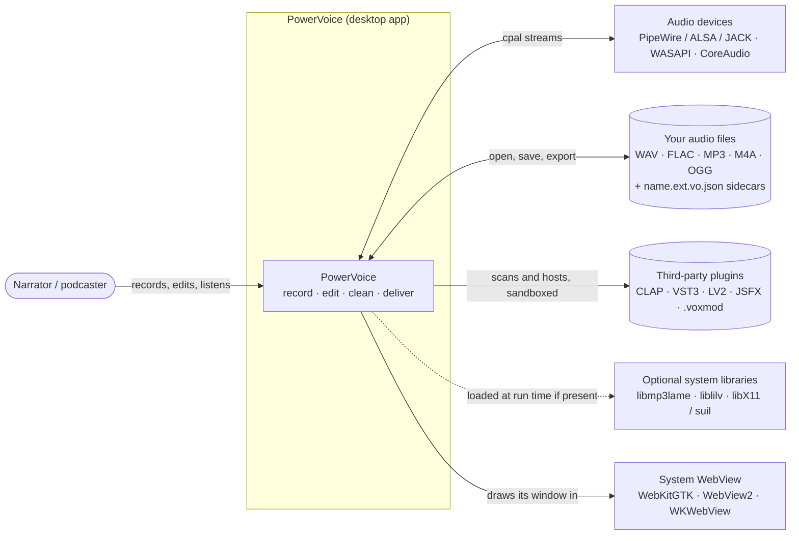
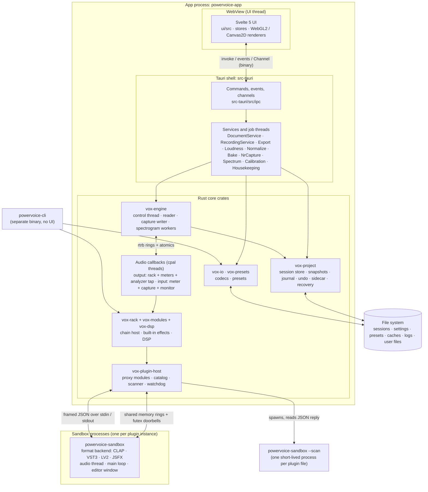
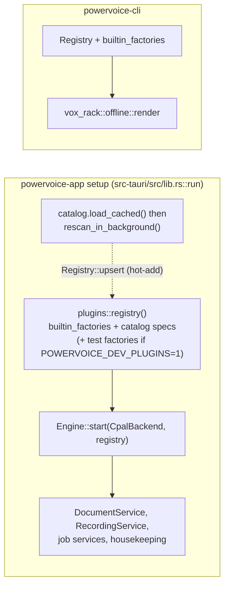

# Architecture overview

PowerVoice is a desktop editor for **one mono voice recording at a time**: record, edit, clean with
a non-destructive effects rack, hit loudness targets, export. This page is the map: the system
context, the processes and containers, the crate graph, and one paragraph per crate. The other
architecture pages go deeper:

| Page | What it covers |
|---|---|
| [runtime.md](runtime.md) | Threads, real-time rules, and sequence diagrams of every main flow |
| [data.md](data.md) | Session storage (chunks, snapshots, journal), sidecar, recovery, settings, presets, caches, where files live per OS |
| [ipc.md](ipc.md) | Commands, events, binary channels, ts-rs types; the generated command and event tables |
| [dsp.md](dsp.md) | The signal chain and every built-in module, with parameters |
| [plugins.md](plugins.md) | Module API, installable modules, sandbox, format backends, scanner, writing a module |
| [ui.md](ui.md) | Svelte component tree, stores, renderers, design system, i18n, dev pages |

Decisions behind this design are in the [ADRs](../adr/README.md); behaviour is specified in
[`specs/`](../../specs/). Words you don't know are in the [glossary](../glossary.md).

> **Source of truth.** Everything here was checked against the code at the time of writing, with
> file paths so you can follow along. Where an ADR or spec says something different, this page
> documents the code and the difference is listed under [Where the code differs from the
> ADRs](#where-the-code-differs-from-the-adrs).

## System context

Who and what PowerVoice talks to (C4 level 1).

- Audio I/O is `cpal` 0.18 behind `vox_engine::backend` (PipeWire is the default host on Linux,
  then ALSA: `crates/engine/src/backend/mod.rs::choose_default_host`).
- The original audio file is never modified until you save; all editing happens in a private
  session directory ([data.md](data.md)).
- LAME (MP3 export), lilv (LV2) and libX11/suil (plugin windows) are loaded with `libloading` at
  run time; the app works without them ([ADR-007](../adr/ADR-007-licensing.md)).

## Containers

The processes and major parts inside them (C4 level 2).

| Container | Code | Notes |
|---|---|---|
| Svelte UI | [`ui/`](../../ui/) | Renders and sends intents; no audio or document logic. [ui.md](ui.md) |
| Tauri shell | [`src-tauri/`](../../src-tauri/) | Command/event layer plus the services that orchestrate jobs ([runtime.md](runtime.md#jobs)) |
| Audio engine | [`crates/engine`](../../crates/engine/) | Control thread, reader, capture writer, devices, transport, monitoring, telemetry, analyzer, spectrogram tiles |
| Audio callbacks | [`crates/engine/src/output.rs`](../../crates/engine/src/output.rs), [`input.rs`](../../crates/engine/src/input.rs) | Real-time: no allocation, locks, I/O or logging ([runtime.md](runtime.md#real-time-rules)) |
| Document model | [`crates/project`](../../crates/project/) | Disk-backed, crash-safe ([data.md](data.md)) |
| Rack and effects | [`crates/rack`](../../crates/rack/), [`crates/modules`](../../crates/modules/), [`crates/dsp`](../../crates/dsp/) | One chain code path for playback, monitoring, export, bake and the CLI ([dsp.md](dsp.md)) |
| Plugin sandbox | [`crates/sandbox`](../../crates/sandbox/) | Separate processes; a crash never takes the editor down ([plugins.md](plugins.md)) |
| CLI | [`crates/cli`](../../crates/cli/) | `powervoice-cli gen / analyze / render --rack / convert / markers`, plus `gen-fixtures` and `voxmod` binaries |

## Crate graph

Generated from `cargo metadata` by `just docs` (`scripts/docs/check.py --write`); `just check`
fails when it's stale. An arrow `A --> B` means "A depends on B" (normal and build dependencies;
dev-dependencies are in the last column of the table only).

```mermaid
flowchart TD
  subgraph Binaries["Binaries"]
    powervoice_app["powervoice-app<br/>src-tauri"]
    powervoice_cli["powervoice-cli<br/>crates/cli"]
    powervoice_sandbox["powervoice-sandbox<br/>crates/sandbox"]
  end
  subgraph Libraries["Libraries"]
    vox_clap_abi["vox-clap-abi<br/>crates/clap-abi"]
    vox_dsp["vox-dsp<br/>crates/dsp"]
    vox_engine["vox-engine<br/>crates/engine"]
    vox_io["vox-io<br/>crates/io"]
    vox_lv2_abi["vox-lv2-abi<br/>crates/lv2-abi"]
    vox_module_api["vox-module-api<br/>crates/module-api"]
    vox_module_clap["vox-module-clap<br/>crates/module-clap"]
    vox_modules["vox-modules<br/>crates/modules"]
    vox_plugin_host["vox-plugin-host<br/>crates/plugin-host"]
    vox_presets["vox-presets<br/>crates/presets"]
    vox_project["vox-project<br/>crates/project"]
    vox_rack["vox-rack<br/>crates/rack"]
    vox_sandbox_ipc["vox-sandbox-ipc<br/>crates/sandbox-ipc"]
    vox_testkit["vox-testkit<br/>crates/testkit"]
    vox_ysfx_sys["vox-ysfx-sys<br/>crates/ysfx-sys"]
  end
  subgraph Plugin_libraries__cdylib_["Plugin libraries (cdylib)"]
    vox_test_clap["vox-test-clap<br/>crates/test-clap"]
    vox_test_lv2["vox-test-lv2<br/>crates/test-lv2"]
    vox_test_vst3["vox-test-vst3<br/>crates/test-vst3"]
    vox_voxmod_gain["vox-voxmod-gain<br/>crates/voxmod-gain"]
  end
  powervoice_app --> vox_dsp
  powervoice_app --> vox_engine
  powervoice_app --> vox_io
  powervoice_app --> vox_modules
  powervoice_app --> vox_plugin_host
  powervoice_app --> vox_presets
  powervoice_app --> vox_project
  powervoice_app --> vox_rack
  powervoice_cli --> vox_dsp
  powervoice_cli --> vox_io
  powervoice_cli --> vox_modules
  powervoice_cli --> vox_plugin_host
  powervoice_cli --> vox_rack
  powervoice_cli --> vox_testkit
  powervoice_sandbox --> vox_clap_abi
  powervoice_sandbox --> vox_lv2_abi
  powervoice_sandbox --> vox_module_api
  powervoice_sandbox --> vox_modules
  powervoice_sandbox --> vox_sandbox_ipc
  powervoice_sandbox --> vox_ysfx_sys
  vox_engine --> vox_dsp
  vox_engine --> vox_project
  vox_engine --> vox_rack
  vox_io --> vox_dsp
  vox_module_clap --> vox_module_api
  vox_modules --> vox_dsp
  vox_modules --> vox_module_api
  vox_plugin_host --> vox_module_api
  vox_plugin_host --> vox_rack
  vox_plugin_host --> vox_sandbox_ipc
  vox_presets --> vox_module_api
  vox_presets --> vox_rack
  vox_project --> vox_dsp
  vox_project --> vox_io
  vox_rack --> vox_dsp
  vox_rack --> vox_module_api
  vox_sandbox_ipc --> vox_module_api
  vox_test_clap --> vox_clap_abi
  vox_test_clap --> vox_module_api
  vox_test_clap --> vox_modules
  vox_test_lv2 --> vox_lv2_abi
  vox_test_lv2 --> vox_module_api
  vox_test_lv2 --> vox_modules
  vox_test_vst3 --> vox_module_api
  vox_test_vst3 --> vox_modules
  vox_voxmod_gain --> vox_module_api
  vox_voxmod_gain --> vox_module_clap
  vox_voxmod_gain --> vox_modules
```

<!-- BEGIN GENERATED: crate-graph -->

| Package | Directory | Targets | Depends on (workspace crates) | Dev-only (tests, benches) |
|---|---|---|---|---|
| `powervoice-app` | [`src-tauri`](../../src-tauri) | staticlib, cdylib, rlib, bin | `vox-dsp`, `vox-engine`, `vox-io`, `vox-modules`, `vox-plugin-host`, `vox-presets`, `vox-project`, `vox-rack` | `vox-module-api`, `vox-testkit` |
| `powervoice-cli` | [`crates/cli`](../../crates/cli) | bin | `vox-dsp`, `vox-io`, `vox-modules`, `vox-plugin-host`, `vox-rack`, `vox-testkit` | none |
| `powervoice-sandbox` | [`crates/sandbox`](../../crates/sandbox) | lib, bin | `vox-clap-abi`, `vox-lv2-abi`, `vox-module-api`, `vox-modules`, `vox-sandbox-ipc`, `vox-ysfx-sys` | `vox-engine`, `vox-plugin-host`, `vox-presets`, `vox-project`, `vox-rack`, `vox-test-clap`, `vox-test-lv2`, `vox-test-vst3`, `vox-testkit`, `vox-voxmod-gain` |
| `vox-clap-abi` | [`crates/clap-abi`](../../crates/clap-abi) | lib | none | none |
| `vox-dsp` | [`crates/dsp`](../../crates/dsp) | lib | none | `vox-testkit` |
| `vox-engine` | [`crates/engine`](../../crates/engine) | lib | `vox-dsp`, `vox-project`, `vox-rack` | `vox-module-api`, `vox-modules`, `vox-testkit` |
| `vox-io` | [`crates/io`](../../crates/io) | lib | `vox-dsp` | `vox-testkit` |
| `vox-lv2-abi` | [`crates/lv2-abi`](../../crates/lv2-abi) | lib | none | none |
| `vox-module-api` | [`crates/module-api`](../../crates/module-api) | lib | none | none |
| `vox-module-clap` | [`crates/module-clap`](../../crates/module-clap) | lib | `vox-module-api` | none |
| `vox-modules` | [`crates/modules`](../../crates/modules) | lib | `vox-dsp`, `vox-module-api` | `vox-testkit` |
| `vox-plugin-host` | [`crates/plugin-host`](../../crates/plugin-host) | lib | `vox-module-api`, `vox-rack`, `vox-sandbox-ipc` | none |
| `vox-presets` | [`crates/presets`](../../crates/presets) | lib | `vox-module-api`, `vox-rack` | `vox-modules` |
| `vox-project` | [`crates/project`](../../crates/project) | lib | `vox-dsp`, `vox-io` | `vox-testkit` |
| `vox-rack` | [`crates/rack`](../../crates/rack) | lib | `vox-dsp`, `vox-module-api` | `vox-modules`, `vox-testkit` |
| `vox-sandbox-ipc` | [`crates/sandbox-ipc`](../../crates/sandbox-ipc) | lib, bin | `vox-module-api` | none |
| `vox-test-clap` | [`crates/test-clap`](../../crates/test-clap) | cdylib, rlib | `vox-clap-abi`, `vox-module-api`, `vox-modules` | none |
| `vox-test-lv2` | [`crates/test-lv2`](../../crates/test-lv2) | cdylib, rlib | `vox-lv2-abi`, `vox-module-api`, `vox-modules` | none |
| `vox-test-vst3` | [`crates/test-vst3`](../../crates/test-vst3) | cdylib, rlib | `vox-module-api`, `vox-modules` | none |
| `vox-testkit` | [`crates/testkit`](../../crates/testkit) | lib | none | none |
| `vox-voxmod-gain` | [`crates/voxmod-gain`](../../crates/voxmod-gain) | cdylib, rlib | `vox-module-api`, `vox-module-clap`, `vox-modules` | none |
| `vox-ysfx-sys` | [`crates/ysfx-sys`](../../crates/ysfx-sys) | lib | none | none |
<!-- END GENERATED: crate-graph -->

### Layering rules that hold today

- **Leaves:** `vox-module-api`, `vox-dsp` and `vox-testkit` have no normal workspace
  dependencies (`vox-testkit` measures independently of production DSP, so tests never grade code
  with itself).
- **`vox-rack` never depends on `vox-engine`, `vox-project`, `vox-io` or cpal**; `vox-project`
  never depends on `vox-rack` or `vox-engine` (ADR-001 rule 4).
- **Only the composition roots depend on `vox-plugin-host`** (`powervoice-app`, `powervoice-cli`).
- **Format code lives only in the sandbox:** `powervoice-sandbox` links `vox-clap-abi`,
  `vox-lv2-abi`, `vox-ysfx-sys` and the `vst3` crate; the app never loads plugin code in-process.
- External crates are confined: `cpal` only in `vox-engine` (feature `backend-cpal`), `tauri` and
  `ts-rs` only in `src-tauri`, `memmap2` only in `vox-project`, codecs and `libloading` for LAME
  in `vox-io`, `rubato`/`realfft` in `vox-dsp` (ADR-001 §3).

## What each crate does

**`powervoice-app`** ([`src-tauri`](../../src-tauri/)) — the Tauri 2 application: window,
[commands, events and channels](ipc.md), DTOs with generated TypeScript types, settings file
(`src-tauri/src/settings.rs`), logging and the panic hook (`logging.rs`), and the *services* that
wire domain crates to the UI — `DocumentService` (`document.rs`), `RecordingService`, the job
services for export, loudness/ACX, normalize, bake, noise-print capture, spectrum averaging and
calibration, the housekeeping thread, and the shared plugin catalog (`plugins.rs`). It is the
composition root that registers built-in modules and plugin factories into the rack registry.

**`powervoice-cli`** ([`crates/cli`](../../crates/cli/)) — the DSP acceptance tool: `gen`
(synthetic signals), `analyze` (peak/RMS/LUFS/true peak/noise floor, `--json`), `render --rack`
(the same offline render as the app), `convert` (export encoders end to end) and `markers`;
binaries `gen-fixtures` (`just fixtures`) and `voxmod` (packs a `.voxmod`, `just voxmod`).

**`powervoice-sandbox`** ([`crates/sandbox`](../../crates/sandbox/)) — the out-of-process plugin
host. One process per plugin instance (`--shm <handle> --host-pid <pid>`), or one per file while
scanning (`--scan <file> --format clap|vst3|lv2|jsfx`). Holds every format backend behind the
`PluginBackend` trait (`src/backend.rs`), runs the sandbox audio thread and the plugin's
main/GUI loop, and opens native editor windows (X11/XWayland on Linux).

**`vox-engine`** ([`crates/engine`](../../crates/engine/)) — the audio engine: the `Backend`
trait with the cpal backend and a deterministic `FakeBackend` for tests, device selection and
hot-plug polling, the control thread and `EngineHandle` facade, transport, reader/prefetch,
the real-time output and input callbacks, recording and record operations (insert, overwrite,
punch-in), monitoring with drift correction, latency calibration, telemetry (`VXTM`/`VXMT`),
the live analyzer (`VXSA`), the spectrogram tile service (`VXST`) and the shared offline
range render used by bake and export (`bake.rs`).

**`vox-project`** ([`crates/project`](../../crates/project/)) — the document model: the
append-only chunk store with per-chunk peak pyramids, immutable snapshots (piece table + markers),
the fsynced edit journal, undo/redo history, edit operations, normalize planning, import,
save, the sidecar, garbage collection, the disk budget and crash recovery.

**`vox-rack`** ([`crates/rack`](../../crates/rack/)) — the pure chain host: module registry,
`RackModel`/`SlotModel` (the sidecar's slot schema, with placeholders for unknown modules),
`Chain` (slots in series with latency-matched dry paths and crossfades), `RackHost` (control
thread) + `LiveRack` (audio thread), whole-rack A/B, restart policy, and `offline::render` /
`render_range`.

**`vox-modules`** ([`crates/modules`](../../crates/modules/)) — the six built-in effects: Gain,
Noise Gate, Noise Reduction, Parametric EQ, Dynamics and True-Peak Limiter
(`builtin_factories()`), on `vox-module-api` + `vox-dsp`. See [dsp.md](dsp.md).

**`vox-dsp`** ([`crates/dsp`](../../crates/dsp/)) — pure DSP with no I/O and no allocation in
`process()`: EQ biquads, dynamics detectors and curves, noise reduction, true-peak detection,
BS.1770 loudness, ACX rules, TPDF dither, three resamplers, spectrogram frames, analyzer bands,
voice diagnostics, calibration sweeps and the FTZ/DAZ guard.

**`vox-module-api`** ([`crates/module-api`](../../crates/module-api/)) — the single contract for
everything in the rack (ADR-005): `Module`, `ModuleFactory`, descriptors, parameter schema,
sample-accurate events, state, extensions, and the `test-util` feature (`ModuleTestHost`,
`no_alloc`, reference modules).

**`vox-io`** ([`crates/io`](../../crates/io/)) — codecs: WAV read/write with `cue`/`LIST adtl`
markers and streaming writes (`hound` + hand-written RIFF chunks), FLAC (`flacenc`, verified
before rename), MP3 via runtime-loaded LAME, import through `symphonia`, downmix, atomic writes.

**`vox-presets`** ([`crates/presets`](../../crates/presets/)) — module and rack preset files
(atomic JSON, name sanitizing, export/import) and the factory rack presets.

**`vox-plugin-host`** ([`crates/plugin-host`](../../crates/plugin-host/)) — the editor side of the
sandbox: `SandboxFactory`/`ProxyModule` (a plugin as a rack module), the watchdog thread, the
control-channel client, the plugin catalog, scanner, blocklist, crash-health store,
installers (per-format and `.voxmod`) and editor-window handles.

**`vox-sandbox-ipc`** ([`crates/sandbox-ipc`](../../crates/sandbox-ipc/)) — the transport between
host and sandbox: the versioned shared-memory layout (control block, sample rings, event rings),
futex doorbells, `HostEnd` (audio thread, bounded wait, dry substitute), `PluginEnd`, `Monitor`,
and the framed JSON control protocol (v3). Ships four fault-injection test binaries
(`vox-sbx-test-*`).

**`vox-module-clap`** ([`crates/module-clap`](../../crates/module-clap/)) — exports any
`vox-module-api` module as a standard CLAP plugin (`ClapModule<F>`, `export_module!`) with the
`org.powervoice.module-info/1` extension: the installable-module ABI (ADR-006).

**`vox-clap-abi`**, **`vox-lv2-abi`** ([`crates/clap-abi`](../../crates/clap-abi/),
[`crates/lv2-abi`](../../crates/lv2-abi/)) — hand-written, layout-tested C bindings for the CLAP 1.2
and LV2 subsets PowerVoice uses; shared by the sandbox and the test plugins.

**`vox-ysfx-sys`** ([`crates/ysfx-sys`](../../crates/ysfx-sys/)) — bindings to the vendored ysfx
JSFX library (`third_party/ysfx`), compiled by `build.rs` on unix x86-64/aarch64 only; linked only
by the sandbox.

**`vox-testkit`** ([`crates/testkit`](../../crates/testkit/)) — deterministic signal generators,
independent measurements (peak, RMS, LUFS, 16× true-peak reference, noise floor), golden-file
helpers and the `BENCH_RESULT` reporter; a dev-dependency of the libraries and a normal
dependency of the CLI.

**Test and example plugins** — [`vox-test-clap`](../../crates/test-clap/),
[`vox-test-vst3`](../../crates/test-vst3/) and [`vox-test-lv2`](../../crates/test-lv2/) are
`cdylib` plugins (the built-in Gain plus a latency line, with crash/hang variants) that the
sandbox tests load instead of installed plugins. [`vox-voxmod-gain`](../../crates/voxmod-gain/)
is the example module package: the built-in Gain exported as `org.powervoice.gain.packaged`
(see [plugins.md](plugins.md#write-a-powervoice-module)).

## Composition roots

- Every registry in the app comes from `src-tauri/src/plugins.rs::registry()`; the catalog
  keeps a weak reference to each and hot-adds newly scanned plugins with `Registry::upsert`.
- The CLI builds offline pipelines from `vox-io` + `vox-rack` without devices or a UI.

## Design choices at a glance

| Choice | Why | Where |
|---|---|---|
| Disk-backed chunk store + immutable snapshots | 60-minute documents, unlimited undo, crash safety | [ADR-004](../adr/ADR-004-document-storage.md), [data.md](data.md) |
| One rack code path (`vox_rack::Chain`) | Export, bake, CLI numbers equal what you hear | [ADR-001 §5](../adr/ADR-001-architecture-overview.md), [dsp.md](dsp.md) |
| Lock-free rings between threads, return ring for drops | Glitch-free audio | [ADR-002](../adr/ADR-002-threading-realtime.md), [runtime.md](runtime.md) |
| Binary IPC for bulk data | Peaks, tiles and meters without JSON float arrays | [ADR-003](../adr/ADR-003-ipc-data-paths.md), [ipc.md](ipc.md) |
| One Module API for built-ins and plugins | The rack, presets and generic UI see one contract | [ADR-005](../adr/ADR-005-module-api.md), [plugins.md](plugins.md) |
| Plugins out of process | A crashing plugin never takes the editor or a recording down | [ADR-008](../adr/ADR-008-plugin-sandbox-outline.md) |
| WebGL2 with Canvas2D fallback | Smooth waveform/spectrogram in WebKitGTK | [ADR-009](../adr/ADR-009-renderer-choice.md), [ui.md](ui.md#renderers) |

## Where the code differs from the ADRs

These are known, accepted differences; the code is the reference.

- **ADR-001 §2 crate graph is older than the code.** Today `vox-engine` does not depend on
  `vox-io`; `vox-rack` depends on `vox-dsp` but not on `vox-modules` (dev-only); `vox-project`
  depends on `vox-io` and `vox-dsp`; `vox-plugin-host` depends on `vox-rack` and `vox-sandbox-ipc`
  as well as `vox-module-api`; `powervoice-app` also depends on `vox-dsp`, `vox-io`, `vox-modules`,
  `vox-presets` and `vox-plugin-host`; `powervoice-sandbox` depends on `vox-modules` and the format
  ABI crates, not on `vox-plugin-host`. The generated graph above is current.
- **ADR-001 §4 puts the export, ACX and processed-analysis jobs in `vox-engine`.** Only the bake
  plan and the shared range render live there (`crates/engine/src/bake.rs`); export, loudness/ACX,
  normalize, NR capture, spectrum and calibration are orchestrated by services in `src-tauri`
  (`export.rs`, `loudness.rs`, `normalize.rs`, ...), on top of domain-crate functions.
- **ADR-001 §6 / ADR-004 §1 put sessions under Tauri's `app_local_data_dir`.** The code uses
  `directories::ProjectDirs::data_dir()/sessions` (`src-tauri/src/document.rs::default_sessions_dir`);
  on Windows that is the roaming profile. Installed modules do use `app_local_data_dir()/modules`.
  See [data.md](data.md#where-files-live).
- **ADR-002 §1's `rayon` worker pool doesn't exist.** Spectrogram tiles have their own
  `spectro-{i}` threads; each job is its own named thread (A-013).
