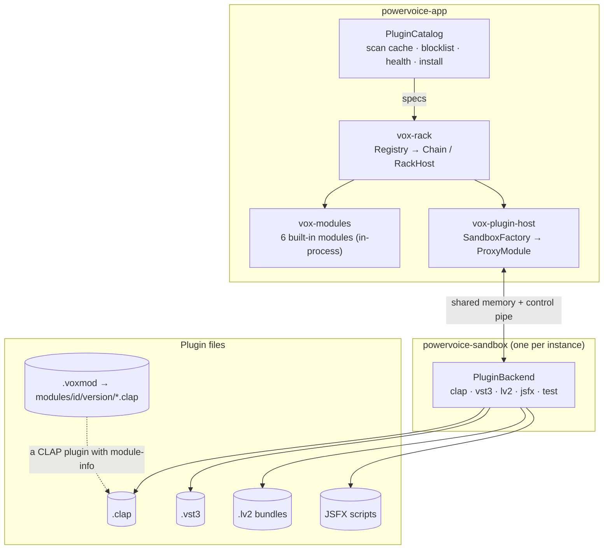
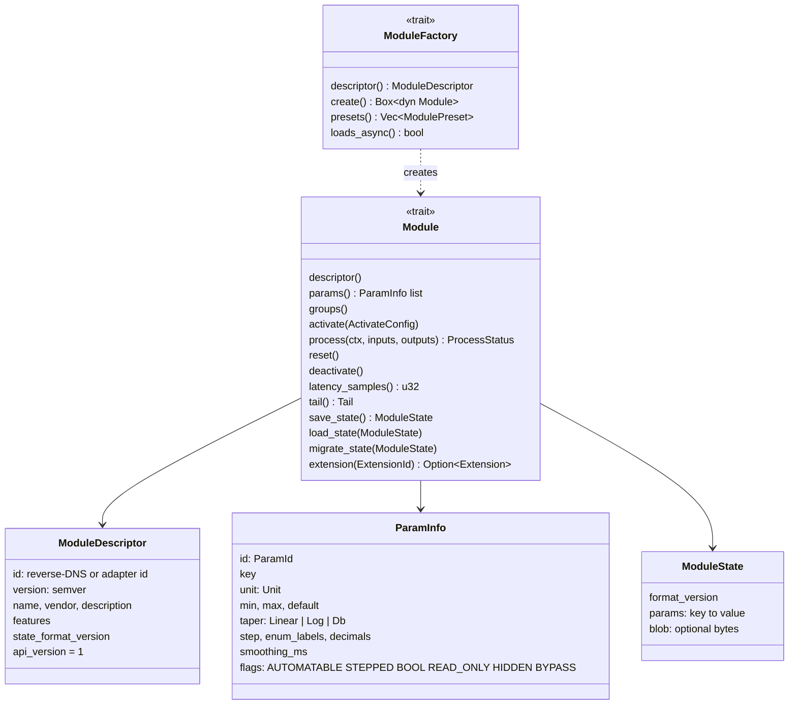
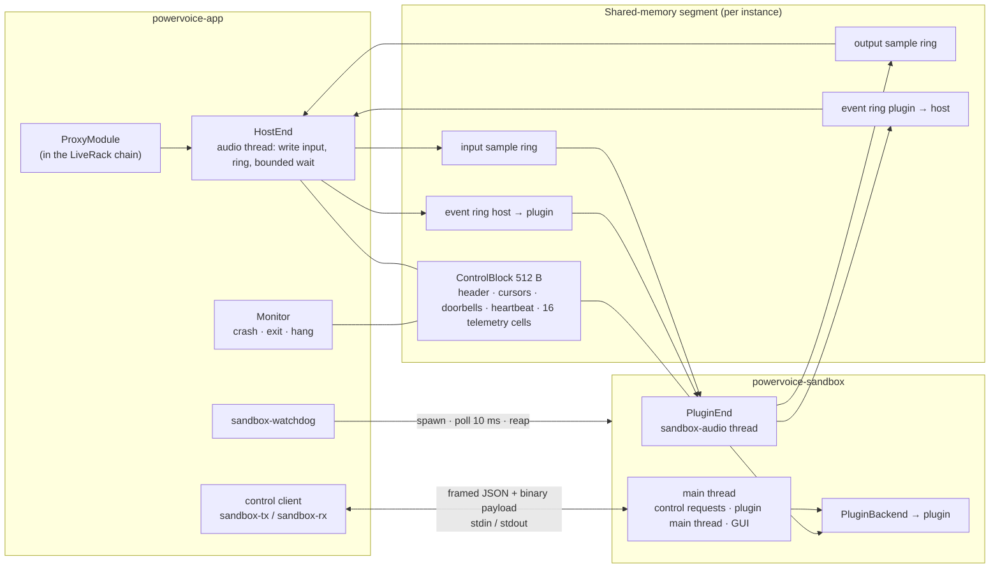

# Plugins: the Module API, installable modules and the sandbox

Everything in the rack — built-in effects, installed PowerVoice modules and third-party plugins —
is a **module** behind one contract. This page covers that contract, how external plugins are
hosted in separate processes, how they are found, and how to write your own module.

Decisions: [ADR-005](../adr/ADR-005-module-api.md) (Module API, Amendments 1–5),
[ADR-006](../adr/ADR-006-installable-module-abi.md) (installable modules),
[ADR-007](../adr/ADR-007-licensing.md) (format licensing),
[ADR-008](../adr/ADR-008-plugin-sandbox-outline.md) (sandbox, Amendments 1–13). Behaviour:
[SPEC-012](../../specs/SPEC-012-module-api-rack.md).



## The Module API

`crates/module-api` (`vox-module-api`). The rack, latency compensation, presets, the sidecar and
the generic parameter UI only ever see this API.



| Piece | What | Where |
|---|---|---|
| Lifecycle | `activate(sample_rate, max_block, mode, layout)` → `process` / `reset` (real-time safe) → `deactivate`. `ProcessMode` is `Realtime` or `Offline` | `src/module.rs`, `src/process.rs` |
| Parameters | Declarative schema; locale-neutral text conversion; `validate_schema`; values are plain (e.g. dB), with normalized conversion for the UI | `src/param.rs`, `src/text.rs` |
| Events | Sample-accurate `ParamEvent { offset, id, value }` in a fixed-capacity, time-sorted `EventList` (512); modules report changes back through `OutputEvents`; `segments()` splits a block at event offsets | `src/event.rs` |
| Requests | `ProcessContext::request(HostRequest::Restart)` when latency or structure changes; `ProcessStatus::Error` (adapters only) makes the host bypass the slot | `src/process.rs` |
| State | `ModuleState` (params by key + optional base64 blob). The host runs `prepare_state`: newer → `TooNew`; older → `migrate_state`; unknown keys dropped, missing ones defaulted, values clamped | `src/state.rs` |
| Identity | Reverse-DNS ids (`org.powervoice.gain`), `id@version` refs; adapters use `clap:…`, `vst3:<hex>`, `lv2:<uri>`, `jsfx:<path>` | `src/descriptor.rs` |

### Extensions

Optional typed abilities behind `Module::extension` (`src/extension.rs`):

| Extension | Purpose | Implemented by |
|---|---|---|
| `Telemetry` (`org.powervoice.telemetry/1`) | Wait-free meter cells the host reads each tick → `VXMT` | Noise Gate, Dynamics, True-Peak Limiter |
| `ResponseCurve` (`org.powervoice.response-curve/1`) | Magnitude response for the EQ graph | Parametric EQ |
| `NoiseProfile` (`org.powervoice.noise-profile/1`) | Capture a noise print into the state blob | Noise Reduction |
| `AdapterHealth` | Host-internal: why an out-of-process module failed | `ProxyModule` |
| `ParamText` | Host-internal: the plugin's own value text | `ProxyModule` (CLAP) |
| `PluginEditor` | Host-internal: open/close the plugin's window, collect GUI edits | `ProxyModule` |

`TransferCurve` (for the gate and dynamics graphs in SPEC-013/016) is not implemented, and
`LiveState` (reserved in ADR-005 §11) doesn't exist.

### Testing a module

`vox-module-api` with feature `test-util` provides `ModuleTestHost`
(`src/test_util/host.rs`): one call runs schema validation, activation at several rates and block
sizes, processing under `no_alloc`, reset, parameter flush and event timing (latency-aware),
state round-trip, determinism, text round-trip and extension checks. Modules whose parameters
deliberately act later (time constants, thresholds) declare them with `allow_delayed_effect(id)`.
Every test binary using it calls `vox_module_api::install_test_allocator!()`.

## Installable modules (`.voxmod`)

A PowerVoice module you install from a file is a **standard CLAP plugin** that also publishes
PowerVoice's metadata (ADR-006), packaged in a validated zip.

- **`vox-module-clap`** wraps any `Module` + `ModuleFactory` as a CLAP 1.2 mono effect
  (`ClapModule<F>`, `export_module!`): descriptor, one mono port per direction, params with their
  flags and text rules, sample-accurate events, state as `ModuleState` JSON (migrations run on
  load), latency/tail, render mode, and the `org.powervoice.module-info/1` extension (`ModuleInfo`
  JSON: descriptor, params, groups). The resulting `.clap` works in any CLAP host.
- **`.voxmod`** (`crates/plugin-host/src/voxmod.rs`): a zip of `manifest.json` (id, version,
  `module_api`, `min_host_version`, name, vendor, license, `binaries` per platform, `sha256` per
  file), `bin/<platform>/<id>.clap` and licenses; ≤ 256 MiB. Validation runs no code: path
  safety, manifest, platform, checksums, and the id must not be a built-in's.
- **Install** (`crates/plugin-host/src/install.rs::install_voxmod`): extract to
  `modules/.staging/…`, rename atomically to `modules/<id>/<version>/`, then scan that `.clap`
  once in a sandbox. It must offer exactly the manifest's id and version with valid module-info,
  or everything is rolled back (a crash or timeout also blocklists the package). One version per
  id; uninstall removes the id folder. The modules folder is the first CLAP scan location.
- Packaged modules run sandboxed like any plugin. They don't expose the telemetry, response-curve
  or noise-profile extensions over CLAP yet (ADR-006 §2 lists them; `ClapModule` doesn't register
  them). Locale and preset files inside a package are not merged yet (H-44).

## The sandbox

Every external plugin instance runs in its own `powervoice-sandbox` process, so a crash, hang or
memory corruption in a plugin never takes down the editor or a recording (ADR-008).



**Transport** (`crates/sandbox-ipc`, layout version 1, magic `PVSBXIPC`):

- One segment per instance (Linux memfd, POSIX `shm_open` on macOS, a named file mapping on
  Windows). The rings are indexed by absolute stream position; capacity is the next power of two
  of 8 × max block.
- Per callback of `n` frames at position `p`, the host writes `in[p, p+n)`, publishes the write
  cursor and rings the `to_plugin` doorbell; the sandbox processes and publishes `out`; the host
  reads what's ready. The path is **pipelined**: output arrives one transport block `B` later, and
  `B` is part of the reported latency (`ProxyModule::latency_samples` = B + plugin latency).
- The host waits at most a budget (25 % of the block period in real time) and otherwise
  substitutes the latency-matched dry signal with a short crossfade. In offline renders it waits
  up to 5 s instead.
- Doorbells are futex words on Linux (spin-then-yield elsewhere); a wake syscall happens only when
  the peer is parked — the one documented exception to the no-syscall rule (ADR-002 Amendment 2).
- Plugin-originated events (a parameter moved in the plugin's GUI, a restart request) travel
  with the chunk they belong to (`PluginEnd::service_with_events`, H-36).

**Control channel** (`sandbox-ipc/src/{control,protocol}.rs`, protocol **v3**): frames of
`u32` length + `u32` JSON length + JSON + binary payload (≤ 64 MiB) over the sandbox's
stdin/stdout. The sandbox points its fd 1 at stderr, so a plugin that prints can't corrupt the
stream. Requests: `Hello`, `Load`, `Activate`, `Deactivate`, `SetParams`, `SaveState`,
`LoadState`, `ParamTexts`, `TextToParam`, `OpenEditor`, `CloseEditor`, `Shutdown`; unsolicited
notifications (id 0): `EditorClosed`, `StateChanged`, `Params`, `Alive`.

**Process lifetime:** the single `sandbox-watchdog` thread spawns every sandbox so Linux's
`PR_SET_PDEATHSIG` is tied to a thread that lives as long as the editor. The sandbox exits on
`Shutdown`, when stdin closes, when the host pid disappears, or when its parent thread dies.
Retired sandboxes get 500 ms, then SIGKILL. Real-time priority (`SCHED_FIFO`) is attempted
unless `POWERVOICE_SANDBOX_NO_RT=1`.

**Failure policy** (rack, `crates/rack/src/host.rs`): a fault → the slot is bypassed with a 15 ms
crossfade and shows *Restarting*; after 200 ms it restarts once from its last committed state;
a second failure shows *Failed* with the reason and a Retry button. Offline renders abort instead.
A runtime crash increments `plugin-health.json` and flags the plugin in the Plugin Manager but
never blocklists it. Sequence: [runtime.md](runtime.md#plugin-crash-and-restart).

**Editor windows** (T-901, ADR-008 Amendment 13): the plugin's own GUI is a floating native window
owned by its sandbox — X11 via runtime-loaded libX11 on Linux (XWayland under Wayland), HWND on
Windows (compiles, untested); macOS isn't implemented. CLAP GUIs are tested end to end; VST3
(`IPlugView`) and LV2 (runtime-loaded suil, X11 UIs) are unit-tested; JSFX has no window. While
a window is open the sandbox sends a heartbeat every 250 ms; 5 s of silence counts as a hang and
the sandbox is killed. GUI edits update the rack's parameter mirror and dirty state; Save
captures editor-only state first. A crashed window isn't reopened automatically (A-027).
`POWERVOICE_SANDBOX_GUI=headless` runs editors headless in tests.

## Format backends

All format code lives in `crates/sandbox/src/` behind `PluginBackend` / `PluginInstance`
(`backend.rs`); nothing format-specific runs in the app process.

| Format | Backend | Binding | Notes |
|---|---|---|---|
| CLAP 1.2 | `clap/` | hand-written `vox-clap-abi` (MIT headers credited) | Control reader thread + 10 ms main-thread tick; recognises `org.powervoice.module-info/1` and registers PowerVoice modules under their bare id |
| VST3 | `vst3/` | `vst3` crate 0.3 (SDK 3.8 bindings) | Component + controller via connection points, preallocated parameter queues; `moduleinfo.json` bundles are indexed without loading |
| LV2 | `lv2/` | `vox-lv2-abi` + **lilv loaded at run time** (`POWERVOICE_LILV` overrides the path) | Unix only; URID, options, bounded block length, worker (own thread), state; sample-accurate controls by block splitting |
| JSFX | `jsfx/` | vendored ysfx (`vox-ysfx-sys`) | Unix x86-64/aarch64 only; sliders → params; `@serialize` state; latency from `pdc_delay` |
| test | `test_backend` | built-in Gain + fault injection | Dev menu with `POWERVOICE_DEV_PLUGINS=1` (`test:gain`, crash, hang) |
| VST2 | — | — | **Not implemented**: gated on the owner's legal sign-off (T-811) |

Every adapter is mono in/out; a stereo-only plugin gets dual-mono input and the host keeps the
left channel.

## Scanner, catalog, blocklist and health

`crates/plugin-host/src/{catalog,scan,blocklist,health,install}.rs`, wired in
`src-tauri/src/plugins.rs`.

- **Catalog:** `PluginCatalog` is the single source of truth for external effects. At start-up
  `load_cached()` registers cached effects instantly (no sandbox), then `rescan_in_background()`
  refreshes and hot-adds new ones into every registry with `Registry::upsert`. Rescans and
  installs are serialized.
- **Search order (tiers):** installed modules folder (CLAP) → per-user install folder → standard
  paths (`$CLAP_PATH`/`$VST3_PATH`/`$LV2_PATH` first) → your custom folders. The first occurrence
  of a plugin id wins; later copies are listed as *Shadowed by …* (ADR-008 Amendment 5).
- **Scanning:** each file in its own `powervoice-sandbox --scan <file> --format <fmt>` process
  with a 30 s timeout; the scan instantiates but never activates. Results are cached in
  `plugin-scan.json` keyed by path + size + mtime.
- **Blocklist** (`plugin-blocklist.json`): a file that crashes or times out while scanning is
  blocked (`Crashed` / `TimedOut`), or you block it manually. An entry clears itself when the
  file changes (size, mtime or CRC-32).
- **Health** (`plugin-health.json`): runtime crash counters per module id, shown as a flag.
- **Missing plugins:** a document whose rack uses an unavailable plugin keeps a *Missing*
  placeholder with the saved state; it re-resolves live when the plugin appears (H-40).
- **Install / uninstall** (Plugin Manager, Effects → Install Module…): `.clap`, `.vst3`, `.lv2`,
  JSFX and `.voxmod` go to the per-user folders ([data.md](data.md#where-files-live)); only files
  inside those folders can be uninstalled (others can be blocked).

| Format | Linux standard paths | macOS | Windows |
|---|---|---|---|
| CLAP | `~/.clap`, `/usr/lib/clap` | `~/Library/Audio/Plug-Ins/CLAP`, `/Library/Audio/Plug-Ins/CLAP` | `%LOCALAPPDATA%\Programs\Common\CLAP`, `%COMMONPROGRAMFILES%\CLAP` |
| VST3 | `~/.vst3`, `/usr/lib/vst3`, `/usr/local/lib/vst3` | `~/Library/Audio/Plug-Ins/VST3`, `/Library/Audio/Plug-Ins/VST3` | `%LOCALAPPDATA%\Programs\Common\VST3`, `%COMMONPROGRAMFILES%\VST3` |
| LV2 | `~/.lv2`, `/usr/local/lib/lv2`, `/usr/lib/lv2` (+ lib64) | `~/Library/Audio/Plug-Ins/LV2`, `~/.lv2`, `/usr/local/lib/lv2`, `/Library/Audio/Plug-Ins/LV2` | — |
| JSFX | PowerVoice's `Effects` folder, then REAPER's `Effects` | same, REAPER's under `~/Library/Application Support/REAPER` | — |

## Write a PowerVoice module

A walkthrough using the in-repo example package [`crates/voxmod-gain`](../../crates/voxmod-gain/),
which exports the built-in Gain as `org.powervoice.gain.packaged`. Build it as a template for your
own effect.

**1. Create a `cdylib` crate** — `crates/my-effect/Cargo.toml`:

```toml
[package]
name = "vox-my-effect"
version.workspace = true
edition.workspace = true
license.workspace = true
publish.workspace = true

[lib]
crate-type = ["cdylib", "rlib"]   # rlib too: test crates can dev-depend on it

[dependencies]
vox-module-api = { path = "../module-api" }
vox-module-clap = { path = "../module-clap" }

[dev-dependencies]
vox-module-api = { path = "../module-api", features = ["test-util"] }

[lints]
workspace = true
```

(Add it to the workspace `members` in the root `Cargo.toml`.)

**2. Implement the module and its factory.** `voxmod-gain` reuses `vox_modules::Gain` and only
supplies a factory with its own id:

```rust
pub const ID: &str = "org.powervoice.gain.packaged";

pub struct PackagedGainFactory { descriptor: ModuleDescriptor }

impl Default for PackagedGainFactory {
    fn default() -> Self {
        let mut descriptor = Gain::descriptor_value();
        descriptor.id = ID.into();
        descriptor.name = LocalizedText::plain(NAME);
        Self { descriptor }
    }
}

impl ModuleFactory for PackagedGainFactory {
    fn descriptor(&self) -> &ModuleDescriptor { &self.descriptor }
    fn create(&self) -> Result<Box<dyn Module>, ModuleError> { Ok(Box::new(Gain::new())) }
}
```

For a module of your own, implement `vox_module_api::Module` (see `TestGain` in
`crates/module-api/src/test_util/` for a minimal, complete example): declare `ParamInfo`s, apply
`ParamEvent`s at their offsets in `process`, never allocate or lock in `process`/`reset`, report
`latency_samples()` and request a restart when it changes. The id must be reverse-DNS
(`[a-z0-9.-]`, ≥ 2 labels, ≤ 128 bytes) and must not be a built-in id.

**3. Export it as CLAP:**

```rust
vox_module_clap::export_module!(PackagedGainFactory);
```

**4. Test it** with the module test host:

```rust
vox_module_api::install_test_allocator!();

#[test]
fn passes_the_module_test_host() {
    ModuleTestHost::new(|| Box::new(MyEffect::new())).assert_passes();
}
```

(`ModuleTestHost::from_factory(Arc<dyn ModuleFactory>)` is the variant that also checks the
factory's presets. `crates/modules/tests/gain.rs` is a worked example.)

**5. Write the manifest template** — `crates/my-effect/voxmod.json`; `id`, `version`, `name`,
`vendor` and `module_api` must match the descriptor (the install scan checks id and version):

```json
{ "manifest_version": 1, "id": "org.powervoice.gain.packaged", "version": "1.0.0",
  "module_api": 1, "min_host_version": "0.1.0", "name": "Gain (packaged)",
  "vendor": "PowerVoice", "license": "MIT OR Apache-2.0", "url": "https://powervoice.app" }
```

**6. Package it:** `just voxmod my-effect` builds the release `.clap` and runs
`powervoice-cli`'s `voxmod` binary to write `target/voxmod/<id>-<version>.voxmod` (binaries,
licenses, checksums). Linux and Windows binaries; macOS bundles aren't assembled by the recipe yet.

**7. Install it:** in PowerVoice, **Effects → Install Module…**, pick the `.voxmod`. It lands in
`<app local data>/modules/<id>/<version>/`, is scanned once in a sandbox, and appears in the
rack's Add-module menu. Its presets and state work like a built-in's; it always runs sandboxed.

**Testing against the real sandbox:** the sandbox's own tests load the in-repo test plugins
instead of installed ones — [`vox-test-clap`](../../crates/test-clap/) (mono gain with 64-sample
latency, a stereo-only variant for the mono shim, a latency-changing variant, and
`crash-on-scan` / `hang-on-scan` / `gui-crash` / `gui-hang` copies selected by file name). Cargo
builds it as a dev-dependency of `powervoice-sandbox`; `crates/sandbox/tests/common/mod.rs`
finds the `.so` next to `CARGO_BIN_EXE_powervoice-sandbox`. Don't link `vox_voxmod_gain` and
`vox_test_clap` into one test binary (both export `clap_entry`).
