# Runtime: threads, real-time rules and the main flows

How PowerVoice runs: which threads exist, how they talk, the rules that keep audio glitch-free,
and a sequence diagram for every main user flow. Decisions: [ADR-002](../adr/ADR-002-threading-realtime.md)
(threading) and [ADR-003](../adr/ADR-003-ipc-data-paths.md) (IPC). Start with the
[overview](overview.md) if you haven't.

Contents: [Threads](#threads) · [Real-time rules](#real-time-rules) · [Rings](#rings-between-threads) ·
[Jobs](#jobs) · [Transport rules](#transport-rules) · Flows: [app start](#app-start) ·
[open a file](#open-a-file) · [play](#play) · [record and punch-in](#record-and-punch-in) ·
[edit and undo](#edit-and-undo) · [bake](#apply-the-rack-bake) ·
[noise-print capture](#noise-print-capture) · [loudness and normalize](#loudness-analysis-and-normalize) ·
[export](#export) · [crash recovery](#crash-recovery) · [plugin scan](#plugin-scan) ·
[load a sandboxed plugin](#load-a-sandboxed-plugin) · [plugin crash and restart](#plugin-crash-and-restart)

## Threads

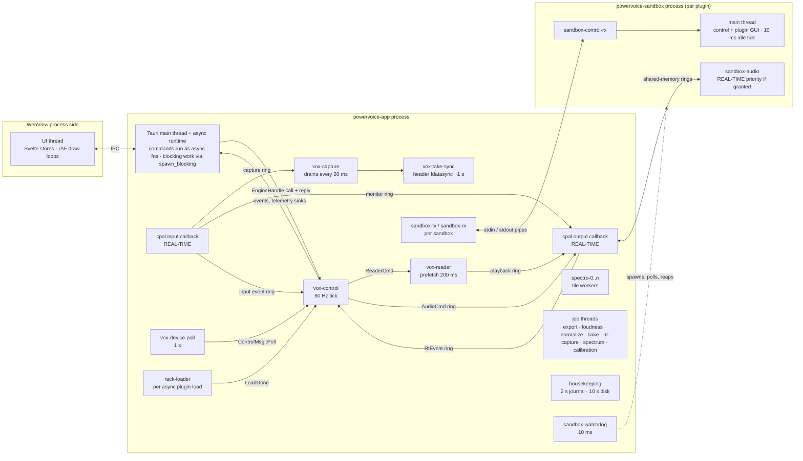

| Thread | Spawned by | Does | Talks through |
|---|---|---|---|
| UI thread | WebView | Svelte 5 UI, draw loops, IPC calls | Tauri `invoke`, events, `Channel` ([ipc.md](ipc.md)) |
| Tauri main + async runtime | Tauri | Runs `#[tauri::command]` handlers (all `async`); engine calls go through `spawn_blocking` (`src-tauri/src/ipc/audio_commands.rs`) | Service structs in Tauri state |
| `vox-control` | `Engine::start` (`crates/engine/src/engine.rs`) | Owns devices, transport, `RackHost`, recording, telemetry; `control::run` handles messages and a 16.67 ms tick (`control::TICK`) | `mpsc` inbox + one `sync_channel(1)` reply per `EngineHandle` call; rtrb rings to the callbacks |
| `vox-reader` | `Control::new` (`control.rs`) | Reads the snapshot (`SnapshotReader`), resamples document → device rate, keeps `READ_AHEAD_MS` = 200 ms in the playback ring; tags pre-roll warm-up packets | `ReaderCmd` channel, playback ring |
| cpal output callback | cpal (`backend/cpal.rs`) | `OutputCb::process` (`output.rs`): commands, monitor, rack, fades, meter, device write, analyzer tap | rings + atomics only |
| cpal input callback | cpal | `input_callback` (`input.rs`): deinterleave the chosen channel, meter, clip, monitor ring, capture ring, dropout detection | rings + atomics only |
| `vox-capture` | `capture::spawn` (`capture.rs`) | Drains the capture ring every 20 ms, resamples if the device rate differs, appends to `TakeCapture` (WAV + chunk store) | capture ring; `RecordDone` callback |
| `vox-take-sync` | `vox-capture` | Patches and `fdatasync`s the take WAV header about every second | atomic stop flag |
| `vox-device-poll` | `DevicePollThread::spawn` (`devices.rs`) | Enumerates hosts/devices now and every 1 s (cpal has no hot-plug events) | `ControlMsg::Poll` |
| `spectro-{i}` | `SpectroService::new` (`crates/engine/src/spectro/mod.rs`) | Spectrogram tiles; clamp(cores − 2, 1, 8) workers, halved while a save/export/bake runs | `Mutex` + `Condvar` queue; `Channel` to the UI |
| `rack-loader` | `RackHost::spawn_load` (`crates/rack/src/host.rs`) | Creates and activates a module off the control thread (sandboxed plugins load asynchronously) | `mpsc` `LoadDone`, drained by `RackHost::tick` |
| Job threads | the job services in `src-tauri` | `export-job`, `loudness-job`, `normalize-peak-job`, `normalize-lufs-job`, `bake-job`, `nr-capture-job`, `spectrum-job`, `vox-calibration` | cancel token in a jobs map; `job_progress` event ([Jobs](#jobs)) |
| Import decoder | `vox_project::import_file` (scoped) | Decodes the source file into a bounded channel while the caller writes chunks | `sync_channel` |
| `housekeeping` | `housekeeping::start` (`src-tauri/src/housekeeping.rs`) | Journals rack + view state (2 s debounce), disk-budget check (10 s, or when an edit kicks it) | `recv_timeout` + kick channel |
| `vox-take-window` | `RecordingService::note_window` (`recording.rs`) | Journals a record operation's window off the control thread | one-shot |
| `sandbox-watchdog` | `vox_plugin_host::watchdog` | Spawns every sandbox (so `PR_SET_PDEATHSIG` binds to a long-lived thread), polls every 10 ms, retires with 500 ms grace then SIGKILL | shared sandbox handles |
| `sandbox-tx` / `sandbox-rx` | `vox_plugin_host::rpc` | One pair per sandbox: framed JSON requests/responses over the child's stdin/stdout | `mpsc` |
| `plugin-scan` (+ workers) | `PluginCatalog::rescan_in_background` | Scans plugin files, each in its own `powervoice-sandbox --scan` process | callbacks → `plugin_scan_progress` |
| Log writer | `tracing_appender::non_blocking` (`src-tauri/src/logging.rs`) | Writes `powervoice.log` off the calling threads | — |
| Sandbox main thread | `powervoice-sandbox` (`crates/sandbox/src/server.rs`) | Serves control requests, runs the plugin's main-thread work and GUI (X11), 10 ms idle tick, 250 ms heartbeat while an editor is open | wake pipe from `sandbox-control-rx` |
| `sandbox-audio` | sandbox on `Activate` | Serves the host's audio chunks (`PluginEnd::service_with_events`), 20 ms idle wait | shared-memory rings + futex |

The **control tick** (`Control::tick`, `control.rs`) runs, in order: drain the output and input
event rings → calibration service, disk poll (~1 s) and disk floor → record-operation and recording
service → `RackHost::tick` (return ring, loader results, restarts) → stream health, monitor relink,
latency readout (500 ms) → when the telemetry rate gate is due (60 Hz, or 30 Hz by setting):
`VXTM`, `VXMT` and `VXSA` publishing → state and record events.

## Real-time rules

The output and input callbacks, and every module's `process()`, must be real-time safe
([CLAUDE.md](../../CLAUDE.md), ADR-002). What that means and how the code enforces it:

| Rule | Why | How it holds in the code |
|---|---|---|
| No allocation or free | The allocator can lock or page-fault | Tests run callbacks and `process()` under `vox_module_api::test_util::no_alloc` (`crates/module-api/src/test_util/mod.rs`); raw `assert_no_alloc` is banned by `clippy.toml`. Fixed-capacity types (`EventList`) implement `Clone` by hand to keep capacity |
| No locks, no blocking | A lock held by a lower-priority thread stalls audio | Only rtrb SPSC rings and atomics cross into the callbacks; the reader prefetches, so the audio thread **never reads the memory-mapped chunk store** |
| Drop heavy objects elsewhere | Freeing memory is an allocator call | The **return ring**: `LiveRack` pushes retired chains onto a 64-entry ring (`crates/rack/src/live.rs`), `RackHost::tick` deactivates and drops them. When a stream ends, `OutputCb::drop` parks its parts in a slot for the control thread (`output.rs`) — the lock there is in `Drop`, not in `process` |
| No I/O, logging or syscalls | Unbounded latency | Notices travel as `RtEvent`s to the control thread, which logs. One documented exception: the sandbox transport's doorbell issues `FUTEX_WAKE` only when the peer is parked (`crates/sandbox-ipc/src/wakeup.rs`, ADR-002 Amendment 2) |
| Denormal-safe | Denormals are ~100× slower on x86 | `vox_dsp::fp::DenormalGuard` (FTZ + DAZ) at the top of `OutputCb::process`, the input callback, spectrogram workers and offline renders; DSP also flushes state explicitly (EQ below 1e-30) |
| Bounded work per callback | A deadline miss is a dropout | ≤ 256 commands drained per callback (`rt.rs`); sub-blocks ≤ `MAX_BLOCK` = 1024; pre-roll bursts ≤ 32× real time (`PREROLL_SPEED`); the sandbox proxy waits a bounded budget then substitutes the dry signal |
| No panics on valid input | A panic on the audio thread kills audio | Non-finite guard in `Chain`: a slot producing NaN/Inf is bypassed and reported (`FailReason::NonFinite`) |

`just bench-callback` measures the real output path (fake backend + a voice rack) against the
block deadline; see [performance.md](../performance.md).

## Rings between threads

Allocated when a stream opens (`Control::open_output` / `open_input`, `control.rs`), never
resized on the audio thread.

| Ring | Direction | Capacity |
|---|---|---|
| Playback | reader → output | 64 packets × 256 frames |
| `AudioCmd` | control → output | 1024 |
| `RtEvent` | output → control | 1024 (`Block` events carry heard position, time, latency, peak, Σx²) |
| Monitor | input → output | 65 536 frames (ADR-002 said 8192; Amendment 1) |
| Analyzer tap | output → control | 32 768 samples, only while a subscriber exists |
| Input commands / events | control ↔ input | 64 / 1024 |
| Capture | input → capture writer | sample rate × 10 s |
| Gap events | input → capture writer | 64 |
| Rack commands / events | control ↔ `LiveRack` | 1024 / 1024 |
| Return ring | `LiveRack` → control | 64 retired chains (≤ 32 swaps in flight) |

## Jobs

Long operations are jobs with one shared shape, in `src-tauri`
(`export.rs`, `loudness.rs`, `normalize.rs`, `bake.rs`, `nr_capture.rs`, `spectrum.rs`,
`calibration.rs`):

1. `start_job` validates the request, **snapshots its inputs** (document source, the live rack
   model), assigns a `job_id`, stores a cancel token and spawns a named thread. The command
   returns the id at once.
2. The thread emits `job_progress { job_id, kind, state: running, fraction }`
   (`src-tauri/src/ipc/events.rs`).
3. On failure it emits the error `notice` **before** the terminal `failed` progress; on cancel
   only `cancelled`; on success `done`, then any result event (`loudness_report`,
   `normalize_result`, `spectrum_report`, `document_changed` + `history_state`).
4. `*_cancel(job_id)` sets the token; unknown ids are ignored.

`JobKind`: `export`, `import`, `nr_capture`, `loudness_analyze`, `normalize_peak`,
`normalize_lufs`, `calibration`, `bake`, `spectrum_analyze`, `paste` (H-56), `save` (H-70). Import
is special: its cancel tokens live in `DocumentService` and `document_open` emits the events
itself. Jobs that **write back** to the document (normalize, bake) take a read-only source and set
`normalize_busy`; they commit only if the snapshot (`Arc::ptr_eq`) and session are unchanged, and
audio edits refuse with `error.document_busy` meanwhile. Save runs a free-space pre-flight
(`estimated_save_output_bytes` + a 64 MiB margin) before writing a byte and can be cancelled
mid-write (`document_save_cancel`); its errors are classified (`error.save.disk_full`,
`.verify_failed`, `.permission`, `.too_large_for_wav`, `.sidecar_locked`, …) rather than a single
generic message. Save, export and bake hold `SpectroService::begin_background_job()` to halve the
tile workers.

## Transport rules

From `crates/engine/src/transport.rs` and SPEC-003 (with owner decisions D-018 and A-023):

- **Stop** returns the playhead to where playback started; **Pause** keeps it; stops the engine
  initiates (end of document, device lost) behave like Pause.
- **Seek while playing**: 5 ms fade-out, rack reset, pre-roll, fade-in.
- **Loop** plays the selection (≥ 10 ms) with a sample-exact wrap and no rack reset; tails carry
  across the seam (A-023).
- **Pre-roll (H-46)**: after a rack reset the reader starts one rack latency early and the output
  callback feeds the rack that look-ahead off the device timeline, so the first heard sample is
  the play position (playback start ≤ 6.7 ms with the voice rack).
- While recording, Stop/Pause/Play stop the take; other transport commands are ignored.

---

## App start

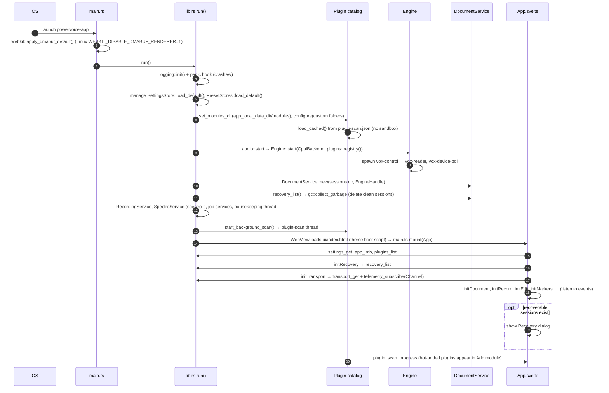

Code: `src-tauri/src/main.rs`, `src-tauri/src/lib.rs::run`, `ui/src/main.ts`, `ui/src/App.svelte`
(`onMount`).

## Open a file

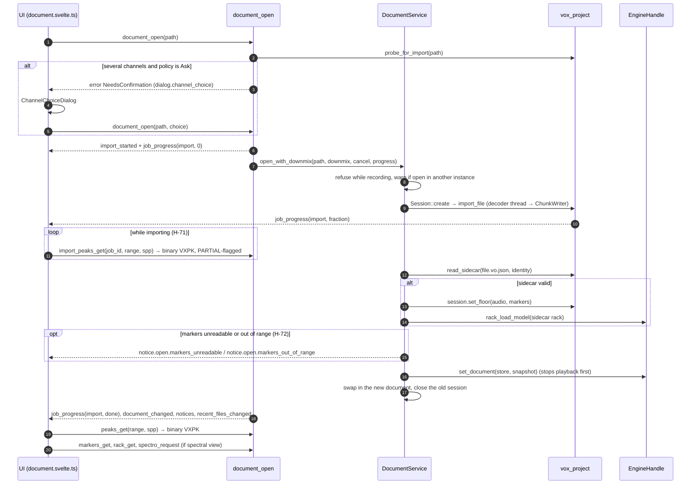

Cancel (`document_open_cancel`) leaves the previous document untouched: nothing is swapped until
the import commits. While the import job is still running, the waveform view polls
`import_peaks_get(job_id, …)` (H-71, SPEC-006 AC-13) instead of `peaks_get` — the same `VXPK`
framing over whatever the growing session has committed so far, `PARTIAL`-flagged with `(NaN, NaN)`
buckets past that point, so the waveform fills in progressively rather than appearing all at once.
Markers read from a WAV's `cue`/`LIST adtl` chunks that are malformed or reference positions
outside the decoded audio are dropped and reported with a notice (H-72) rather than silently
ignored or left to corrupt the marker list. Code:
`src-tauri/src/ipc/document_commands.rs::document_open` / `import_peaks_get`,
`src-tauri/src/document.rs::open_impl`, `crates/project/src/import.rs`,
`crates/project/src/sidecar.rs`.

## Play

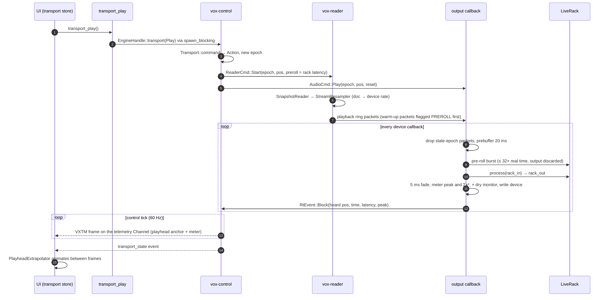

Code: `src-tauri/src/ipc/audio_commands.rs`, `crates/engine/src/control.rs` (`transport_command`,
`execute`), `crates/engine/src/reader.rs`, `crates/engine/src/output.rs`,
`crates/engine/src/telemetry.rs`, `ui/src/lib/state/transport.svelte.ts`.

## Record and punch-in

A new recording into an empty document uses `record_start`. Recording at the cursor (insert or
overwrite) and punch-in over a selection use a record **operation**:

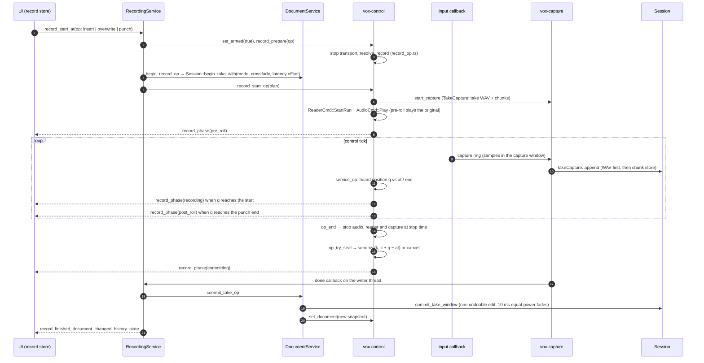

- Punch replaces exactly the selection and stops itself at its end; Stop during pre-roll cancels
  (no edit), during recording keeps a partial punch to the heard stop point.
- Insert splices without fades; Overwrite/Punch crossfade inside the replaced range.
- The recording offset (latency calibration, `calibration_run`) is applied only when recording
  follows playback. A punch needs an output device.
- Capture never splices audio on ring overflow: the take ends at the last sample that fit.
  Input dropouts are filled and marked; gaps > 2 s stop the take. Disk space below the floor
  stops gracefully.

Code: `crates/engine/src/record_op.rs`, `control.rs` (`record_prepare`, `record_start_op`,
`service_op`, `op_end`, `op_try_seal`), `crates/engine/src/capture.rs`, `src-tauri/src/recording.rs`,
`src-tauri/src/document.rs::commit_take_op`, `crates/project/src/session.rs::commit_take_window`.

## Edit and undo

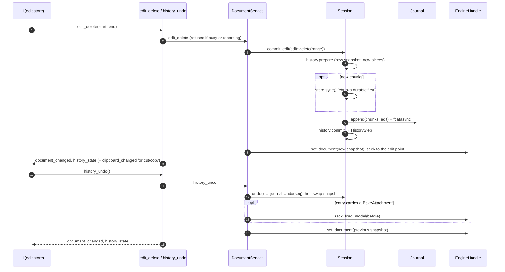

Snapshots are immutable `Arc<DocSnapshot>`s, so undo is a pointer swap; chunks are never
rewritten. Rack edits themselves are not undoable (D-015), except that undoing a bake restores
the pre-bake rack. Code: `src-tauri/src/document.rs` (`edit_*`, `apply_committed`,
`undo_or_redo`), `crates/project/src/session.rs::commit_internal`, `crates/project/src/history.rs`.

## Apply the rack (bake)

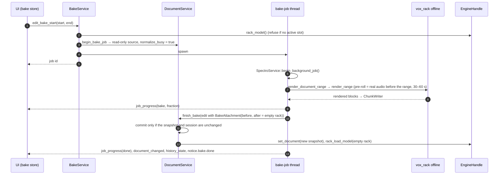

The render is length-preserving (no tail appended) and bit-identical to an export of the same
range, because both use `vox_engine::bake::render_document_range`. Code:
`src-tauri/src/bake.rs`, `crates/engine/src/bake.rs`, `crates/rack/src/offline.rs`.

## Noise-print capture

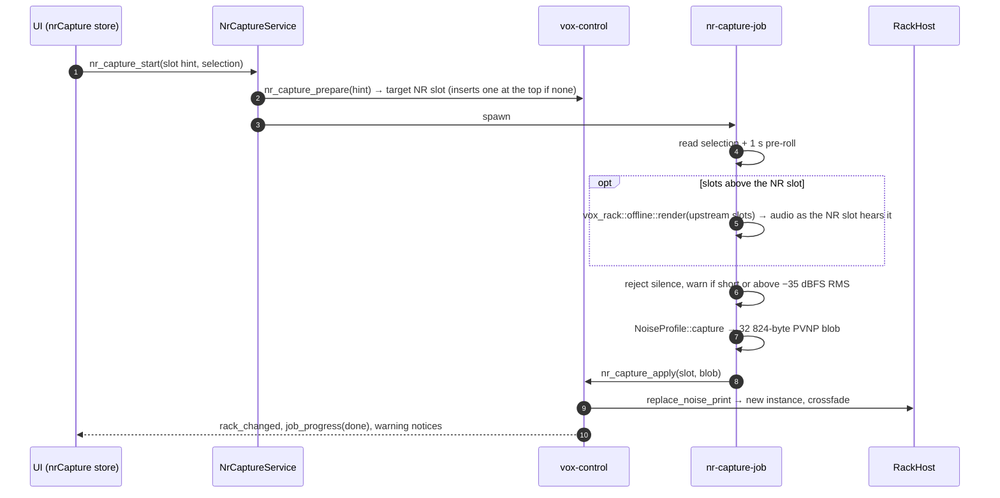

Code: `src-tauri/src/nr_capture.rs`, `crates/engine/src/control.rs::nr_capture_*`,
`crates/rack/src/host.rs::replace_noise_print`, `crates/dsp/src/nr/profile.rs`.

## Loudness analysis and normalize

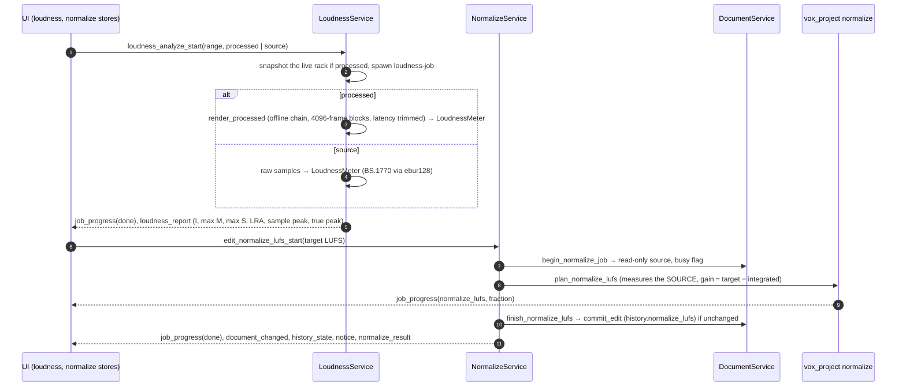

Peak normalize is the same shape (`edit_normalize_peak_start` → `plan_normalize_peak`, which scans
the chunk peak pyramid). The ACX check is a synchronous command (`acx_check` →
`LoudnessService::run_acx_check` → `vox_dsp::acx::evaluate`). Code: `src-tauri/src/loudness.rs`,
`src-tauri/src/normalize.rs`, `crates/project/src/normalize.rs`, `crates/dsp/src/loudness.rs`.

## Export

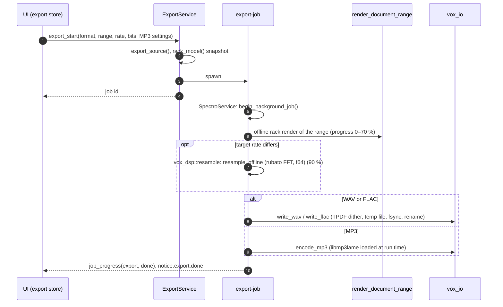

Exports always render the rack, even when A/B is on (D-019). If a sandboxed plugin fails during an
offline render, the render aborts. Code: `src-tauri/src/export.rs::run_pipeline`,
`crates/io/src/{wav,flac,mp3,atomic}.rs`.

## Crash recovery

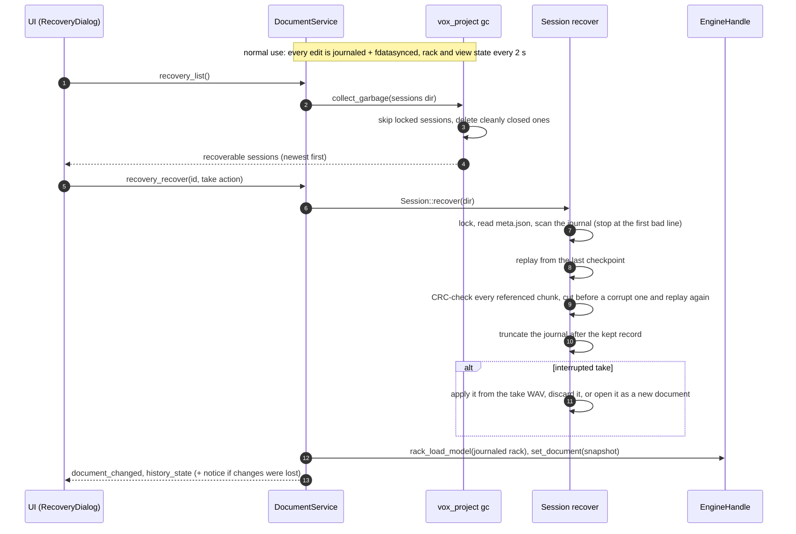

Bounds: a process crash loses at most the last ~250 ms; a power loss about 1.5 s (ADR-004).
Code: `src-tauri/src/ipc/recovery_commands.rs`, `src-tauri/src/document.rs::recover`,
`crates/project/src/{gc,recovery}.rs`, `src-tauri/src/housekeeping.rs`. See also
[data.md](data.md#recovery).

## Plugin scan

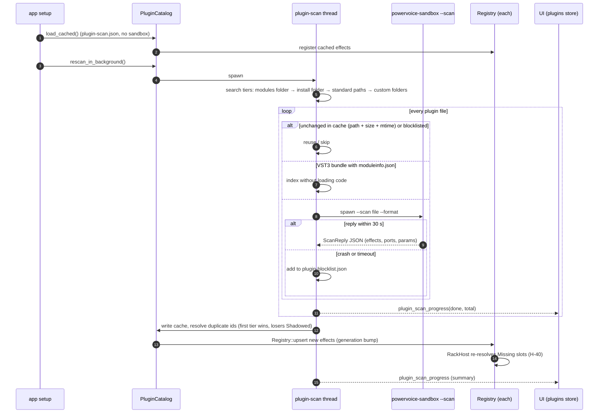

`POWERVOICE_NO_PLUGIN_SCAN=1` skips the start-up rescan. Code:
`crates/plugin-host/src/{catalog,scan,blocklist}.rs`, `src-tauri/src/plugins.rs`.

## Load a sandboxed plugin

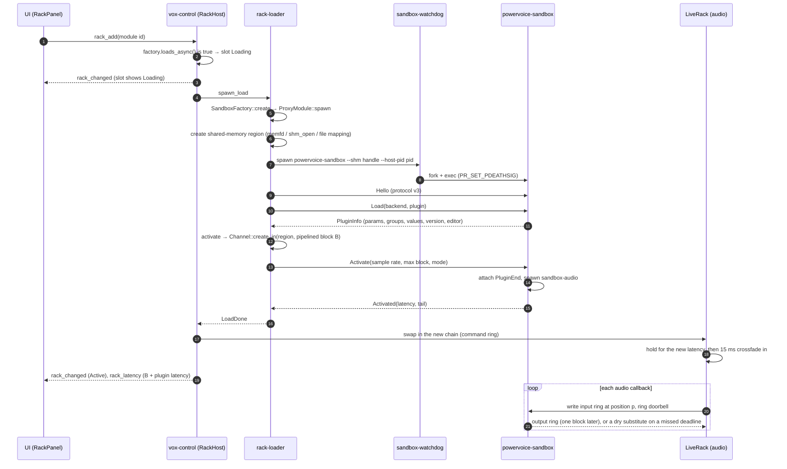

Code: `crates/rack/src/host.rs` (`spawn_load`, `tick`), `crates/plugin-host/src/{factory,proxy,sandbox,watchdog,rpc}.rs`,
`crates/sandbox/src/server.rs`, `crates/sandbox-ipc/src/{host,plugin,layout}.rs`. Details in
[plugins.md](plugins.md#the-sandbox).

## Plugin crash and restart

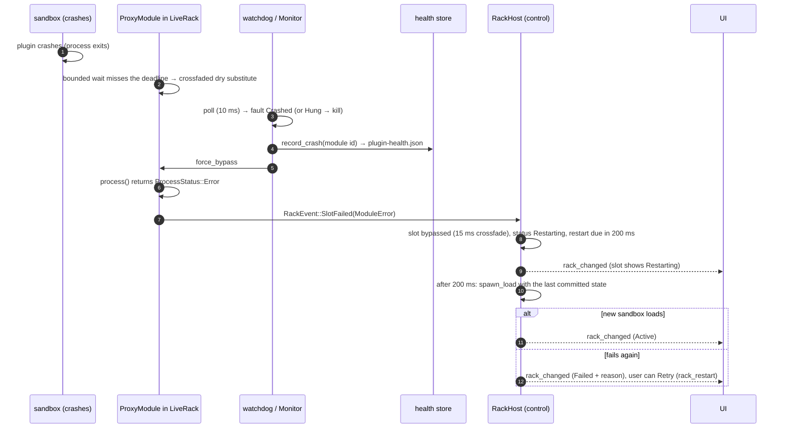

- A runtime crash never blocklists the plugin; it counts in `plugin-health.json` and the Plugin
  Manager flags it. Only scan-time crashes and timeouts blocklist.
- The editor window of a crashed plugin is not reopened automatically (A-027). A GUI that
  freezes the sandbox's main thread stops the 250 ms heartbeat and is killed after 5 s.
- Offline renders (export, bake, analysis) abort on a plugin failure instead of bypassing.

Code: `crates/plugin-host/src/sandbox.rs::record`, `crates/plugin-host/src/health.rs`,
`crates/rack/src/host.rs` (`AUTO_RESTARTS` = 1, `AUTO_RESTART_DELAY` = 200 ms),
`crates/sandbox-ipc/src/monitor.rs`.
