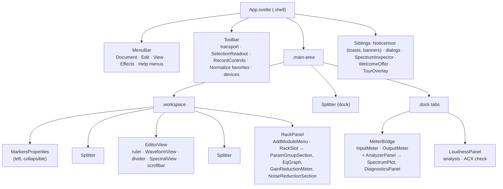
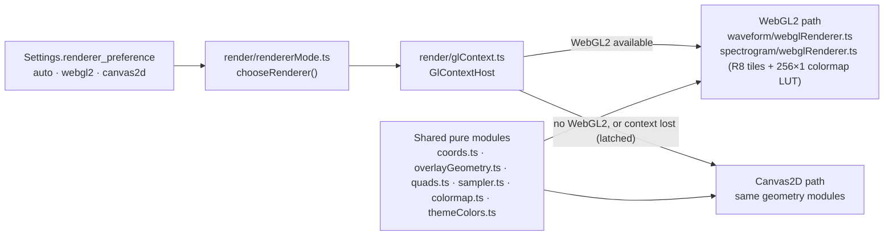

# UI: components, stores, renderers and the design system

The interface is a Svelte 5 (runes) + TypeScript (strict, `noUncheckedIndexedAccess`) app in
[`ui/`](../../ui/), running in the system WebView through Tauri 2. It renders and sends intents;
all audio, document and DSP logic is in Rust. Decisions: [ADR-003](../adr/ADR-003-ipc-data-paths.md)
(IPC), [ADR-009](../adr/ADR-009-renderer-choice.md) (renderers). Design:
[design-system.md](../design/design-system.md) and [ui-audit.md](../design/ui-audit.md).

## Start-up

- [`ui/index.html`](../../ui/index.html) runs a tiny inline script before anything loads: it reads
  the theme mirror `localStorage["powervoice.theme"]` and sets `data-theme` on `<html>`, so the
  window never flashes the wrong theme (Settings remains the source of truth).
- [`ui/src/main.ts`](../../ui/src/main.ts) imports the token stylesheets and mounts
  [`App.svelte`](../../ui/src/App.svelte) — or, in dev builds only, a dev page
  ([below](#dev-pages)).
- `App.svelte`'s `onMount` loads settings and applies the saved preferences (spectral, analyzer,
  renderer, theme, layout, tour offer), then calls each store's `init*()` to subscribe to its
  events: plugins, recovery, notices, record, transport, document, recent files, edit,
  normalize (peak and LUFS), loudness, markers, noise-print capture, spectral view.

## Component tree

| Area | Components | Folder |
|---|---|---|
| Menus | `MenuBar`, `MenuBarMenu`, per-domain `DocumentMenu`, `EditMenu`, `ViewMenu`, `EffectsMenu`, `HelpMenu` — all built from `MenuEntry[]` rendered by the one `ui/Menu.svelte` | `lib/menu/`, `lib/ui/Menu.svelte` |
| Toolbar | `Toolbar`, `SelectionReadout`, `RecordControls`, `NormalizeToolbarButtons` | `lib/layout/`, `lib/record/`, `lib/normalize/` |
| Editor | `EditorView` owns the shared viewport, ruler and scrollbar; `WaveformView`, `SpectralView` | `lib/layout/`, `lib/waveform/`, `lib/spectrogram/` |
| Rack | `RackPanel`, `RackSlot`, generic `ParamGroupSection`/`ParamControl`, `EqGraph`, `GainReductionMeter`, NR section | `lib/rack/`, `lib/eq/` |
| Dock | `MeterBridge` (fixed 13 rem column, vertical `OutputMeter`), `AnalyzerPanel`, `LoudnessPanel` | `lib/layout/`, `lib/analyzer/`, `lib/loudness/` |
| Dialogs | Recovery, Preferences, Plugin Manager, Install/Uninstall plugin, Unsaved changes, Confirm, Save As, Channel choice, Clip prompt, Export, New recording, Low disk, Normalize, Normalize LUFS, Bake, Manage presets, About, Shortcuts, Calibration, Spectrum Inspector | per-domain folders |
| Notices | `NoticeHost` → `Banner`, `Toast` | `lib/notices/` |
| Tours | `TourOverlay`, `TourButton`, `WelcomeOffer` | `lib/tour/` |

The rack's parameter UI is **generic**: it's generated from each module's `ParamInfo` schema
(groups, units, tapers, enum labels), with special panels only where a module offers an extension
(the EQ graph for `ResponseCurve`, gain-reduction meters for `Telemetry`, the noise-print section
for `NoiseProfile`).

## Stores

State lives in module-level `$state` singletons in `*.svelte.ts` files. Each store owns its IPC:
commands through the wrappers in `ui/src/lib/ipc/commands.ts`, events through `listen(...)` in its
`init*()` function, binary frames through the decoders in `ui/src/lib/ipc/`.

| Store | Holds | Fed by |
|---|---|---|
| `state/transport.svelte.ts` | Transport state, extrapolated playhead, output meter | `transport_state`, `VXTM` channel, clock sync |
| `state/record.svelte.ts` | Record panel, input meter, take time, record phase | `record_state`, `record_phase`, `record_finished`, `calibration_result`, telemetry |
| `document/document.svelte.ts` | Open document, file dialogs, window title | `document_changed`, `import_started`, `job_progress` |
| `state/edit.svelte.ts` | Cut/copy/paste/undo availability | `history_state`, `clipboard_changed` |
| `state/selection.svelte.ts` | Time selection (locked while recording) | UI only; synced to the engine for loop/play |
| `state/waveformView.svelte.ts` | Shared viewport, time format, vertical zoom | UI; saved to the sidecar (`sidecar_view_set_waveform`) |
| `state/spectral.svelte.ts` | Spectral pane visibility and display settings | UI; `sidecar_view_set_spectral` |
| `rack/rack.svelte.ts` | Slots, modules, parameter values | `rack_changed`, `param_changed`, `rack_latency`, `VXMT` channel; parameter drags coalesced to one IPC call per frame |
| `analyzer/analyzer.svelte.ts`, `diagnostics.svelte.ts`, `inspectorStream.svelte.ts` | Live analyzer, voice diagnostics, Average/Compare, Inspector | `VXSA`, voice-report channel, `spectrum_report`, `VXLT`, `VXIS` |
| `analyzer/explain/explainVoice.svelte.ts`, `explainModal.svelte.ts` | Explain My Voice's frozen snapshot (memoized per input) and modal open/closed state | Built from the same Average job's `spectrum_report`/`VXLT` above, matched by `job_id` (H-92) |
| `loudness/loudness.svelte.ts`, `acx.svelte.ts` | Loudness analysis, ACX report | `job_progress`, `loudness_report`, `acx_check` |
| `state/normalize.svelte.ts`, `normalizeLufs.svelte.ts`, `state/bake.svelte.ts`, `rack/nrCapture.svelte.ts`, `export/export.svelte.ts` | Job dialogs and progress | `job_progress` (+ result events) |
| `markers/markers.svelte.ts` | Markers | `markers_get` on every `document_changed` |
| `plugins/plugins.svelte.ts` | Plugin Manager | `plugins_*` commands, `plugin_scan_progress` |
| `recovery/recovery.svelte.ts` | Recovery dialog | `recovery_list` |
| `state/notices.svelte.ts` | Toasts and banners | `notice` |
| `state/settings.svelte.ts`, `layout/layoutSettings.svelte.ts`, `theme/theme.svelte.ts`, `tour/tour.svelte.ts`, `state/rendererPref.svelte.ts` | Preferences, layout, theme, tours, renderer choice | `settings_get` / `settings_set` (debounced saves) |

Rules the stores follow: listeners attach only from `init*()` or action entry points; events are
typed with `satisfies EventName`; every store exports a `reset*ForTest()` helper.

## Renderers

Six components draw on a `<canvas>`: `WaveformView`, `SpectralView`, `EqGraph`, `SpectrumPlot`,
`TransferGraph` (H-63, the Dynamics/Noise Gate transfer-curve graph) and `ExplainGraph` (H-92, the
Explain My Voice modal's annotated spectrum).

- **WebGL2 first, Canvas2D fallback** (ADR-009): `GlContextHost` tries `webgl2` unless the
  preference forces Canvas2D, and on `webglcontextlost` switches to Canvas2D for good, with one
  notice. The waveform and spectrogram use it; the EQ graph, analyzer plot, transfer-curve graph
  and Explain My Voice's graph are Canvas2D only.
- **Data:** the waveform draws `VXPK` min/max buckets (or raw samples when zoomed in, with dots
  at ≥ 3 px per sample); the spectrogram draws `VXST` u8 tiles computed in Rust, colored on the GPU
  through a lookup texture. `shaderSampler.ts` mirrors the shader's sampling and is parity-tested
  against the Canvas2D `sampler.ts`.
- **Colours** come only from `theme/themeColors.ts::themeColors()` (typed, cached, invalidated on
  theme change), so a theme switch repaints live.
### Meters and readouts

Meter ballistics live in one place, `ui/src/lib/meters/`: `ballistics.ts::PeakBallistics`
(instant attack, 1.5 s hold, 20 dB/s release, snapping to −∞ below a silence floor so a decayed
value comes to rest instead of drifting), `SmoothedDb` and `ThrottledReadout` (~4.5 Hz numerals).
The output meter, input meter, gain-reduction meters and the analyzer's falling peak markers
(`analyzer/peakMarkers.ts`) all use it. `meters/meterScale.ts` holds the canvas-free scale maths —
floor −60 dBFS, the loud (−18 dBFS) and hot (−3 dBFS) zone boundaries, and collision-free tick
labels through the shared `ui/axisLabels.ts` fitting. No function there takes a level, and no
value ever sets an inline width, so the meter column can't resize the analyzer next to it.
Time readouts size their fields from the document and format, not from the current value
(`waveform/timeFormat.ts::documentTimeFieldChars`), so the Selection readout never clips or
jitters.

- **Draw loops (H-43, H-47):** every canvas renderer draws **on demand** from one shared
  scheduler, [`render/frameScheduler.ts`](../../ui/src/lib/render/frameScheduler.ts) — the
  perpetual per-renderer `requestAnimationFrame` loops of H-32 are gone, and an idle app schedules
  no frame at all. A renderer registers with `createFrameClient(callback)` and calls
  `invalidate()` wherever an input of its draw changes (new data, viewport, size, theme, playhead,
  telemetry); any number of `invalidate()`s before the next frame coalesce into one `rAF` for all
  clients, run in `priority` order. The callback returns `true` **only while it is still
  animating** — playback, recording, a meter decaying, and (H-47) while budgeted tile uploads are
  still outstanding — and then gets the next frame automatically. H-32's robustness is kept: each
  client draws inside its own `try/catch`, a throwing draw is retried on a bounded number of
  following frames, and `installInputInvalidation()` redraws everything once on discrete user
  input, so a renderer that missed a change heals at the user's next gesture.
- **Per-frame GPU upload budget (H-47):** a `spectro_request` is served up to 64 `VXST` tiles
  (SPEC-007 §4.6), which all arrive between two frames. The spectrogram's WebGL2 renderer uploads
  at most [`render/uploadBudget.ts`](../../ui/src/lib/render/uploadBudget.ts)'s
  `DEFAULT_UPLOAD_BUDGET` per frame (2 tiles / 2 MiB) — visible tiles before off-screen margin,
  newest first — and reports the backlog, which `SpectralView` turns into the next frame. Tile
  textures live in a 64 MiB least-recently-drawn cache, are re-used across frames and re-filled
  with `texSubImage2D` when the tile size is unchanged; a tile that has scrolled off screen keeps
  its texture, so scrolling back costs no upload. Before H-47 the renderer deleted every texture
  the latest draw hadn't used and re-created it on the next one.

## Layout and splitters

`ui/src/lib/layout/`: the shell is three rows (menu + toolbar, workspace, dock). `Splitter.svelte`
(`role="separator"`, pointer drag, arrow keys in 16 px steps, double-click to reset, optional
collapse) sits between the Markers panel, the editor, the rack and the dock; `App.svelte` owns the
sizes (`MARKERS_MIN_PX` 180, `RACK_MIN_PX` 200, side columns ≤ min(480 px, 35 % of the width)).
`fitColumns.ts` keeps the editor's minimum width by shrinking the side panels, dropping Markers
before the rack. Sizes, collapsed panels and the dock tab persist in `Settings.layout`
(`layoutSettings.svelte.ts`, debounced).

## Design system and themes

- **Tokens:** [`ui/src/lib/theme/design-tokens.css`](../../ui/src/lib/theme/design-tokens.css)
  holds one block per theme — Dark (default, A-018), Light, High Contrast (AAA text, thick focus
  ring) — with `--pv-*` chrome roles and content tokens (`--wave-*`, `--spec-*`, `--eq-*`,
  `--analyzer-*`, `--pv-meter-*`). *Match system* follows `prefers-color-scheme` and
  `prefers-contrast: more` (A-019).
- **Guards:** `colorLiterals.test.ts` fails the build on any colour literal outside the token files
  and colormap tables; `contrast.test.ts` checks WCAG ratios per theme; `themeParity.test.ts` keeps
  the TS and Rust theme lists aligned.
- **Component kit** ([`ui/src/lib/ui/`](../../ui/src/lib/ui/)): Button, IconButton, Tooltip,
  ToggleButton, SegmentedControl, Select, Slider, NumberField, Toggle, PanelHeader, Tabs, Badge,
  StatusDot, Readout, Kbd, Separator, EmptyState, Icon (Lucide via `@lucide/svelte`), Dialog,
  Menu, Popover. New UI must use the kit. Dialog footers are ordered per platform
  (`dialogActions.ts`); numbers are formatted with `units.ts::formatNumber` (true minus sign).
- The full rules are in [design-system.md](../design/design-system.md).

## i18n

- Every user-facing string is a key in [`ui/src/lib/i18n/en.json`](../../ui/src/lib/i18n/en.json)
  (flat, dotted keys; one locale today). `t(key, params)` is type-checked against the file;
  `tDynamic(key)` is for keys that arrive from Rust (errors, notices, history labels, module and
  parameter names) or are built at run time. Placeholders use `{name}`.
- The backend only ever sends keys + params (`Notice`, `IpcError`, history labels).
- `i18n.test.ts` lints every `t("…")` key, every `tDynamic` prefix and placeholder against
  `en.json`; `src-tauri/tests/i18n_audit.rs` checks the `error.*` / `notice.*` keys the Rust code
  uses. Module, parameter and group keys (`module.<id>.param.<key>` ...) are not generated — a new
  module needs them added by hand.

## Shortcuts and menus

- [`ui/src/lib/shortcuts/registry.ts`](../../ui/src/lib/shortcuts/registry.ts) is the single
  shortcut table (Audition-compatible defaults, not remappable in v1): each entry has an action,
  key code, modifiers, a scope (`global`, `waveform`, `dialog`, `text-input`) and a label key.
  `listener.ts` dispatches on `keydown`, ignoring text inputs and anything under an open modal
  (`[aria-modal="true"]`). [`docs/shortcuts.md`](../shortcuts.md) is generated from the registry
  (`just shortcuts-table`, checked by `just check`).
- Menu items with a shortcut dispatch the same action (`dispatchAction`), and show the key via
  `shortcutLabel.ts`.

## Guided tours

`ui/src/lib/tour/`: tours Welcome, Rack, Noise, Loudness, Punch-in and Plugin Manager. A step is
i18n keys + a `data-tour` anchor on a stable element + an entry in `tours.ts`;
`tourAnchors.test.ts` mounts the real app and fails on a missing anchor. Progress lives in
`Settings.tours`; bumping a tour's `version` offers it again.

## Dev pages

Dev builds (`npm --prefix ui run dev` / `just dev`) have two extra entry points
(`ui/src/main.ts`):

| URL | What |
|---|---|
| `?gallery` | Every kit component in every theme (`lib/ui/Gallery.svelte`) |
| `?preview` | The real app on mocked IPC (`src/dev/previewIpc.ts`, `mockIPC`) — no Rust needed. Parameters: `scene=document,spectral,recording,rack,loudness,plugins,analyzer…`, `dialog=…`, `menu=…`, `theme=dark\|light\|system\|high_contrast`, `doc=60min`, `renderer=auto\|webgl2\|canvas2d`, `tour=…&step=n` |

`?preview` is what headless screenshot and frame-time runs use (`just bench-ui`). The mock throws
under Vitest for any command it doesn't handle.

## Tests

- **Vitest + jsdom** (`ui/vitest.config.ts`; `resolve.conditions: ["browser"]`; CSS token files
  are let through so contrast tests can read them). `npm --prefix ui test -- --run` runs about
  2,200 tests; `npm --prefix ui run check` runs `svelte-check`.
- IPC is mocked with `mockIPC` from `@tauri-apps/api/mocks`. DTO literals come from
  `ui/src/lib/test/fixtures.ts` (`settingsFixture`, `docDto`, `rackSlotDto`, …) — add new DTO
  fields there only.
- jsdom has no canvas 2D context or `ResizeObserver`: renderer math lives in canvas-free modules
  (`eq/*.ts`, `waveform/coords.ts`, `spectrogram/sampler.ts`) that are tested directly.
