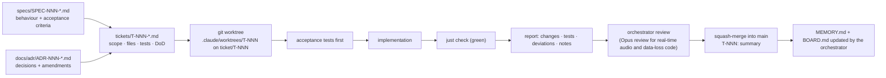

# Contributing to PowerVoice

Dev setup, the `just` recipes, how the tests are organised, how this project is actually built
(spec-driven, one ticket at a time), and step-by-step recipes for the changes people make most
often. Read [CLAUDE.md](../CLAUDE.md) first if you're an agent working a ticket.

## Set up

Prerequisites per OS are in [building.md](building.md) (Rust stable, Node 22+, `just`, and on
Linux the WebKitGTK, GTK3, ALSA/PipeWire and clang development packages).

```sh
git clone https://github.com/engLucasCorreia/powervoice.git
cd powervoice
npm ci --prefix ui      # UI dependencies (rerun after any package-lock.json change)
just hooks              # pre-commit hook: cargo fmt --all --check
just check              # everything must be green before you push
just dev                # run the app
```

`just dev` builds `powervoice-sandbox` first (so plugins work) and, on Linux, sets
`WEBKIT_DISABLE_DMABUF_RENDERER=1` by default (ADR-009 Amendment 1; opt out with
`POWERVOICE_WEBKIT_DMABUF=1`).

## Recipes

| Recipe | What it does |
|---|---|
| `just check` | The gate: `cargo fmt --check`, `cargo clippy --workspace --all-targets -D warnings`, `cargo test --workspace`, `just check-types`, the packaging, notices, docs and shortcuts checks, `svelte-check`, Vitest |
| `just test` | `cargo test --workspace` only |
| `just test-big` | Release-mode big/slow tests (60-minute documents, the full true-peak matrix, recovery timing) under `target/big-tests`; writes `target/bench/big.log` |
| `just bench` / `just bench-callback` / `just bench-ui` | Divan benches; the audio-callback histogram; headless UI frame times |
| `just perf-matrix` | Rewrites the table in [performance.md](performance.md) from the last bench logs |
| `just gen-types` / `just check-types` | Regenerate / verify `ui/src/lib/ipc/bindings.ts` from the Rust DTOs (ts-rs) |
| `just docs` | Regenerate the generated sections of the architecture docs (crate graph, IPC tables) |
| `just shortcuts-table` | Regenerate [shortcuts.md](shortcuts.md) from the shortcut registry |
| `just notices` | Regenerate `THIRD_PARTY_NOTICES` after any dependency change |
| `just fixtures` | Generate test fixtures into `fixtures/generated/` (not committed) |
| `just build` | Release build + the plugin sandbox + Linux bundles (AppImage, `.deb`) + bundle checks |
| `just voxmod <crate>` | Package a module crate as a `.voxmod` |
| `just check-cross` | `cargo check` every non-Tauri crate for Windows |
| `just spike` | The ADR-009 platform spike build |
| `just roadmap` | Build the roadmap dashboard into `target/roadmap/` |

## Tests

| Kind | Where | How it's run |
|---|---|---|
| Unit and integration (Rust) | `crates/*/src` (`#[cfg(test)]`), `crates/*/tests/` | `cargo test --workspace` |
| DSP acceptance | `crates/modules/tests/`, `crates/dsp/tests/` — synthetic signals from `vox-testkit`, measured against the spec's tolerances | `cargo test` |
| Module contract | `ModuleTestHost` (schema, activation, `no_alloc` processing, reset, event timing, state round-trip, determinism, text) | `cargo test` |
| Real-time safety | `vox_module_api::test_util::no_alloc` around callbacks and `process()`; `FakeBackend::set_rt_guard` | `cargo test` (debug/test builds) |
| Engine behaviour | `crates/engine/tests/` with the deterministic `FakeBackend` + `ManualEngine` (fake clock, `tick()` = one control tick) — no real devices | `cargo test` |
| Golden files | `crates/io/tests/golden_save.rs` (file hashes), `crates/engine/tests/spectro.rs` (tile in `tests/data/`, rewrite with `POWERVOICE_BLESS=1`) | `cargo test` |
| Sandbox / plugins | `crates/sandbox/tests/` against the in-repo test plugins (`vox-test-clap`, `-vst3`, `-lv2`) and the fault-injection binaries | `cargo test` |
| Big / slow | `#[ignore]`d tests (60-minute documents, recovery, the true-peak matrix) | `just test-big` |
| UI | `ui/src/**/*.test.ts` (Vitest + jsdom, `mockIPC`, fixtures in `ui/src/lib/test/fixtures.ts`) | `npm --prefix ui test -- --run` |
| Types, docs, packaging, licences | `check-types`, `scripts/docs/check.py`, `scripts/docs/generate_shortcuts.mjs --check`, `scripts/packaging/*`, `scripts/notices/generate.py --check` | part of `just check` |
| Benchmarks | Divan benches printing `BENCH_RESULT` lines with their spec target | `just bench` (never in `just check`) |

Tests that need real audio devices, a display or an optional system library skip themselves.
Write the acceptance tests from the spec **before** the implementation.

### Useful environment variables

| Variable | Effect |
|---|---|
| `POWERVOICE_LOG` | Log filter (default `info`) |
| `POWERVOICE_WEBKIT_DMABUF=1` | Keep WebKit's DMA-BUF renderer on Linux |
| `POWERVOICE_DEV_PLUGINS=1` | Show the sandbox test plugins in the Add-module menu |
| `POWERVOICE_NO_PLUGIN_SCAN=1` | Skip the start-up plugin scan |
| `POWERVOICE_LILV` | Path to the lilv library (LV2) |
| `POWERVOICE_SANDBOX_BIN` | Path to `powervoice-sandbox` (otherwise: next to the app binary) |
| `POWERVOICE_SANDBOX_GUI=headless` / `POWERVOICE_TEST_GUI=1` | Headless / real plugin editor windows in tests |
| `POWERVOICE_SANDBOX_NO_RT=1` | Don't ask for real-time priority in the sandbox |
| `POWERVOICE_TEST_TMP` | Scratch directory for big tests (keeps them off tmpfs) |
| `POWERVOICE_BLESS=1` | Rewrite golden files |
| `CLAP_PATH`, `VST3_PATH`, `LV2_PATH` | Extra plugin search paths |

## How work is organised

PowerVoice is built spec-first by an orchestrated set of AI sessions; the same flow works for a
human contributor.



- **[PROMPT.md](../PROMPT.md)** holds the mission and the **LOCKED** product decisions; changing
  one needs the owner.
- **[specs/](../specs/)** is the source of truth for behaviour: purpose, UX, parameters,
  numbered acceptance criteria with numeric tolerances, test plan (`specs/_TEMPLATE.md`).
  Specs are amended rather than rewritten, so an amendment at the end wins.
- **[tickets/](../tickets/)** are the units of work (`tickets/_TEMPLATE.md`), tracked in
  `tickets/BOARD.md` (`todo → ready → in-progress → review → done`, plus `blocked` and `gated`).
- **[MEMORY.md](../MEMORY.md)** is the project's curated memory: decisions (D-nnn, A-nnn),
  conventions, gotchas, per-ticket learnings. Only the orchestrator edits MEMORY.md, BOARD.md and
  PROMPT.md — everyone else reports notes instead.
- **Reviews** are blocking-findings-only, and required for real-time audio and data-loss code.
- **Commits:** work on `ticket/T-NNN`, commit freely, and the orchestrator squash-merges one
  commit `T-NNN: <summary>` into `main`. Run `cargo fmt --all` before committing (the pre-commit
  hook only checks formatting).
- **CI** (`.github/workflows/ci.yml`) runs `just check` on pushes and PRs to `main`;
  `release.yml` builds and publishes the Linux packages on a `v*` tag.

## Code conventions

- Rust stable, edition 2024. Clippy warnings are errors. `unsafe` only with a `// SAFETY:` comment.
- Units in identifiers: `_db`, `_dbfs`, `_lufs`, `_ms`, `_hz`, `_samples`. Audio samples are `f32`,
  time positions `u64` samples, accumulators `f64`.
- Libraries use `thiserror`; only the binaries (`cli`, `src-tauri`) use `anyhow`.
- `src-tauri` stays a thin command/event layer.
- Real-time code follows the [real-time rules](architecture/runtime.md#real-time-rules).
- UI: Svelte 5 runes, TypeScript strict, kit components, i18n keys for every string, generated
  types (never hand-copied).
- No new dependencies without a ticket or ADR naming them; run `just notices` after any change.

## Recipes for common changes

### Add a built-in module (rack effect)

1. Implement `vox_module_api::Module` + `ModuleFactory` in `crates/modules/src/<name>.rs`, with the
   DSP in `crates/dsp` (pure, no allocation in `process`). Id `org.powervoice.<name>`, semver
   version, `state_format_version`.
2. Register it in `builtin_factories()` (`crates/modules/src/lib.rs`).
3. Write the spec's acceptance tests plus `ModuleTestHost` in `crates/modules/tests/<name>.rs`
   (declare deliberately delayed parameters with `allow_delayed_effect`).
4. Add its i18n keys to `ui/src/lib/i18n/en.json`: `module.<name>.*`, `param.*`/
   `module.<name>.param.<key>`, `group.*` — these are **not** generated.
5. If it needs a custom panel, add it in `ui/src/lib/rack/`; otherwise the generic parameter UI
   is generated from the schema. Extensions (telemetry, response curve, noise profile) are picked
   up automatically.
6. Tests that count `builtin_factories()` must look modules up by id, not by index.

### Add a setting

1. Add the field to `Settings` in `src-tauri/src/settings.rs` with a `#[serde(default)]`-friendly
   default in `impl Default for Settings` (never duplicate defaults in the UI — the UI reads
   `settings_defaults`).
2. `just gen-types` to refresh `bindings.ts`.
3. Update `settingsFixture` in `ui/src/lib/test/fixtures.ts` — that's the only place with a
   hand-written `Settings` literal (H-18); Rust tests use `..Default::default()`.
4. Add the control to the right Preferences section (`ui/src/lib/preferences/`: Recording,
   Editing, Display & Appearance, Plugins, Advanced) and its i18n keys.
5. If the engine must react live, handle it in `settings_set` (`src-tauri/src/ipc/commands.rs`).

### Add a command or event

1. Write the handler in the matching `src-tauri/src/ipc/<domain>_commands.rs`: `#[tauri::command]
   pub async fn …`, with a one-sentence doc comment (it becomes the row in
   [ipc.md](architecture/ipc.md)). Bulk data returns `tauri::ipc::Response`; streams take a
   `Channel`.
2. Add the name to `ipc_commands!` in `src-tauri/src/ipc/mod.rs` (**both** lists — the second is
   the `spike` build). For an event, add it to `ipc_events!` in `ipc/events.rs` and emit it with
   `EventName::<name>.as_str()`.
3. New DTOs go in `ipc/<domain>_dto.rs` with `#[derive(TS)] #[ts(export, export_to = "bindings.ts")]`;
   map domain → DTO with `From`.
4. `just gen-types`, then add a typed wrapper in `ui/src/lib/ipc/commands.ts`
   (`invoke<T>("name" satisfies CommandName, args)`) and subscribe in the owning store's `init*()`.
5. `just docs` to refresh the generated command/event tables.

### Add an i18n key

Add it to `ui/src/lib/i18n/en.json` (check first — the file has keys added ahead of time) and use
`t("your.key")`, or `tDynamic` for keys built at run time. Keys the Rust side sends (`error.*`,
`notice.*`, history labels) are checked by `src-tauri/tests/i18n_audit.rs`; the UI side is checked
by `ui/src/lib/i18n/i18n.test.ts`.

### Update the documentation

- Architecture pages live in `docs/architecture/`; link every new page from
  [docs/README.md](README.md) — `scripts/docs/check.py` fails if a page isn't linked.
- The crate graph and the IPC tables are **generated**: edit the code, then run `just docs`.
- `just check` verifies that relative links and anchors resolve, that Mermaid fences are
  plausible (known diagram type, balanced brackets, matched `subgraph`/`end`, quoted labels) and
  that the generated sections are current. Run `python3 scripts/docs/test_check.py` if you change
  the checker itself.
- Diagrams must render on GitHub: use `flowchart`, `sequenceDiagram` or `classDiagram`, quote node
  labels that contain brackets (`a["x (y)"]`), and avoid `;` inside sequence-diagram text.
