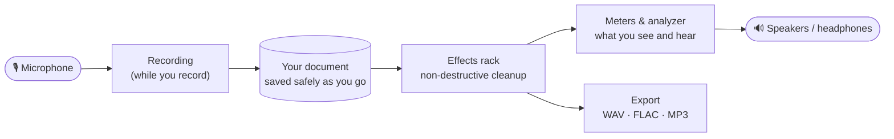
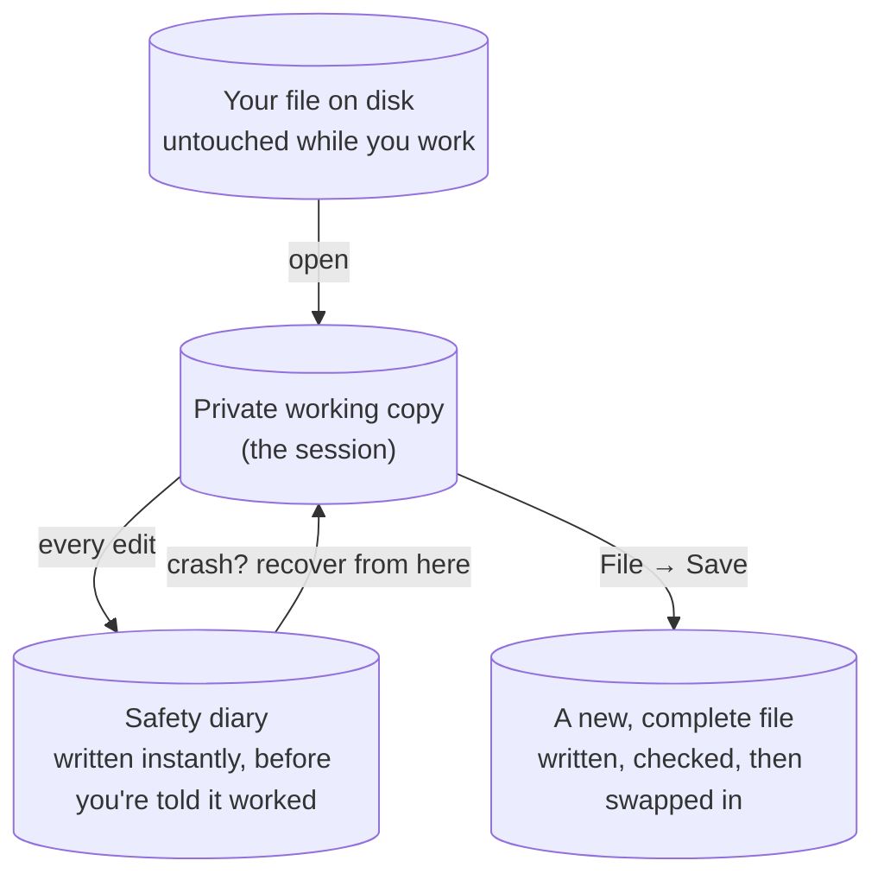

# How PowerVoice works

A plain-language explanation of what happens to your voice between the microphone and the finished
file — no code, no jargon without a link to the [glossary](glossary.md). If you're a developer
looking for the technical version (threads, crates, real code paths), see the [architecture
docs](architecture/overview.md) instead; this page tells the same story in everyday terms.

## The journey of your voice

1. **Microphone → recording.** While you record, PowerVoice listens to your microphone many
   thousands of times a second and writes what it hears to two places at once: a safety copy on
   disk (so a crash loses at most a fraction of a second) and your document. A meter shows how loud
   the incoming sound is, and a red warning lights up if it's loud enough to
   [clip](glossary.md#c) (distort).
2. **Recording → your document.** What you record becomes part of your **document** — PowerVoice's
   private working copy of your audio (see [Why your recording is never
   damaged](#why-your-original-recording-is-never-damaged), below). Cuts, deletes, punch-ins and
   normalizes all happen here, and every one of them can be undone.
3. **Your document → effects rack.** Whenever you play, monitor or export, your audio flows through
   the **effects rack**: an ordered chain of up to 16 effects (built-in ones like noise reduction
   and EQ, or third-party plugins) that shape the sound live. Nothing in the rack changes your
   document's audio until you explicitly [bake](user-guide.md#apply-the-rack-bake) it or export —
   you can add, remove, reorder or tweak every effect and always get back to how it sounded before.
4. **Effects rack → meters.** As the (possibly effected) sound comes out the other end, PowerVoice
   measures it — a peak/loudness meter, a live spectrum analyzer, voice diagnostics — and shows you
   those numbers as you listen, dozens of times a second.
5. **Effects rack → export.** When you're happy, **Export** runs your audio through the same
   effects rack one more time, as fast as the computer can manage rather than in real time, and
   writes a finished WAV, FLAC or MP3 file. Because it's the exact same rack code that plays back
   live, what you export is what you heard.

## Why your original recording is never damaged

PowerVoice follows one rule everywhere: **the file on your disk is never touched while you work.**

- **Opening a file** copies its audio into a private working area (a *session*) rather than editing
  it in place. Every change you make — cut, paste, record, normalize — happens to that private
  copy.
- **Undo has no limit** (other than free disk space) because of how that private copy is built: it
  is a list of small, unchangeable pieces of audio, and an edit produces a *new* list rather than
  overwriting the old one. Undo just switches back to an older list — instantly, because nothing
  needs to be rewritten.
- **Nothing is saved to your actual file until you choose File → Save (or Save As).** Even then,
  PowerVoice writes the new version to a temporary file first and only swaps it in for the old one
  once the write has fully succeeded — so a crash or power loss mid-save can't leave you with a
  half-written file.
- **Autosave and crash recovery** run continuously and separately from Save: every edit is written
  to a small, fast "diary" file (the *journal*) the instant it happens, safely flushed to disk
  before PowerVoice tells you the edit succeeded. If PowerVoice or your computer crashes, the next
  time you open the app it offers to bring back your unsaved work from that diary — typically
  losing at most a quarter of a second of it. See [Recovering after a crash or power
  loss](user-guide.md#recovering-after-a-crash-or-power-loss).
- **A small sidecar file** (`yourfile.wav.vo.json`) written next to your audio on Save remembers
  your effects rack, markers and view settings, so closing and reopening a project picks up exactly
  where you left off. It's a plain text file — deleting it just resets those settings, and never
  touches your audio.

## Why plugins run in their own "safety box"

PowerVoice can host effects made by other companies (in the CLAP, VST3, LV2 and JSFX formats — see
[Plugins](user-guide.md#plugins)). Those are programs PowerVoice didn't write and can't fully
vouch for: a bug in one could, in principle, crash the whole application and take your unsaved work
with it.

To prevent that, every third-party plugin runs in its own **sandbox** — a separate, disposable
helper program, connected to PowerVoice over a fast private channel rather than sharing its memory.
Think of it like running a power tool with a dead-man's switch in a room next door, connected by a
cable, rather than letting it loose on your own workbench: if it seizes up or breaks, you close the
door and start a new one — the workbench (PowerVoice, and your recording) is never at risk.

- If a plugin **crashes**, PowerVoice notices within milliseconds, quietly mutes just that one
  effect for a fraction of a second, and restarts it automatically. Your audio keeps playing.
- If a plugin **freezes** (stops responding), a watchdog notices and shuts it down the same way a
  crash is handled.
- Recording, playback and every other plugin in the rack are unaffected — only the misbehaving
  plugin's slot is interrupted, and never more than once automatically before PowerVoice asks you
  whether to retry.
- **Exporting and baking are stricter**: if a plugin fails during those, the operation stops rather
  than silently producing a file with a gap in it — your original audio is unchanged either way.

See [Plugins](user-guide.md#plugins) for what to do if a plugin keeps crashing, and the [Plugin
Manager](user-guide.md#the-plugin-manager) for installing, updating and managing them.

## Where to go next

- [What is PowerVoice?](what-is-powervoice.md) — the short pitch, if you haven't read it yet.
- [The user guide](user-guide.md) — step by step, for every feature.
- [FAQ and troubleshooting](faq.md) — quick answers to common questions.
- [Glossary](glossary.md) — every term PowerVoice uses, explained simply.
- Curious about the actual code? Start at [architecture/overview.md](architecture/overview.md).
